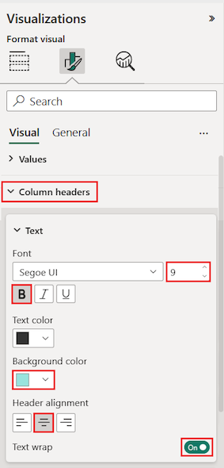
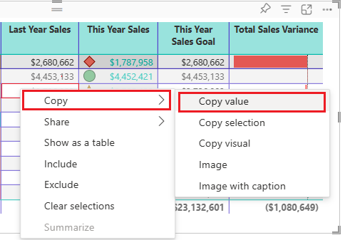

# Tables in Power BI reports and dashboards

A table is a grid that contains related data in a logical series of rows and columns. It may also contain headers and a row for totals. Tables work well with quantitative comparisons where you're looking at many values for a single category. For example, this table displays five different measures for **Category**.

Create tables in reports and cross-highlight elements within the table with other visuals on the same report page. You can select rows, columns, and even individual cells and cross-highlight. You can also copy and paste individual cells and multiple cell selections into other applications.

## When to use a table

Tables are a great choice:

* To see and compare detailed data and exact values (instead of visual representations).

* To display data in a tabular format.

* To display numerical data by categories.

> [!NOTE]
> If a table has too many values, consider converting it to a matrix and/or using drill down. The maximum data points a table will display is 3,500.

## Prerequisites

* The Power BI service or Power BI Desktop

* Retail Analysis Sample

## Create a table

You'll create the table pictured above to display sales values by item category.  Creating a visualization requires edit permissions to the dataset and report. Luckily, the Power BI samples are all editable. If someone shares a report with you, you can't create visualizations in reports. To follow along, sign in to the Power BI service and select **Get Data** > **Samples** > **Retail Analysis Sample** > **Connect**. Select **View dataset**. Now that you have the **Retail Analysis Sample** dataset in front of you, you can get started.

1. From the **Fields** pane, select **Item** > **Category**.

    Power BI automatically creates a table that lists all the categories.

    

1. Select **Sales > Average Unit Price** and **Sales > Last Year Sales**

1. Then select **Sales > This Year Sales** and select all three options: **Value**, **Goal**, and **Status**.

1. In the **Visualizations** pane, locate the **Values** well and drag the values until the order of your chart columns matches the first image on this page. Your **Values** well will look like this:

    

1. Pin the table to the dashboard by selecting the pin icon  in the upper-right corner of the visual.

## Format the table

There are many ways to format a table. Only a few are covered here. A great way to learn about the other formatting options is to open the **Format** pane (paint roller icon ) and explore.

* Try formatting the table grid. Here you'll add a blue vertical grid, add space to the rows, increase the outline and text size a bit.

    

    

* For the column headers, change the background color, add an outline, and increase the font size.

    

    

* You can even apply formatting to individual columns and column headers. Start by expanding **Field formatting** and selecting the column to format from the drop-down. Depending on the column values, **Field formatting** lets you set things like: display units, font color, number of decimal places, background, alignment, and more. Once you've adjusted the settings, decide whether to apply those settings to the header and totals row as well.

    

    

* And after some additional formatting, here is our final table.

    

### Conditional formatting

*Conditional formatting* is one type of formatting. Power BI applies conditional formatting to fields in the **Values** well of the **Visualizations** pane.

With conditional formatting for tables, you can specify customized cell background colors and font colors based on cell values, including using gradient colors.

1. In the **Visualizations** pane, select the **Fields** icon ).

1. Now select the down-arrow beside the value in the **Values** well that you want to format (or right-click the field).

    > [!NOTE]
    > You can only manage conditional formatting for fields in the **Values** area of the **Fields** well.

    

1. Select **Background color scales**.

1. In the dialog that appears, you can configure the color, the *Minimum* value, and the *Maximum* value. If you select the **Diverging** box, you can configure an optional *Center* value as well.

    

    Let's apply some custom formatting to our Average Unit Price values. Select **Diverging**, add some colors, and select **OK**.

    
1. Add a new field to the table that has both positive and negative values. Select **Sales > Total Sales Variance**.

    

1. Add data bar conditional formatting by selecting the down-arrow beside **Total Sales Variance** and choosing **Conditional formatting > Data bars**.

    

1. In the dialog that appears, set colors for **Positive bar** and **Negative bar**, select the **Show bar only** option, and make any other changes you'd like.

    

1. Select **OK**.

    Data bars replace the numerical values in the table making it easier to scan.

    

If you'd like to remove conditional formatting from a visualization, right-click the field again, and select **Remove Conditional Formatting**.

> [!TIP]
> Conditional formatting is also available from the Format pane (paintroller icon). Select the value to format and then set **Color scales** or **Data bars** to **On** to apply the default settings or, to customize the settings, select **Advanced controls**.

## Copy values from Power BI tables for use in other applications

Your table or matrix may have content that you'd like to use in other applications, like Dynamics CRM, Excel, and even other Power BI reports. In Power BI, when you right-click inside a cell, you can copy a the data in a single cell or a selection of cells onto your clipboard, and paste it into the other applications.

To copy the value of a single cell:

1. Select the cell you want to copy.

1. Right-click inside the cell.

1. Select **Copy** > **Copy value**.

    

    With the unformatted cell value on your clipboard, you can paste it into another application.

To copy more than a single cell:

1. Select a range of cells or use **Ctrl** to select one or more cells.

1. Right-click inside one of the cells you selected.

1. Select **Copy** > **Copy selection**.

    

    The copy includes the column and row headers.

    

## Adjust the column width of a table

Sometimes Power BI will truncate a column heading in a report and on a dashboard. To show the entire column name, hover over the space to the right of the heading to reveal the double arrows, select, and drag.

## Considerations and troubleshooting

When applying column formatting, you can only choose one alignment option per column: **Auto**, **Left**, **Center**, **Right**. Usually, a column contains all text or all numbers, and not a mix. In cases where a column contains both numbers and text, **Auto** will align left for text and right for numbers. This behavior supports languages where you read left-to-right.

## Next steps

* [Treemaps in Power BI](power-bi-visualization-treemaps.md)

* [Visualization types in Power BI](power-bi-visualization-types-for-reports-and-q-and-a.md)
