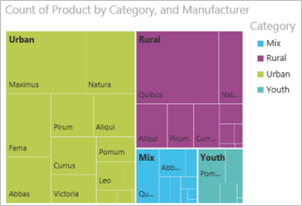
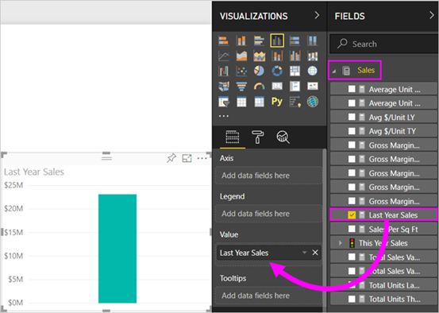
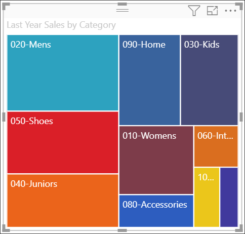
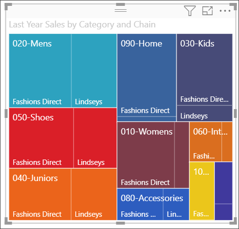
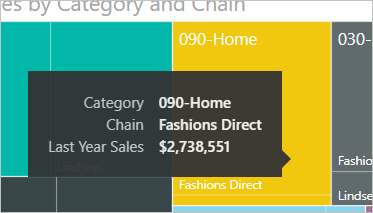
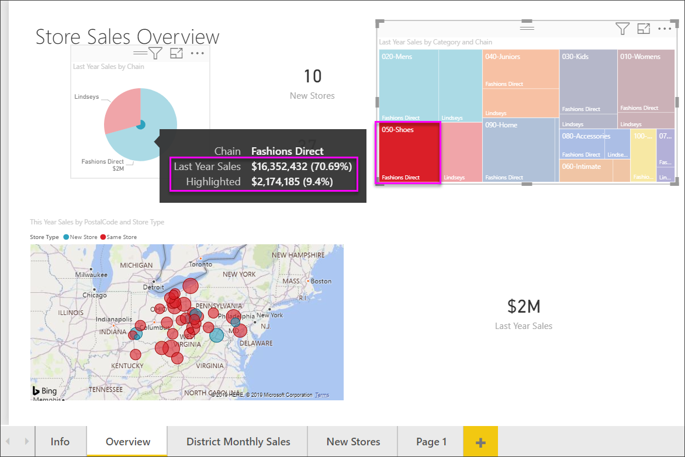

# Treemaps in Power BI
Treemaps display hierarchical data as a set of nested rectangles.  Each level of the hierarchy is represented by a colored rectangle (often called a "branch") containing other rectangles ("leaves").  The space inside each rectangle is allocated based on the value being measured. And the rectangles are arranged in size from top left (largest) to bottom right (smallest).

For example, if I'm analyzing my sales, I might have top-level rectangles, also called *branches*, for the clothing categories: **Urban**, **Rural**, **Youth**, and **Mix**.  My category rectangles would be split into smaller rectangles, also called *leaves*, for the clothing manufacturers within that category. And these smaller rectangles would be sized and shaded based on the number sold.  

In the **Urban** branch above, lots of `Maximus` clothing was sold, less `Natura` and `Fama`, and few `Leo`.  So, the **Urban** branch of my Treemap would have:
* the largest rectangle for `Maximus` in the top left corner
* slightly smaller rectangles for `Natura` and `Fama`
* lots of other rectangles for all the other clothing sold, and 
* a tiny rectangle for `Leo`.  

And I could compare the number of items sold across the other clothing categories by comparing the size and shading of each leaf node; larger and darker rectangles mean higher value.

## When to use a treemap
Treemaps are a great choice:

* to display large amounts of hierarchical data.
* when a bar chart can't effectively handle the large number of values.
* to show the proportions between each part and the whole.
* to show the pattern of the distribution of the measure across each level of categories in the hierarchy.
* to show attributes using size and color coding.
* to spot patterns, outliers, most-important contributors, and exceptions.

### Prerequisites
 - Power BI service or Power BI Desktop
 - Retail Analysis sample

## Create a basic treemap
Want to watch someone else create a treemap first?  Skip to 2:10 in this video to watch Amanda create a treemap.

<iframe width="560" height="315" src="https://www.youtube.com/embed/IkJda4O7oGs" frameborder="0" allowfullscreen></iframe>

Or, create your own treemap. These instructions use the Retail Analysis Sample. To follow along, sign in to Power BI service and select **Get Data \> Samples \>  Retail Analysis Sample \> Connect \> Go to dashboard**. Creating visualizations in a report requires edit permissions to the dataset and report. Luckily, the Power BI samples are editable. But you can't add visualizations to a report that someone has shared with you.  

1. Select the "Total stores" tile to open the Retail Analysis sample report.    
2. Open [Editing View](../service-interact-with-a-report-in-editing-view.md) and select the **Sales** > **Last Years Sales** measure.   
      
3. Convert the chart to a treemap.  
      
4. Drag **Item** > **Category** to the **Group** well. Power BI creates a treemap where the size of the rectangles is based on total sales and the color represents the category.  In essence you've created a hierarchy that visually describes the relative size of total sales by category.  The **Men's** category has the highest sales and the **Hosiery** category has the lowest.   
      
5. Drag **Store** > **Chain** to the **Details** well to complete your treemap. You can now compare last year's sales by category and chain.   
   
   
   > [!NOTE]
   > Color Saturation and Details cannot be used at the same time.
   > 
   > 
5. Hover over a **Chain** area to reveal the tooltip for that portion of the **Category**.  For example, hovering over **Fashions Direct** in the **090-Home** rectangle reveals the tooltip for Fashion Direct's portion of the Home category.  
   
6. [Add the treemap as a dashboard tile (pin the visual)](../service-dashboard-tiles.md). 
7. [Save the report](../service-report-save.md).

## Highlighting and cross-filtering
For information about using the Filters pane, see [Add a filter to a report](../power-bi-report-add-filter.md).

Highlighting a Category or Detail in a treemap cross-highlights and cross-filters the other visualizations on the report page... and vice versa. To follow along, either add some visuals to this report page or copy the treemap to one of the other non-blank pages in this report.

1. On the treemap, select either a Category or a Chain within a Category.  This cross-highlights the other visualizations on the page. Selecting **050-Shoes**, for example, shows me that last year's sales for shoes was $3,640,471 with $2,174,185 of that coming from Fashions Direct.  
   

2. In the **Last Year Sales by Chain** pie chart, selecting the **Fashions Direct** slice, cross-filters the treemap.  
       

3. To manage how charts cross-highlight and cross-filter each other, see [Visualization interactions in a Power BI report](../service-reports-visual-interactions.md)

## Next steps

[Waterfall charts in Power BI](power-bi-visualization-waterfall-charts.md)

[Visualization types in Power BI](power-bi-visualization-types-for-reports-and-q-and-a.md)