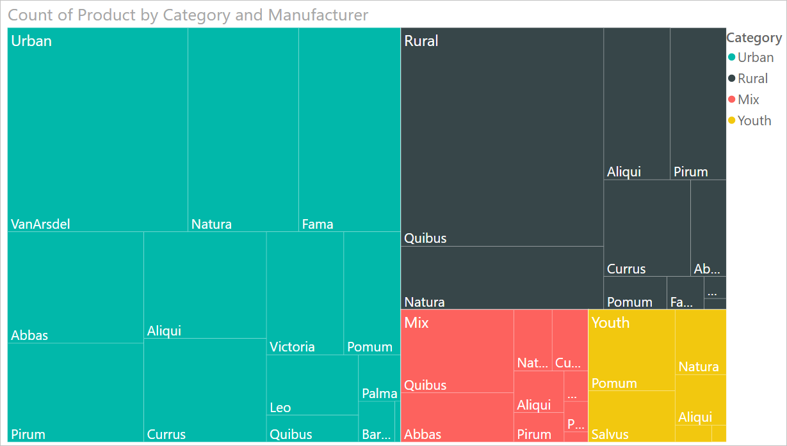
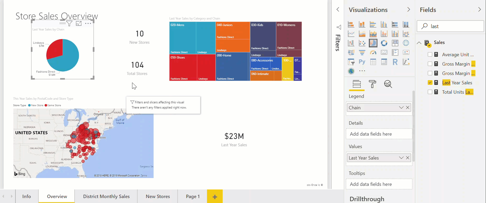

# Treemaps in Power BI

[!INCLUDE [applies-yes-desktop-yes-service](../includes/applies-yes-desktop-yes-service.md)]

Treemaps display hierarchical data as a set of nested rectangles. Each level of the hierarchy is represented by a colored rectangle (branch) containing smaller rectangles (leaves). Power BI bases the size of the space inside each rectangle on the measured value. The rectangles are arranged in size from top left (largest) to bottom right (smallest).

For example, if you're analyzing your sales, you might have top-level branches for the clothing categories: **Urban**, **Rural**, **Youth**, and **Mix**. Power BI would split your category rectangles into leaves, for the clothing manufacturers within that category. These leaves would be sized and shaded based on the number sold.

In the **Urban** branch above, lots of **VanArsdel** clothing was sold. Less **Natura** and **Fama** was sold. Only a few **Leo** were sold. So, the **Urban** branch of your Treemap has:

* The largest rectangle for **VanArsdel** in the top-left corner.

* Slightly smaller rectangles for **Natura** and **Fama**.

* Lots of other rectangles for all the other clothing sold.

* A tiny rectangle for **Leo**.

You could compare the number of items sold across the other clothing categories by comparing the size and shading of each leaf node; larger and darker rectangles mean higher value.

## When to use a treemap

Treemaps are a great choice:

* To display large amounts of hierarchical data.

* When a bar chart can't effectively handle the large number of values.

* To show the proportions between each part and the whole.

* To show the pattern of the distribution of the measure across each level of categories in the hierarchy.

* To show attributes using size and color coding.

* To spot patterns, outliers, most-important contributors, and exceptions.

## Prerequisite

This tutorial uses the [Retail Analysis sample PBIX file](https://download.microsoft.com/download/9/6/D/96DDC2FF-2568-491D-AAFA-AFDD6F763AE3/Retail%20Analysis%20Sample%20PBIX.pbix).

1. From the upper left section of the menubar, select **File** > **Open report**

1. Find your copy of the **Retail Analysis sample PBIX file**

1. Open the **Retail Analysis sample PBIX file** in report view :::image type="icon" source="media/power-bi-visualization-kpi/power-bi-report-view.png":::.

1. Select :::image type="icon" source="media/power-bi-visualization-kpi/power-bi-yellow-tab.png"::: to add a new page.

> [!NOTE]
> Sharing your report with a Power BI colleague requires that you both have individual Power BI Pro licenses or that the report is saved in Premium capacity.    

After you get the **Retail Analysis Sample** dataset, you can get started.

## Create a basic treemap

You'll create a report and add a basic treemap.

1. From the **Fields** pane, select the **Sales** > **Last Year Sales** measure.

   :::image type="content" source="media/power-bi-visualization-treemaps/treemapfirstvalue-new.png" alt-text="Screenshot of Sales > Last Tear Sales selected and the resulting visual.":::

1. Select the treemap icon :::image type="icon" source="media/power-bi-visualization-treemaps/power-bi-treemap-icon.png"::: to convert the chart to a treemap.

   :::image type="content" source="media/power-bi-visualization-treemaps/treemapconvertto-new.png" alt-text="Screenshot of the treemap without configuration.":::  

1. Select **Item** > **Category** which will add **Category** to the **Group** well.

    Power BI creates a treemap where the size of the rectangles is based on total sales and the color represents the category. In essence you've created a hierarchy that visually describes the relative size of total sales by category. The **Men's** category has the highest sales and the **Hosiery** category has the lowest.

    :::image type="content" source="media/power-bi-visualization-treemaps/power-bi-complete.png" alt-text="Screenshot of the configured treemap.":::

1. Select **Store** > **Chain** which will add **Chain** to the **Details** well to complete your treemap. You can now compare last year's sales by category and chain.

   :::image type="content" source="media/power-bi-visualization-treemaps/power-bi-details.png" alt-text="Screenshot of the treemap with Store > Chain added to the Details.":::

   > [!NOTE]
   > Color Saturation and Details cannot be used at the same time.

1. Hover over a **Chain** area to reveal the tooltip for that portion of the **Category**.

    For example, hovering over **Fashions Direct** in the **090-Home** rectangle reveals the tooltip for Fashion Direct's portion of the Home category.

   :::image type="content" source="media/power-bi-visualization-treemaps/treemaphoverdetail-new.png" alt-text="Screenshot of the Home tooltip that appears.":::

## Highlighting and cross-filtering

Highlighting a **Category** or **Detail** in a treemap cross-highlights and cross-filters the other visualizations on the report page. To follow along, either add some visuals to this report page or copy the treemap to one of the other pages in this report. The below image the treemap was copied over to the **Overview** page. 

1. On the treemap, select either a **Category** or a **Chain** within a **Category**. That will cross-highlight the other visualizations on the page. Selecting **050-Shoes**, for example, shows you that last year's sales for shoes was **$16,352,432** with **Fashions Direct** accounting for **$2,174,185** of those sales.

   :::image type="content" source="media/power-bi-visualization-treemaps/treemaphiliting.png" alt-text="Screenshot of the Store Sales Overview report showing cross-highlighting.":::

1. In the **Last Year Sales by Chain** pie chart, selecting the **Fashions Direct** slice, cross-filters the treemap.

   

1. To manage how charts cross-highlight and cross-filter each other, see [Change how visuals interact in a Power BI report](../create-reports/service-reports-visual-interactions.md).

## Next steps

* [Waterfall charts in Power BI](power-bi-visualization-waterfall-charts.md)

* [Visualization types in Power BI](power-bi-visualization-types-for-reports-and-q-and-a.md)

