# Visualization types in Power BI
## Power BI visualizations
We'll be adding new visualizations, stay tuned!

And check out the [Microsoft AppSource](https://appsource.microsoft.com/marketplace/apps?product=power-bi-visuals) , where you'll find a growing list of [custom visuals](../power-bi-custom-visuals.md) you can download and use in your own dashboards and reports. Feeling creative? [Learn how to create and add your own visuals to this community site](../developer/office-store.md).  

## List of visualizations available in Power BI
All of these visualizations can be added to Power BI reports, specified in Q&A, and pinned to dashboards.

### Area charts: Basic (Layered) and Stacked
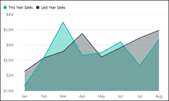

>[!TIP]
>The Basic Area chart is based on the line chart with the area between the axis and line filled in.

For more information, see [Basic Area chart](power-bi-visualization-basic-area-chart.md).

### Bar and column charts
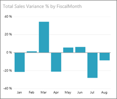

 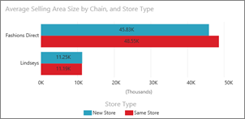

>[!TIP]
>Bar charts are the standard for looking at a specific value across different categories.

### Cards: Multi row
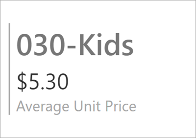

### Cards: Single number

For more information, see [Create a Card (big number tile)](power-bi-visualization-card.md).

### Combo charts

>[!TIP]
>A Combo chart combines a column chart and a line chart. Choose from *Line and Stacked Column* and *Line and Clustered Column*.

For more information, see [Combo charts in Power BI](power-bi-visualization-combo-chart.md).

### Doughnut charts

>[!TIP]
>Doughnut charts are similar to Pie charts.  They show the relationship of parts to a whole.

For more information, see [Doughnut charts in Power BI](power-bi-visualization-doughnut-charts.md).

### Funnel charts

>[!TIP]
>Funnels help visualize a process that has stages and items flow sequentially from one stage to the next.  Use a funnel when there is a sequential flow between stages, such as a sales process that starts with leads and ends with purchase fulfillment.

For more information, see [Funnel Charts in Power BI](power-bi-visualization-funnel-charts.md).

### Gauge charts

>[!TIP]
>Displays current status in the context of a goal.

For more information, see [Gauge Charts in Power BI](power-bi-visualization-radial-gauge-charts.md).

### Key influencers chart
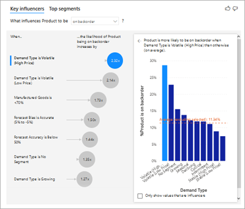

A key influencer chart displays the major contributors to a selected result or value.

For more information, see [Key influencer charts in Power BI](power-bi-visualization-influencers.md)

### KPIs
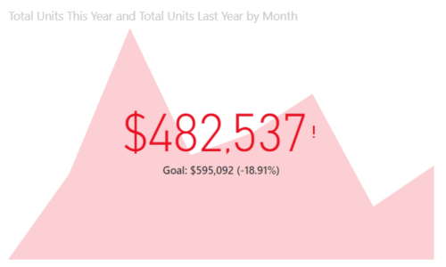

>[!TIP]
>Displays progress toward a measurable goal.

For more information, see [KPIs in Power BI](power-bi-visualization-kpi.md).

### Line charts

>[!TIP]
>Emphasize the overall shape of an entire series of values, usually over time.

### Maps: Basic maps
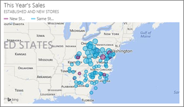

>[!TIP]
>Used to associate both categorical and quantitative information with spatial locations.

For more information, see [Tips and tricks for map visuals](power-bi-map-tips-and-tricks.md).

### Maps: ArcGIS maps
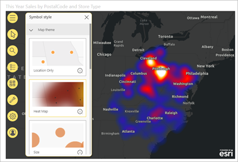

For more information, see [ArcGIS maps in Power BI](power-bi-visualization-arcgis.md).

### Maps: Filled maps (Choropleth)

>[!TIP]
>The more intense the color, the larger the value.

For more information, see [Filled Maps in Power BI](power-bi-visualization-filled-maps-choropleths.md).

### Maps: Shape maps
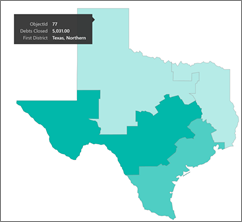

>[!TIP]
>Compares regions by color.

For more information, see [Shape Maps in Power BI](desktop-shape-map.md).

### Matrix
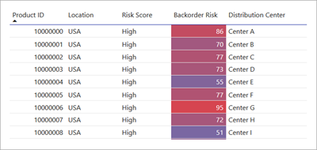

>[!TIP]
>A table supports two dimensions, but a matrix makes it easier to display data meaningfully across multiple dimensions -- it supports a stepped layout. The matrix automatically aggregates the data and enables drill down. 

For more information, see [Matrix visuals in Power BI](desktop-matrix-visual.md).

### Pie charts

>[!TIP]
>Pie charts show the relationship of parts to a whole. 

### R script visuals
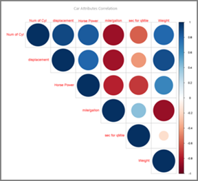

>[!TIP]
>Visuals created with R scripts, commonly called *R visuals*, can present advanced data shaping and analytics such as forecasting, using the rich analytics and visualization power of R. R visuals can be created in Power BI Desktop and published to the Power BI service.   

For more information, see [R visuals in Power BI](service-r-visuals.md).

### Ribbon chart
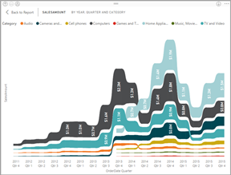

>[!TIP]
>Ribbon charts show which data category has the highest rank (largest value). Ribbon charts are effective at showing rank change, with the highest range (value) always displayed on top for each time period.

For more information, see [Ribbon charts in Power BI](desktop-ribbon-charts.md).

### Scatter and Bubble charts

>[!TIP]
>Display relationships between 2 (scatter) or 3 (bubble) quantitative measures -- whether or not, in which order, etc.

For more information, see [Scatter charts in Power BI](power-bi-visualization-scatter.md).

### Scatter-high density
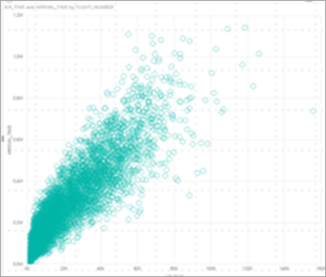

>[!TIP]
>Too many data points on a visual can bog it down, so a sophisticated sampling algorithm is used to ensure the accuracy of the visualization.

For more information, see [High Density Scatter charts in Power BI](desktop-high-density-scatter-charts.md).

### Slicers

For more information, see [Slicers in Power BI](power-bi-visualization-slicers.md).

### Standalone images

For more information, see [Add an image widget to a dashboard](../service-dashboard-add-widget.md).

### Tables
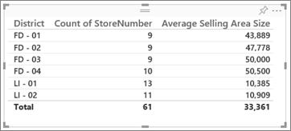

>[!TIP]
>Work well with quantitative comparisons among items where there are many categories.

For more information, see [Working with tables in Power BI](power-bi-visualization-tables.md).

### Treemaps
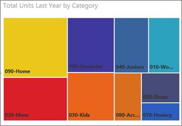

For more information, see [Treemaps in Power BI](power-bi-visualization-treemaps.md).

>[!TIP]
>Are charts of colored rectangles, with size representing value.  They can be hierarchical, with rectangles nested within the main rectangles.

### Waterfall charts

>[!TIP]
>Waterfall charts show a running total as values are added or subtracted.

For more information, see [Waterfall charts in Power BI](power-bi-visualization-waterfall-charts.md).

## Tell Q&A which visualization to use
When typing natural language queries with Power BI Q&A, you can specify the visualization type in your query.  For example:

"***sales by state as a treemap***"

## Next steps
[Visualizations in Power BI reports](power-bi-report-visualizations.md)    
[The right visual reference from sqlbi.com](http://www.sqlbi.com/wp-content/uploads/videotrainings/dashboarddesign/visuals-reference-may2017-A3.pdf)