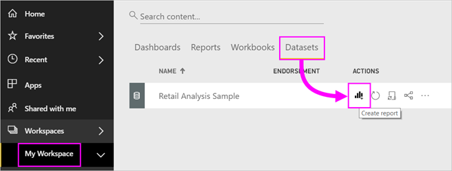
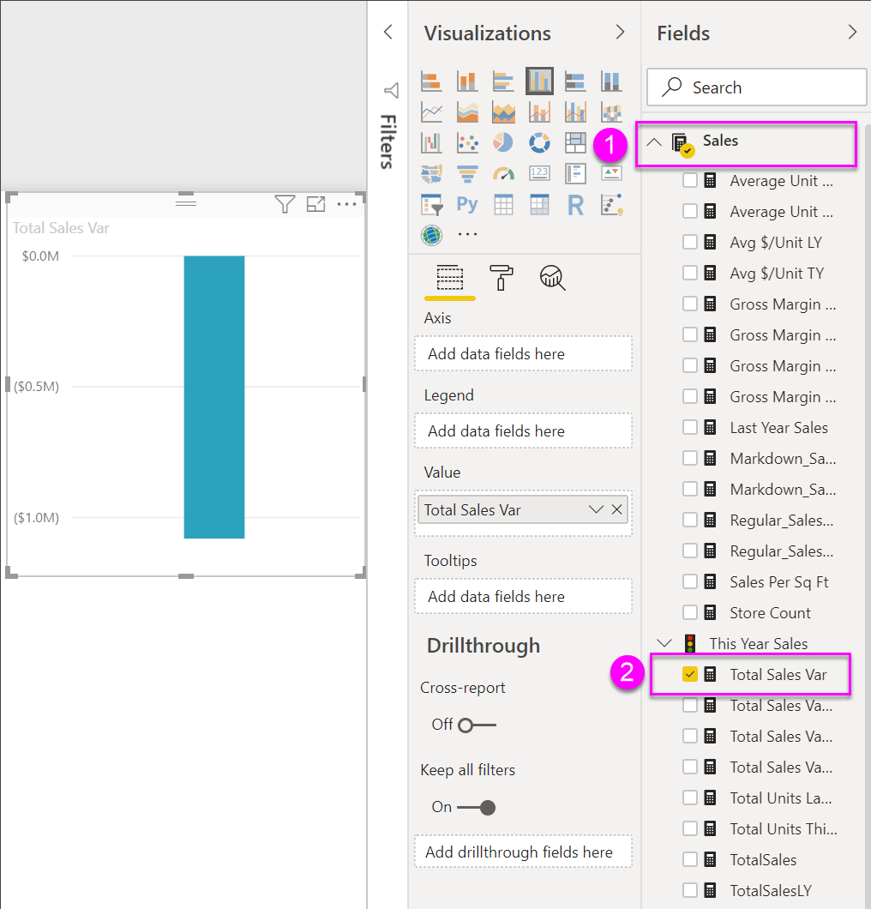
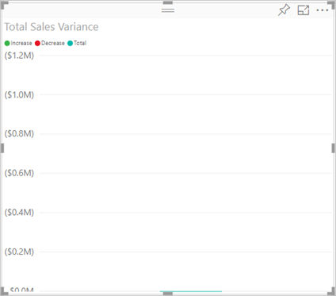
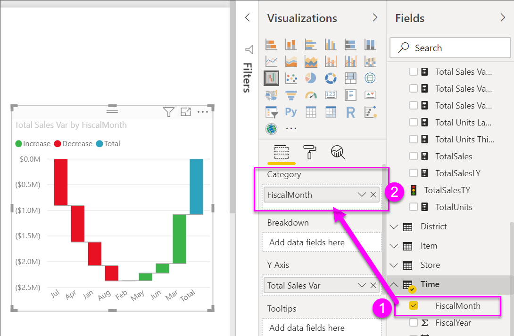
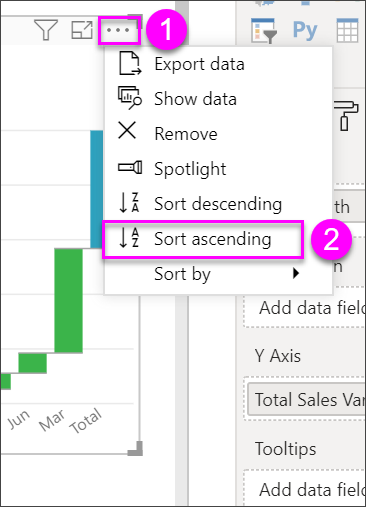
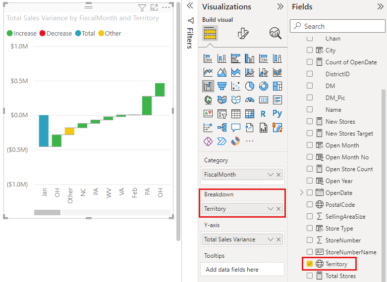
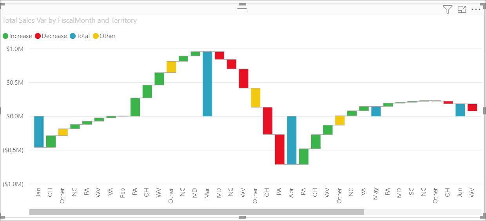
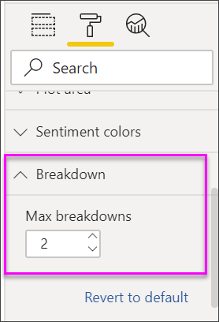
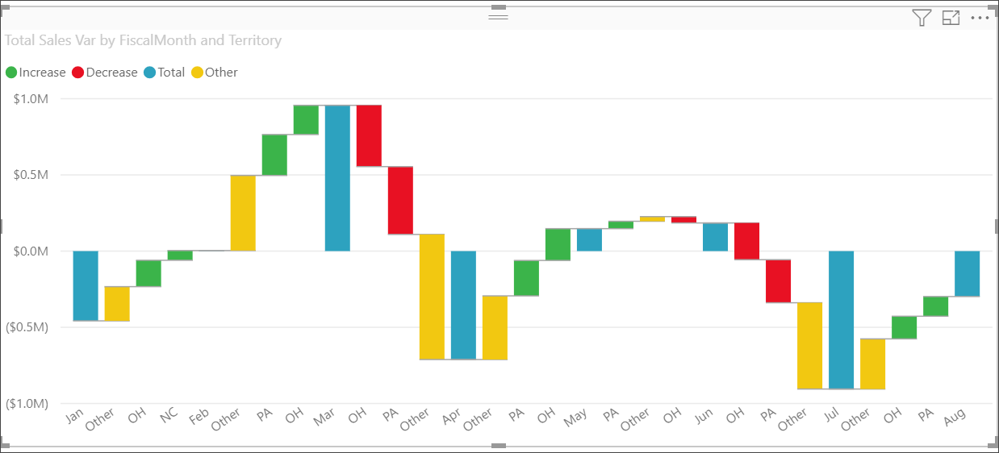
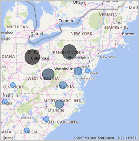

# Waterfall charts in Power BI

Waterfall charts show a running total as Power BI adds and subtracts values. They're useful for understanding how an initial value (like net income) is affected by a series of positive and negative changes.

The columns are color coded so you can quickly notice increases and decreases. The initial and the final value columns often [start on the horizontal axis](https://support.office.com/article/Create-a-waterfall-chart-in-Office-2016-for-Windows-8de1ece4-ff21-4d37-acd7-546f5527f185#BKMK_Float "start on the horizontal axis"), while the intermediate values are floating columns. Because of this style, waterfall charts are also called bridge charts.

<iframe width="560" height="315" src="https://www.youtube.com/embed/qKRZPBnaUXM" frameborder="0" allow="autoplay; encrypted-media" allowfullscreen></iframe>

## When to use a waterfall chart

Waterfall charts are a great choice:

* When you have changes for the measure across time, a series, or different categories.

* To audit the major changes contributing to the total value.

* To plot your company's annual profit by showing various sources of revenue and arrive at the total profit (or loss).

* To illustrate the beginning and the ending headcount for your company in a year.

* To visualize how much money you make and spend each month, and the running balance for your account.

## Prerequisites

* The Power BI service or Power BI Desktop

* Retail Analysis Sample report

## Get the Retail Analysis Sample report

These instructions use the Retail Analysis Sample. Creating a visualization requires edit permissions to the dataset and report. Luckily, the Power BI samples are all editable. If someone shares a report with you, you can't create visualizations in reports. To follow along, get the [Retail Analysis Sample report](../sample-datasets).

After you get the **Retail Analysis Sample** dataset, you can get started.

## Create a waterfall chart

You'll create a waterfall chart that displays sales variance (estimated sales versus actual sales) by month.

1. From **My Workspace**, select **Datasets** > **Create a report**.

    

1. From the **Fields** pane, select **Sales** > **Total Sales Variance**.

   

1. Select the waterfall icon  to convert the chart to a treemap.

    If **Total Sales Variance** isn't in the **Y-Axis** area, drag it there.

    

1. Select **Time** > **FiscalMonth** to add it to the **Category** well.

    

1. Make sure Power BI sorted the waterfall chart chronologically. From the top-right corner of the chart, select the ellipsis (...).

    Check that there is a yellow indicator next to the left of the **Sort ascending** and **FiscalMonth** options

    

    You can also look at the X-Axis values and see that they are in order from **Jan** to **Aug**.

    Dig in a little more to see what's contributing most to the changes month to month.

1. Drag **Store** > **Territory** to the **Breakdown** bucket.

    

    By default, Power BI adds the top five contributors to increases or decreases by month.

    

    You're only interested in the top two contributors.

1. In the **Format** pane, select **Breakdown** and set **Max breakdowns** to **2**.

    

    A quick review reveals that the territories of Ohio and Pennsylvania are the biggest contributors to movement, both negative and positive, in your waterfall chart.

    

    It's an interesting finding. Do Ohio and Pennsylvania have such a significant impact because sales in these two territories are much higher than the other territories? You can check that.

1. Create a map that looks at this year sales value and last year sales by territory.

    

    The map supports your theory. It shows that these two territories had the highest value of sales last year (bubble size) and this year (bubble shading).

## Highlighting and cross-filtering

For information about using the **Filters** pane, see [Add a filter to a report in Editing view](../power-bi-report-add-filter.md).

Highlighting a column in a waterfall chart cross-filters the other visualizations on the report page and the other way around. However, the **Total** column doesn't trigger highlighting or respond to cross-filtering.

## Next steps

* [Change how visuals interact in a Power BI report](../service-reports-visual-interactions.md)

* [Visualization types in Power BI](power-bi-visualization-types-for-reports-and-q-and-a.md)
