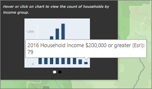
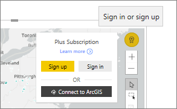

# Interacting with ArcGIS maps in Power BI
This topic is written from the point of view of a person *consuming* an ArcGIS map in Power BI service, Desktop, or mobile. Once a creator shares an ArcGIS map with you, there are many ways to interact with that map.  To learn more about creating an ArcGIS map, see [ArcGIS maps by esri tutorial](../power-bi-visualization-arcgis.md).

The combination of ArcGIS maps and Power BI takes mapping beyond the presentation of points on a map to a whole new level. The available options for base maps, location types, themes, symbol styles, and reference layers creates gorgeous informative map visualizations. The combination of authoritative data layers (such as census data) on a map with spatial analysis conveys a deeper understanding of the data in your visualization.

> [!TIP]
> GIS stands for Geographic Information System.
> 

The example we're using is the same ArcGIS map created in the [ArcGIS maps by esri tutorial](../power-bi-visualization-arcgis.md). It looks at last year's sales by city and uses a street basemap, bubble symbols to represent size, and a reference layer for average household income. The map contains 3 pins and one drive time radius (in purple).

> [!TIP]
> Visit [esri's page on Power BI](https://www.esri.com/powerbi) to see many examples and read testimonials. And then see esri's [ArcGIS Maps for Power BI Getting Started page](https://doc.arcgis.com/en/maps-for-powerbi/get-started/about-maps-for-power-bi.htm).
> 
> 

 

## User consent
The first time a colleague shares an ArcGIS map with you, Power BI will display a prompt. ArcGIS Maps for Power BI is provided by Esri(www.esri.com) and your use of ArcGIS Maps for Power BI is subject by Esri's terms and privacy policy. Power BI users wishing to use the ArcGIS Maps for Power BI visuals need to accept the consent dialog.

## Selection tools
ArcGIS Maps for Power BI allows three selection modes. A maximum of 250 data points can be selected at a time.

 Select individual data points.

 Draws a rectangle on the map and selects the contained data points. Use CTRL to select more than one rectangular area.

 Allows boundaries or polygons within reference layers to be used to select contained data points.

 

## Interacting with an ArcGIS map
The features available to you depend on whether you are the *creator* (person who made the map) or the *consumer* (someone shared an ArcGIS map with you). If you are interacting with an ArcGIS map as a consumer (aka [Reading view](../consumer/end-user-reading-view.md), here are the actions available to you.

* If you are a Premium consumer with *view* permissions, you'll be able to [view the data used to create the visualization](../consumer/end-user-show-data.md) , [subscribe](../consumer/end-user-subscribe.md), see the map in [Focus mode and full screen mode](../consumer/end-user-focus.md), [view related content](../consumer/end-user-related.md), [interact with the filters](../consumer/end-user-report-filter.md) set by the *report creator*, [Share the report](../service-share-reports.md), and more.

* As with other visualization types, Power BI **Pro** consumers can do everything the Premium consumer can do, plus [export the underlying data](power-bi-visualization-export-data.md), [get usage metrics](../service-usage-metrics.md), save a copy and [publish to Web](../service-publish-to-web.md), and more.

    
* Expand the **Filters** pane to explore the map using filters.   
      
* If the map has a reference layer, select locations to display details in a tooltip. Here we've selected Adams County and see data from the average household income reference layer the creator added to the map.
  
      
  
    In this case we also get a chart. Select a bar on the chart to dig into the data. Here we see that 79 households in Adams county earn $200,000 or greater.
  
    
  
    Select the arrow to display any additional charts.
* Hover over basemap location symbols to display details in a tooltip.     
  
  
  > [!TIP]
  > You may have to zoom in to select a specific location.  Otherwise, if there are overlapping locations, Power BI may present you with more than 1 tooltip at a time. Select the arrows to move between the tooltips
  > 
  > 
  > 
  > 
* If the creator has added an Infographics layer to the ArcGIS map, you'll see additional data displayed in the upper-right corner of the map.  For example, here the map creator added "Children under 14."
  
    

## Considerations and Limitations
ArcGIS Maps for Power BI is available in the following services and applications:

<table>
<tr><th>Service/App</th><th>Availability</th></tr>
<tr>
<td>Power BI Desktop</td>
<td>Yes</td>
</tr>
<tr>
<td>Power BI service (app.powerbi.com)</td>
<td>Yes</td>
</tr>
<tr>
<td>Power BI mobile applications</td>
<td>Yes</td>
</tr>
<tr>
<td>Power BI publish to web</td>
<td>No</td>
</tr>
<tr>
<td>Power BI Embedded</td>
<td>No</td>
</tr>
<tr>
<td>Power BI service embedding (PowerBI.com)</td>
<td>No</td>
</tr>
</table>

**How do ArcGIS Maps for Power BI work together?**
ArcGIS Maps for Power BI is provided by Esri (www.esri.com). Your use of ArcGIS Maps for Power BI is subject by Esri's [terms](https://go.microsoft.com/fwlink/?LinkID=8263222) and [privacy policy](https://go.microsoft.com/fwlink/?LinkID=826323). Power BI users wishing to use the ArcGIS Maps for Power BI visuals, need to accept the consent dialog (see User Consent for details).  Using Esri’s ArcGIS Maps for Power BI is subject to Esri’s Terms and Privacy Policy, which are also linked to from the consent dialog. Each user must consent prior to using ArcGIS Maps for Power BI for the first time. Once the user accepts the consent, data bound to the visual is sent to Esri’s services at least for geocoding, meaning transforming location information into latitude and longitude information that can be represented in a map. You should assume any data bound to the data visualization can be sent to Esri’s services. Esri provides services like base maps, spatial analytics, geocoding, etc. The ArcGIS Maps for Power BI visual interacts with these services using an SSL connection protected by a certificate provided and maintained by Esri. Additional information about ArcGIS Maps for Power BI can be obtained from Esri’s [ArcGIS Maps for Power BI product page](https://www.esri.com/powerbi).

**Power BI Plus**    

When a user signs up for a Plus subscription offered by Esri through ArcGIS Maps for Power BI, they are entering into an direct relationship with Esri. Power BI does not send personal information about the user to Esri. The user signs in to and trusts an Esri provided AAD application using their own AAD identity. By doing so, the user is sharing their personal information directly with Esri. Once the user adds Plus content to an ArcGIS Maps for Power BI visual, other Power BI users also need a Plus subscription from Esri to view or edit that content. 

For technical detailed questions about how Esri’s ArcGIS Maps for Power BI works, reach out to Esri through their support site.

**The ArcGIS map is not showing up**    
In services or applications where ArcGIS Maps for Power BI is not available, the visualization will show as an empty visual with the Power BI logo.

**I'm not seeing all of my information on the map**    
When geocoding latitude/longitude on the map, up to 30,000 data points are displayed. When geocoding data points such as zip codes or street addresses, only the first 15,000 data points are geocoded. Geocoding place names or countries is not subject to the 1500 address limit.

**Is there any charge for using ArcGIS Maps for Power BI?**

The ArcGIS Map for Power BI is available to all Power BI users at no additional cost. It is a component provided by **Esri** and your use is subject to the terms and privacy policy provided by **Esri** as noted earlier in this article. If you subscribe to ArcGIS **Plus**, there is a charge.

**I'm getting an error message about my cache being full**

This is a bug that is being addressed.  In the meantime, select the link that appears in the error message for instructions on clearing your Power BI cache.

**Can I view my ArcGIS maps offline?**

No, Power BI needs network connectivity to display the maps.

## Next steps
Getting help: **Esri** provides [comprehensive documentation](https://go.microsoft.com/fwlink/?LinkID=828772) on the feature set of **ArcGIS Maps for Power BI**.

You can ask questions, find the latest information, report issues, and find answers on the Power BI [community thread related to **ArcGIS Maps for Power BI**](https://go.microsoft.com/fwlink/?LinkID=828771).

If you have a suggestion for an improvement, please submit it to [Power BI's ideas list](https://ideas.powerbi.com).

[ArcGIS Maps for Power BI product page](https://www.esri.com/powerbi)
