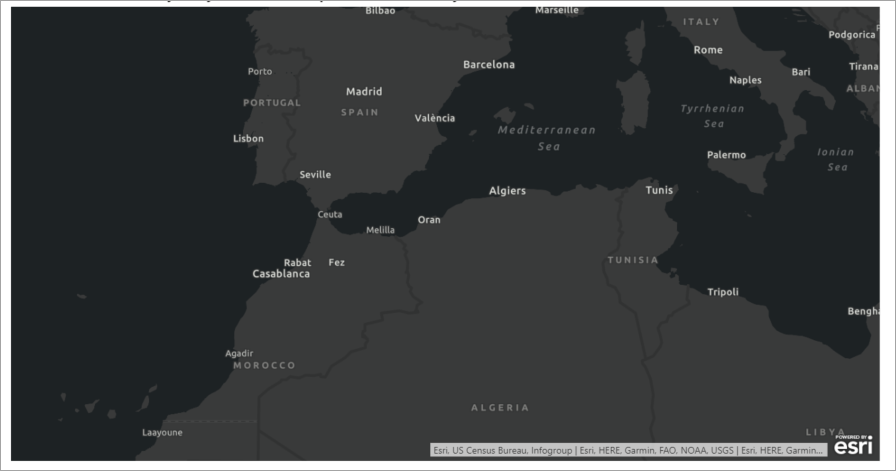
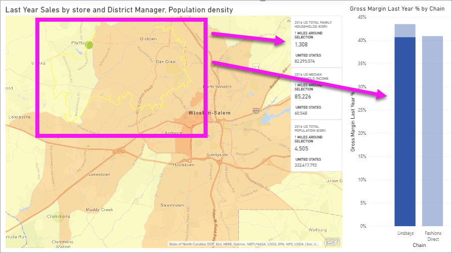

# Interact with ArcGIS maps in Power BI
This topic is written from the point of view of a person using an ArcGIS map in the Power BI service, Desktop, or mobile. Once a designer shares an ArcGIS map for Power BI visual with you, there are many ways to interact with that visual.  To learn more about creating an ArcGIS map, see [ArcGIS maps by Esri tutorial](../visuals/power-bi-visualization-arcgis.md).

The combination of ArcGIS maps and Power BI takes mapping beyond the presentation of points on a map to a whole new level. Report designers start with a map and attach layers of demographic data to that map. The combination of this location-based data layers (such as census data) on a map with spatial analysis conveys a deeper understanding of the data in your visualizations.

> [!TIP]
> GIS stands for Geographic Information System.
> 

This ArcGIS map for Power BI visual shows last year's sales by city and uses a street base map and an average household income reference layer. The map contains two pins (red and yellow) and one drive time radius (in purple).

> [!TIP]
> Visit [Esri's page on Power BI](https://www.esri.com/powerbi) to see many examples and read testimonials. And then see Esri's [ArcGIS Maps for Power BI Getting Started page](https://doc.arcgis.com/en/maps-for-powerbi/get-started/about-maps-for-power-bi.htm).
> 
> 

## User consent

The first time a colleague shares an ArcGIS map with you, Power BI will display a consent prompt. ArcGIS Maps for Power BI is provided by Esri (https://www.esri.com) and your use of ArcGIS Maps for Power BI is subject by Esri's terms and privacy policy. Power BI users wishing to use the ArcGIS Maps for Power BI visuals need to accept the consent dialog.

## Understand the layers

An ArcGIS Maps for Power BI visual can have several different types of layers of demographic location information.

### Base maps

Each ArcGIS Maps for Power BI visual starts with a base map. Think of base maps as the canvas for the data. A base map might be a basic dark or light canvas,

 

or a canvas with street and transportation detail. 

  

The base map is applied to the canvas entirely - as you pan and zoom, the map updates. Zoom in to see increasingly more detailed street and transportation information. Pan from one continent to another and the level of detail remains constant. Here, we've panned from Porto to Beijing.

  

### Reference layers

A report *designer* can add one reference layer. Reference layers are hosted by Esri and provide an additional layer of demographic information about a location. The example below has a reference layer for population density. Darker colors represent higher density.

  

### Infographics

A report *designer* can add many infographics layers. Infographics are quick visual indicators that display along the right side of the visual canvas. Infographics are hosted by Esri and provide an additional layer of demographic information about a location. The example below has three infographics applied. They don't display on the map itself, but on cards. The infographics cards update as you zoom, pan, and select areas on the map.

  

### Pins

Pins represent precise locations, like a city or address. Sometimes report *designers* use pins with drive time radius. This example shows stores within a 50-mile radius of Charlotte, North Carolina.

 

## Interact with an ArcGIS Maps for Power BI visual
The features available to you depend on how the report was shared with you and your Power BI account type. Check with your system administrator if you have questions. ArcGIS Maps for Power BI visuals behave much like other visuals in a report. You'll be able to [show the data that is used to create the visualization](../consumer/end-user-show-data.md), see the map in [Focus mode and full screen mode](../consumer/end-user-focus.md), [add comments](../consumer/end-user-comment.md), [interact with the filters](../consumer/end-user-report-filter.md) set by the report *designer*, and more. ArcGIS visuals can cross-filter other visuals on the report page and vice versa.

Hover over base map locations (for example, a bubble) to reveal tooltips. Additionally, use the ArcGIS visual selection tools to display additional tooltips, and to make specific selections on the base map or reference layer.  

### Selection tools

ArcGIS Maps for Power BI allows five selection modes. A maximum of 250 data points can be selected at a time.

#### The single-select tool

 

Select a data point, a bubble, a pin, or an individual data point from the reference layer. Power BI will display a tooltip with details about your selection. Single-select cross-filters the other visuals on the report page based on your selection, and updates the infographics cards for the selected area. 

Here we've selected a brown bubble data point from our base map. Power BI:
- highlights our selection,
- displays a tooltip for that data point, 
- updates the infographics cards to display data for just our selection, and
- cross-hghlights the column chart.

If the map has a reference layer, selecting locations displays details in a tooltip. Here we've selected Seneca County and see data from the reference layer (population density) that the report *designer* added to the map. In this example, our data point includes two different counties, so our tooltip has two pages. Each page has a chart. Select a bar on the chart to display additional details. 

> [!TIP]
  > Sometimes, you can reduce the number of tooltip pages by zooming in to select a specific location.  Otherwise, if there are overlapping locations, Power BI may present you with more than 1 tooltip at a time. Select the arrows to move between the tooltips
  > 
  > 

#### The multi-select tool

 

Draws a rectangle on the map and selects the contained data points. Use CTRL to select more than one rectangular area. Multi-select updates the infographics cards for the selected area, and cross-highlights the other visuals on the report page based on your selection.

 

#### The reference layer tool

 

Allows boundaries or polygons within reference layers to be used to select contained data points. It's hard to see, but there is a yellow outline on the reference layer. Unlike the single-select tool, we don't get a tooltip. Instead we get data about any data points contained within the borders of that outline. In this example, our selection does contain a data point -- it's for a Lindseys store in Winston Salem.

 

#### The buffer tool

 

Allows selection of data points using a buffer layer. For example, use this tool to select a drive time radius and continue to interact with the rest of the report. The drive time radius remains active and the infographics cards continue to reflect the drive time radius, but selecting other data points on the map cross-filters the other visuals on the report page.

 

#### The Find Similar tool

 

Allows you to find locations with similar attributes. You begin by selecting one or more points of interest, or reference locations, defining up to five dimensions that you want to use in analysis. Find Similar then calculates the 10 locations on your map that are most like the reference locations you defined. You can then use Infographics cards to learn more about the demographics around each of your results, create drive-time areas to get a sense of what is within driving distance of each of these locations, or even use the Find Similar tool itself to filter your report and gain more insights. Most importantly, all the calculation is done locally on your machine, so you can be sure your confidential data remains protected.

## Considerations and Limitations
ArcGIS Maps for Power BI is available in the following services and applications:

|Service/App  |Availability  |
|---------|---------|
|Power BI Desktop     |     Yes    |
|Power BI service (app.powerbi.com)     |    Yes     |
|Power BI mobile applications     |  Yes      |
|Power BI publish to web     |  No       |
|Power BI Embedded     |     No    |
|Power BI service embedding (PowerBI.com)  | No |

## How do ArcGIS Maps for Power BI work together?
ArcGIS Maps for Power BI is provided by Esri (https://www.esri.com). Your use of ArcGIS Maps for Power BI is subject by Esri's [terms](https://go.microsoft.com/fwlink/?LinkID=8263222) and [privacy policy](https://go.microsoft.com/fwlink/?LinkID=826323). Power BI users wishing to use the ArcGIS Maps for Power BI visuals, need to accept the consent dialog (see User Consent for details).  Using Esri’s ArcGIS Maps for Power BI is subject to Esri’s Terms and Privacy Policy, which is also linked to from the consent dialog. Each user must consent prior to using ArcGIS Maps for Power BI for the first time. Once the user accepts the consent, data bound to the visual is sent to Esri’s services at least for geocoding, meaning transforming location information into latitude and longitude information that can be represented in a map. You should assume any data bound to the data visualization can be sent to Esri’s services. Esri provides services like base maps, spatial analytics, geocoding, etc. The ArcGIS Maps for Power BI visual interacts with these services using an SSL connection protected by a certificate provided and maintained by Esri. Additional information about ArcGIS Maps for Power BI can be obtained from Esri’s [ArcGIS Maps for Power BI product page](https://www.esri.com/powerbi).

### Power BI Plus

When a user signs up for a Plus subscription offered by Esri through ArcGIS Maps for Power BI, they are entering into a direct relationship with Esri. Power BI does not send personal information about the user to Esri. The user signs in to and trusts an Esri provided AAD application using their own AAD identity. By doing so, the user is sharing their personal information directly with Esri. Once the user adds Plus content to an ArcGIS Maps for Power BI visual, colleagues who want to view or edit that visual will also need a Plus subscription from Esri. 

For technical detailed questions about how Esri’s ArcGIS Maps for Power BI works, reach out to Esri through their support site.

## Considerations and troubleshooting

**The ArcGIS map is not showing up**    
In services or applications where ArcGIS Maps for Power BI is not available, the visualization will show as an empty visual with the Power BI logo.

**I'm not seeing all of my information on the map**    
When geocoding latitude/longitude on the map, up to 30,000 data points are displayed. When geocoding data points such as zip codes or street addresses, only the first 15,000 data points are geo-coded. Geocoding place names or countries is not subject to the 1500 address limit.

**Is there any charge for using ArcGIS Maps for Power BI?**

The ArcGIS Map for Power BI is available to all Power BI users at no additional cost. It is a component provided by **Esri** and your use is subject to the terms and privacy policy provided by **Esri** as noted earlier in this article. If you subscribe to ArcGIS **Plus**, there is a charge.

**I'm getting an error message about my cache being full**

This behavior is a bug that is being addressed.  In the meantime, select the link that appears in the error message for instructions on clearing your Power BI cache.

**Can I view my ArcGIS maps offline?**

No, Power BI needs network connectivity to display the maps.

## Next steps
Getting help: **Esri** provides [comprehensive documentation](https://go.microsoft.com/fwlink/?LinkID=828772) on the feature set of **ArcGIS Maps for Power BI**.

You can ask questions, find the latest information, report issues, and find answers on the Power BI [community thread related to **ArcGIS Maps for Power BI**](https://go.microsoft.com/fwlink/?LinkID=828771).

[ArcGIS Maps for Power BI product page](https://www.esri.com/powerbi)
