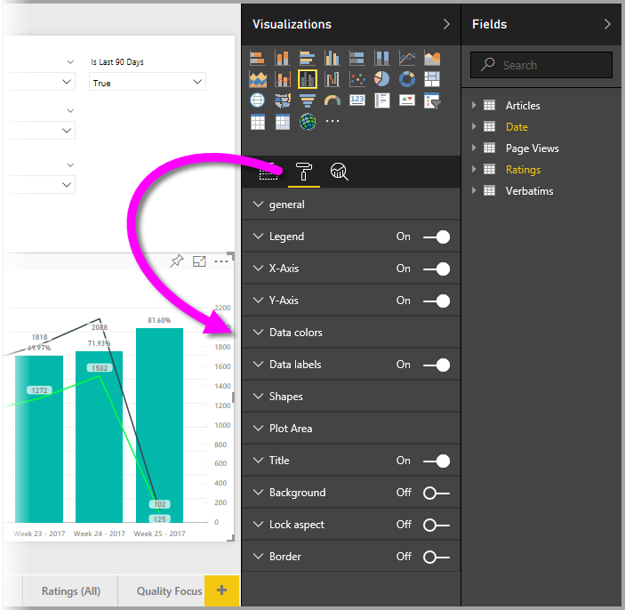
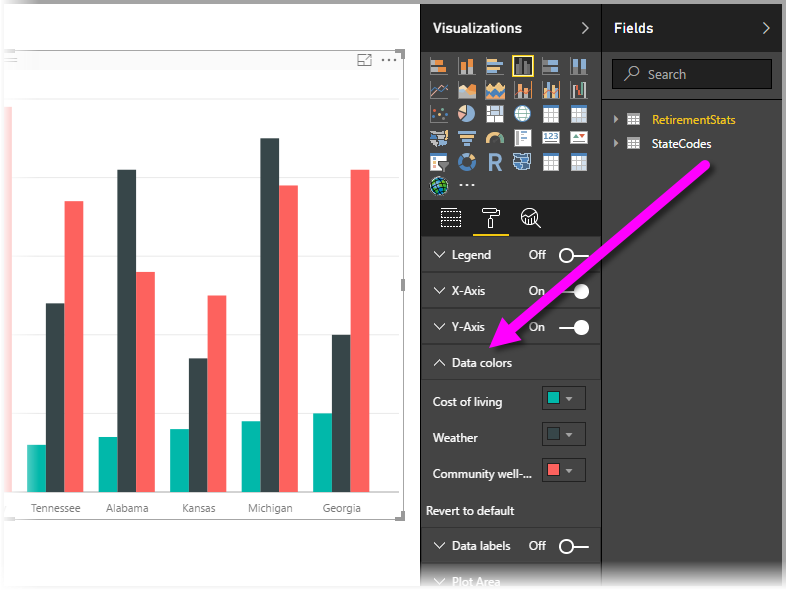
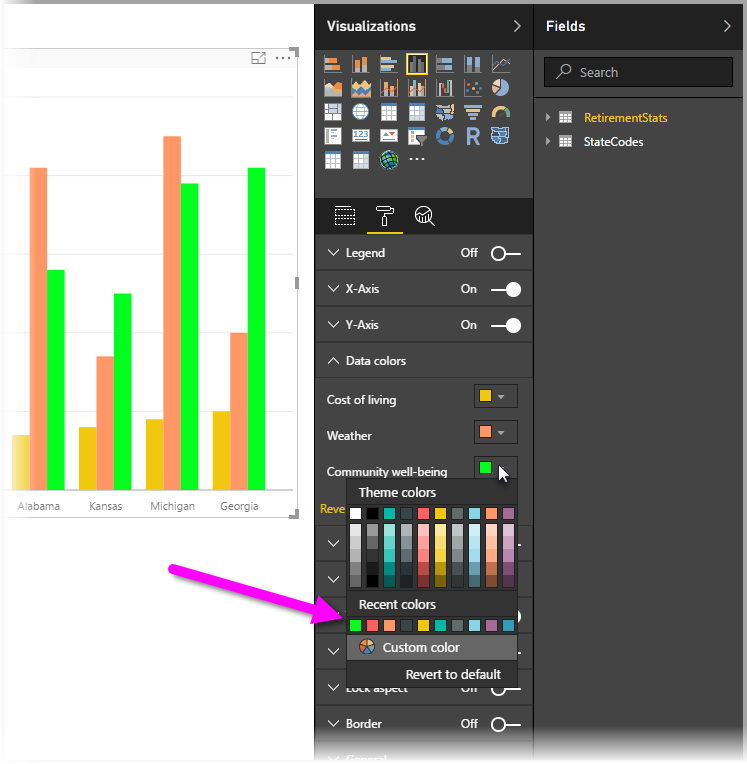
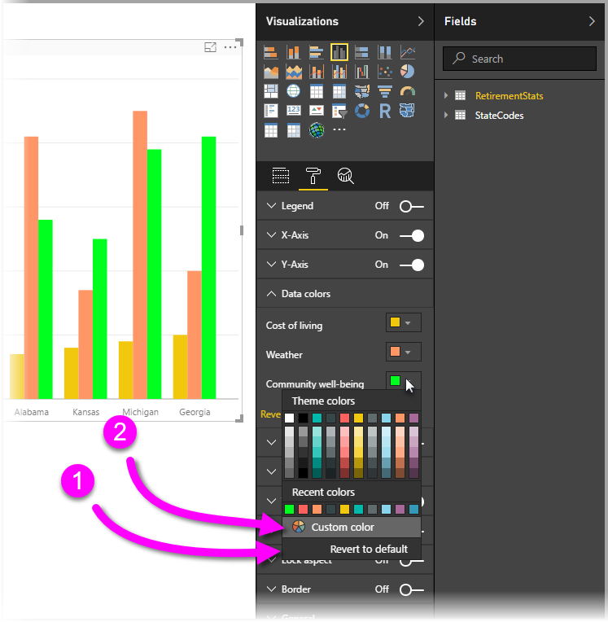
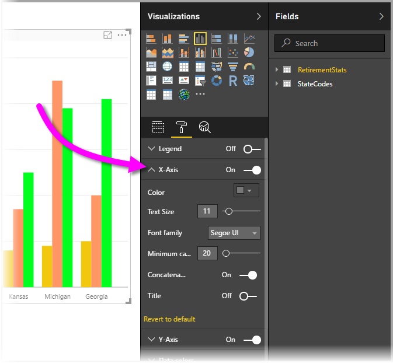

# Getting started with color formatting and axis properties
In **Power BI**, you can change the color of data series, data points, and even the background of visualizations. You can also change how the x-axis and y-axis are presented, providing you with full control of how your dashboards and reports appear.

To get started, select a **Report** from the **My Workspace** pane. Then from the top menu area, select **Edit Report**.  

When you’re editing a report and you have a visualization selected, the **Visualizations** pane appears which lets you add or change visualizations. Directly below the available visualizations are three icons: the **Fields** icon (a stack of bars), the **Format** icon (a roller brush), and the **Analytics** icon (a magnifying glass). In the image below the **Fields** icon is selected, indicated by a yellow bar below the icon.

When you select **Format**, the area below the icon displays the color and axis customizations available for the currently selected visualization.  

You can customize many elements of each visualization:

* Legend
* X-axis
* Y-axis
* Data colors
* Data labels
* Shapes
* Plot area
* Title
* Background
* Lock aspect
* Border

> [!NOTE]
>  
> You won’t see all these elements with each visualization type. The visualization you select will affect which customizations are available; for example, you won’t see an X-Axis if you have a pie chart selected because pie charts don’t have an X-axis.

Also note that if you don’t have any visualization selected, **Filters** appears in place of the icons, which lets you apply filters  to all visualizations on the page.

Let’s show a couple examples: one working with colors, the other changing the properties of an axis. From there, you should be ready to customize colors, axes, and labels all day long.

## Working with colors

Let’s walk through the steps necessary to customize colors on a chart.

1. I select a **Clustered Column Chart** from the report canvas.
2. Next, I choose the **Format** icon to show the available customizations.
3. Then I select the small down arrow to the left of the **Data Colors** customization. This will show how I can customize the Data Colors, with options that are specific to the visualization I’ve selected.
4. **Data Colors** expands downward to show its available customizations.  
   

Let’s make some changes. I can select the down arrow next to the color to make changes on each available data series. I’ll make **Cost of living** yellow, **Weather** I’ll turn orange, and **Community well-being** will be green. The following screen shows me at the last step, changing **Cost of living**.  

The changes are shown in the image below. Wow, that’s a bright chart. Here are a few useful elements to note about working with colors. The numbers in the following list are also shown on the following screen, indicating where these useful elements can be accessed or changed.

1. Don’t like the colors? No problem, just select **Revert to default** and your selection reverts to the default settings. You can do that for one color, or for the entire visualization.
2. Want a color you don’t see in the palette? Just select **Custom color**, and choose from the spectrum.  
   

Not crazy about the change you just made? Use **CTRL+Z** to undo , just like you’re used to doing.

## Changing axis properties

It’s often useful to modify the X-axis or the Y-axis. Similar to working with colors, you can modify an axis by selecting the down-arrow icon to the left of the axis you want to change, as shown in the following image.  

If you want to collapse the **X-Axis** options, just select the up arrow icon beside **X-Axis**.

You can remove the X-axis labels entirely, by toggling the radio button beside **X-Axis**. You can also choose whether to turn axis titles on or off by selecting the radio button next to **Title**.  

There are all sorts of colors to choose from, and many more customizations you can apply to your Power BI reports and dashboards.

> [!NOTE]
>  
> These color, axis, and related customizations available when the **Format** icon is selected are also available in Power BI Desktop.

## Setting color from text values

Beginning with the August 2018 **Power BI Desktop** update, you can set colors by the text value, or hex code, for a given report element. For more information, please see [conditional formatting in tables](../desktop-conditional-table-formatting.md).

## Next steps
For more information, see the following article:  

* [Tips and tricks for color formatting in Power BI](service-tips-and-tricks-for-color-formatting.md)  
* [Conditional formatting in tables](../desktop-conditional-table-formatting.md)

