# Getting started with the formatting pane

[!INCLUDE[consumer-appliesto-nyyn](../includes/consumer-appliesto-nyyn.md)]    

If you have edit permissions for a report, there are numerous formatting options available. In Power BI reports, you can change the color of data series, data points, and even the background of visualizations. You can change how the x-axis and y-axis are presented. You can even format the font properties of visualizations, shapes, and titles. Power BI provides you with full control over how your reports appear.

To get started, open a report in Power BI Desktop or the Power BI service. Both provide almost identical formatting options. When you open a report in the Power BI service, be sure to select **Edit** from the menu bar. 

When you’re editing a report and you have a visualization selected, the **Visualizations** pane appears. Use this pane to change visualizations. Directly below the **Visualizations** pane are three icons: the **Fields** icon (a stack of bars), the **Format** icon (a paint roller), and the **Analytics** icon (a magnifying glass). In the image below, the **Fields** icon is selected, indicated by a yellow bar below the icon.

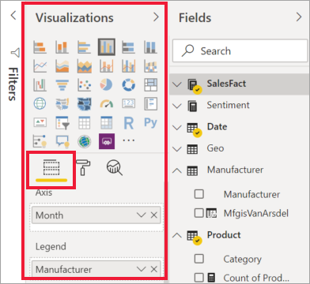

When you select **Format**, the area below the icon displays the customizations available for the currently selected visualization.  

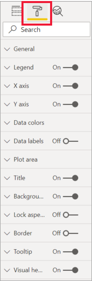

You can customize many elements of each visualization. The options available depend on the visual selected. Some of those options are:

* Legend
* X-axis
* Y-axis
* Data colors
* Data labels
* Total labels
* Shapes
* Plot area
* Title
* Background
* Lock aspect
* Border
* Tooltips
* Visual headers
* Shapes
* Position    
and more.

> [!NOTE]
>  
> You won’t see all these elements with each visualization type. The visualization you select will affect which customizations are available; for example, you won’t see an X-Axis if you have a pie chart selected because pie charts don’t have an X-axis.

Also note that if you don’t have any visualization selected, **Filters** appears in place of the icons, which lets you apply filters  to all visualizations on the page.

The best way to learn how to use the Formatting options is to try them out. You can always undo your changes or revert to default. There are an incredible amount of options available, and new ones being added all the time. It's just not possible to describe all formatting options in one article. But to get you started, let's review a few together. 

1. Change colors used in the visual   
2. Apply a style    
3. Change axis properties    
4. Add data labels    
1. Add total labels

## Working with colors

Let’s walk through the steps necessary to customize colors on a visualization.

1. Select a visualization to make it active.

2. Select the paint roller icon to open the Formatting tab. The Formatting tab displays all the formatting elements available for the selected visual.

    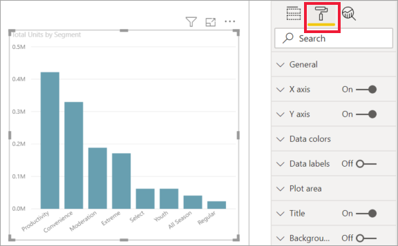

3. Select **Data Colors** to expand its available customizations.  

    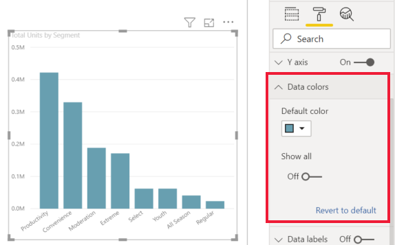

4. Change **Show all** to On, and select different colors for columns, rows, lines -- depending on the visual type.

    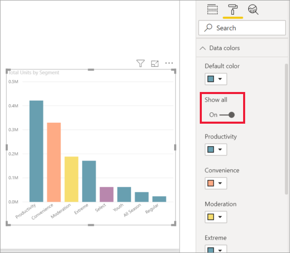

Here are a few useful tips for working with colors. The numbers in the following list are also shown on the following screen, indicating where these useful elements can be accessed or changed.

1. Don’t like the color? No problem, just select **Revert to default** and your selection reverts to the default setting. 

2. Don't like any of the color changes? Select **Revert to default** from the bottom of the **Data color** section, and your colors revert to the default settings. 

3. Want a color you don’t see in the palette? Just select **Custom color**, and choose from the spectrum.  

   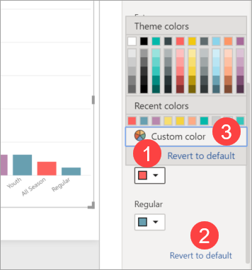

Not crazy about the change you just made? Use **CTRL+Z** to undo , just like you’re used to doing.

## Applying a style to a table
Some Power BI visualizations have a **Style** option. With one click, a full set of formatting options are applied to your visualization, all at once. 

1. Select a table or matrix to make it active.   
1. Open the Formatting tab and select **Style**.

   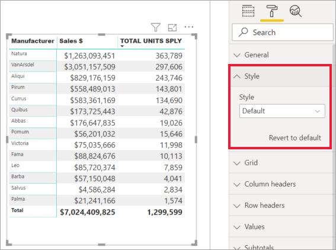

1. Select a style from the dropdown. 

   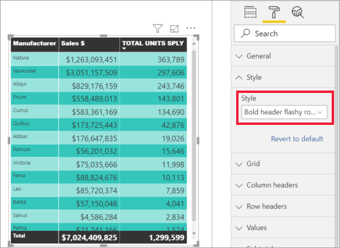

Even after you apply a Style, you can continue formatting properties, including color, for that visualization.

## Changing axis properties

It’s often useful to modify the X-axis or the Y-axis. Similar to working with colors, you can modify an axis by selecting the down-arrow icon to the left of the axis you want to change, as shown in the following image.  
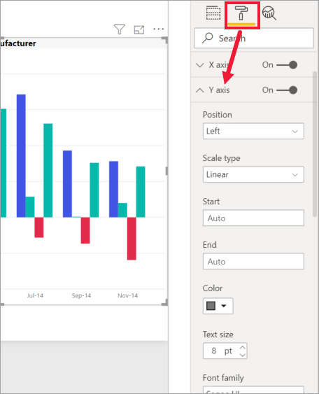

In the example below, we've formatted the Y axis by:
- moving the labels to the right side of the visualization

- changing the starting value to zero.

- changing the label font color to black

- increasing label font size to 12

- adding a Y-axis title

    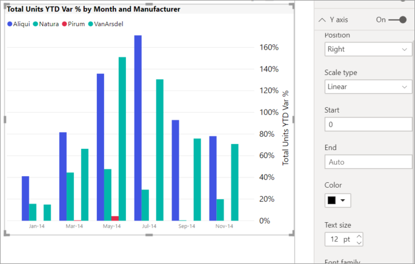

You can remove the axis labels entirely, by toggling the radio button beside **X-Axis** or **Y-Axis**. You can also choose whether to turn axis titles on or off by selecting the radio button next to **Title**.  

## Adding data labels    

Let's add data labels to an area chart. 

Here is the *before* picture. 

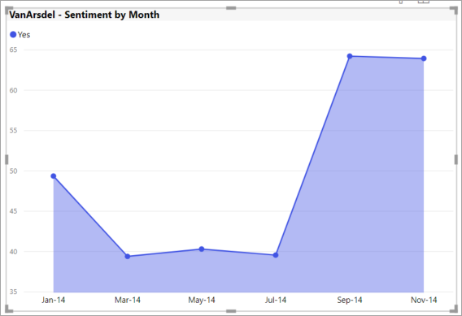

And, here is the *after* picture.

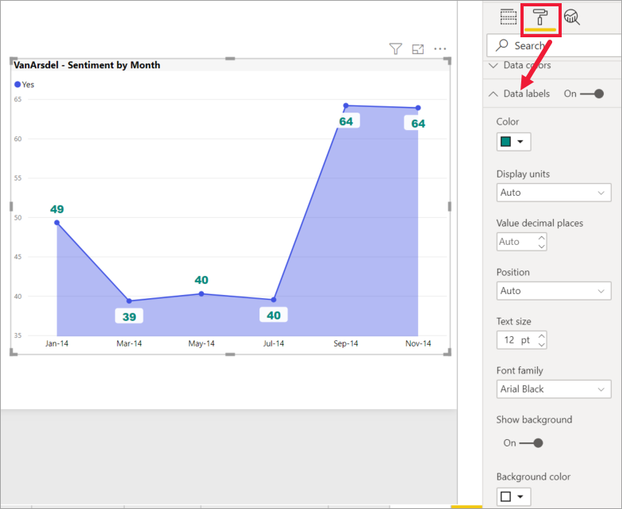

We selected the visualization to make it active and opened the Formatting tab.  We selected **Data labels** and turned them On. Then we increased font to 12, changed font family to Arial Black, turned **Show background** to On and background color to white with a transparency of 5%.

Depending on the visual and its size, data labels may not display.  If your data labels don't display, try making the visual larger or viewing it in full screen mode. 

These are just a few of the formatting tasks that are possible. Open a report in Editing mode and have fun exploring the Formatting pane to create beautiful and informative visualizations.

## Adding total labels    

One last formatting example before you start exploring on your own.  Let's add total labels to a stacked column chart. Total labels are available for stacked charts, combo charts, and area charts.

When you turn on total labels, Power BI displays the aggregate, or total, of the data. Let's look at an example. 

Here, we have a stacked column chart with data labels showing the value of each portion of each full stack.  This is the default view. 

By opening the visual in Editing view, you can change the display for data labels and total labels. Select the visual to make it active and open the Formatting pane. Scroll down to **Data labels** and **Total labels**. **Data labels** is On and **Total labels** is Off. 

Turn **Data labels** Off, and turn **Total labels** On. Power BI now displays the aggregate for each column.    

These are just a few of the formatting tasks that are possible. Open a report in Editing mode and have fun exploring the Formatting pane to create beautiful and informative visualizations.

## Next steps
For more information, see the following article: 

* [Sharing reports](../collaborate-share/service-share-reports.md)

* [Tips and tricks for color formatting in Power BI](service-tips-and-tricks-for-color-formatting.md)  
* [Conditional formatting in tables](../create-reports/desktop-conditional-table-formatting.md)

