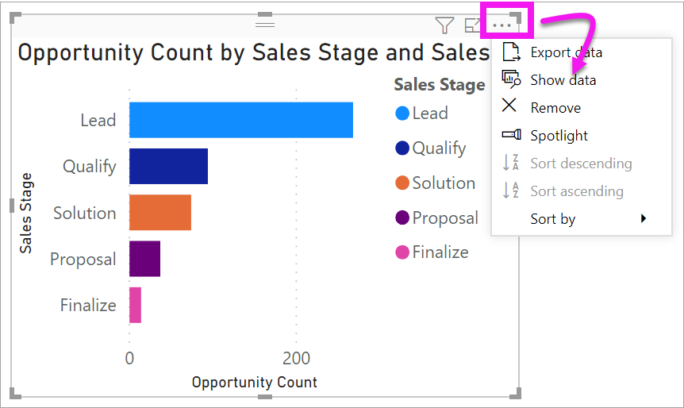
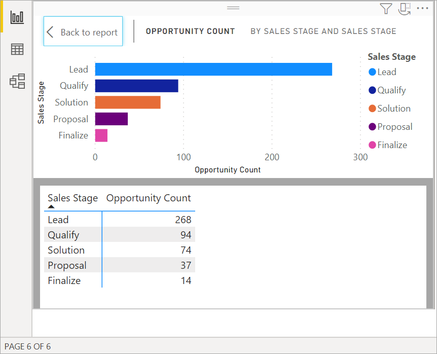
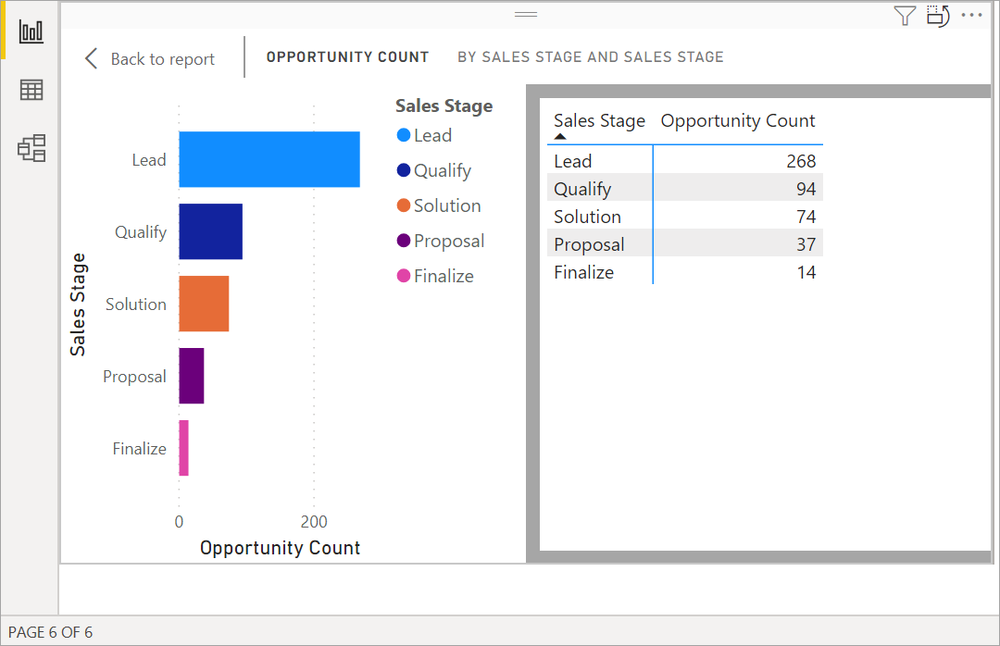
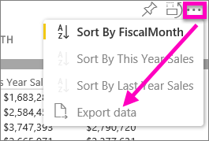

# Display a visualization's underlying data

[!INCLUDE[consumer-appliesto-yyyn](../includes/consumer-appliesto-nyyn.md)]    

## Show data
A Power BI visualization is constructed using data from your datasets. If you're interested in seeing behind-the-scenes, Power BI lets you *display* the data that is being used to create the visual. When you select **Show Data**, Power BI displays the data below (or next to) the visualization.

You can also export the data that is being used to create the visualization as an .xlsx or .csv file and view it in Excel. For more information, see [Export data from Power BI visualizations](power-bi-visualization-export-data.md).

> [!NOTE]
> *Show Data* and *Export Data* are both available in Power BI service and Power BI Desktop. However, Power BI Desktop provides one additional layer of detail; [*Show Records* displays the actual rows from the dataset](../create-reports/desktop-see-data-see-records.md).
> 
> 

## Using *Show Data* 
1. In Power BI Desktop, select a visualization to make it active.

2. Select **More actions** (...) and choose **Show data**. 
    

3. By default, the data displays below the visual.
   
   

4. To change the orientation, select vertical layout  from the top-right corner of the visualization.
   
   
5. To export the data to a .csv file, select the ellipses and choose **Export data**.
   
    
   
    For more information on exporting the data to Excel, see [Export data from Power BI visualizations](power-bi-visualization-export-data.md).
6. To hide the data, de-select **Explore** > **show data**.

## Using Show records
You can also focus on one data record in a visualization, and drill into the details behind it. 

1. To use **See records**, select a visualization to make it active. 

2. In the Desktop ribbon, select the tab for **Visual tools** > **Data/Drill** > **See records**. 

    

3. Select a data point or row on the visualization. In this example, we've selected the fourth column from the left. Power BI shows us the dataset record for this data point.

    

4. Select **Back to report** to return to the Desktop report canvas. 

## Considerations and troubleshooting

- If the **See records** button in the ribbon is disabled and grayed-out, it means the selected visualization does not support See Records.
- You can't change the data in the See Records view and save it back to the report.
- You can't use See Records when your visual uses a calculated measure in a multidimensional model.
- You can't use See Records when you are connected to a live multidimensional (MD) model.  

## Next steps
[Export data from Power BI visualizations](power-bi-visualization-export-data.md)    

More questions? [Try the Power BI Community](https://community.powerbi.com/)

