# Tips and tricks for formatting in reports

[!INCLUDE[consumer-appliesto-nyyn](../includes/consumer-appliesto-nyyn.md)]    

Power BI provides many different ways to customize your reports. This article details a collection of tips that can make your Power BI visualizations more compelling, interesting, and customized to your needs.

The following tips are provided. Have another great tip? Great! Send it our way and we’ll see about adding it to this list.

* Apply a theme to the entire report
* Change the color of a single data point
* Conditional formatting
* Base the colors of a chart on a numeric value
* Base the color of data points on a field value
* Customize colors used in the color scale
* Use diverging color scales
* Add color to table rows
* How to undo in Power BI

To make any changes, you must have edit permissions for the report. In Power BI Desktop, open the report in **Report** view. In the Power BI service, that means opening the report and selecting **Edit** from the menu bar, as shown in the following image.

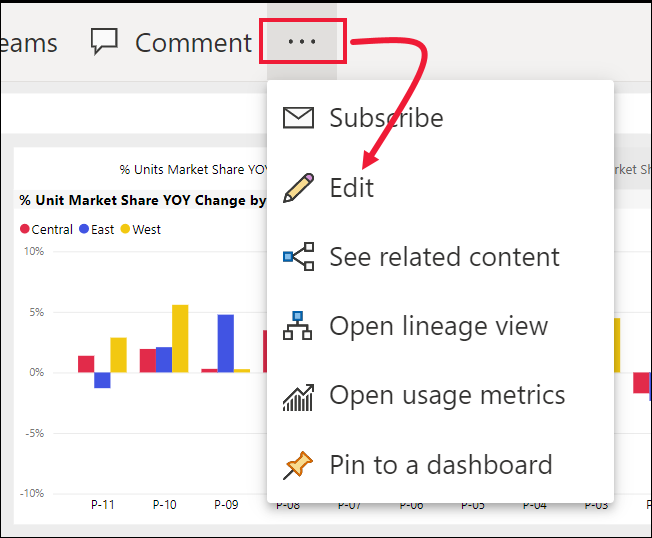

When the **Filters** and **Visualizations** panes appear along the right side of the report canvas, you’re ready to start customizing. If the panes do not appear, select the arrow, from the top-right corner, to open them.

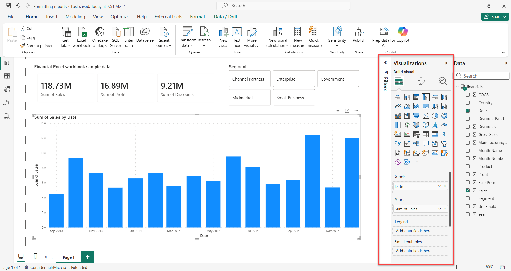

## Apply a theme
With report themes you can apply design changes to your entire report, such as using corporate colors, changing icon sets, or applying new default visual formatting. When you apply a report theme, all visuals in your report use the colors and formatting from your selected theme. To learn more, see [Use report themes](../create-reports/desktop-report-themes.md)

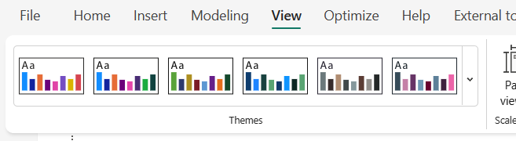

Here, we've applied the **Innovate** theme to the Sales and Marketing report.

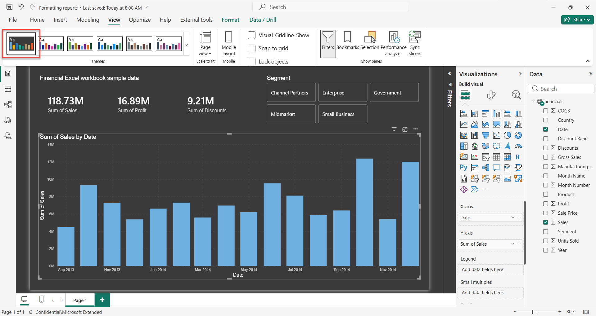

## Change the color of a single data point
Sometimes you want to highlight one particular data point. Perhaps it’s a sales figure for the launch of a new product, or increased quality scores after launching a new program. With Power BI, you can highlight a particular data point by changing its color.

The following visualization ranks units sold by product segment. 

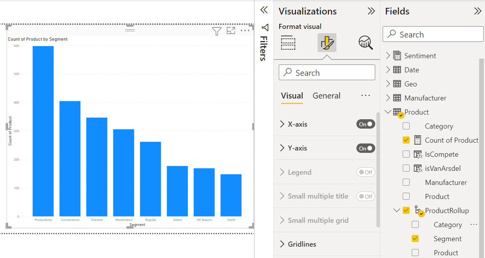

Now imagine you want to call out the **Convenience** segment to show how well this brand new segment is performing, by using color. Here are the steps:

Expand the **Data colors** card and turn the slider On for **Show all**. This displays the colors for each data element in the visualization. You can now modify any of the data points.

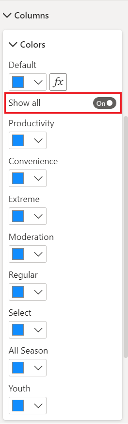

Set **Convenience** to orange. 

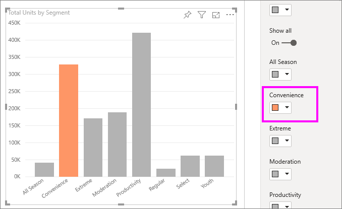

Once selected, the **Convenience** data point is a nice shade of orange, and certainly stands out.

Even if you change visualization types, then return, Power BI remembers your selection and keeps **Convenience** orange.

You can change the color of a data point for one, several, or all data elements in the visualization. Perhaps you want your visual to mimic your corporate colors of yellow, green, and blue. 

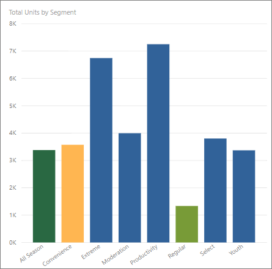

There are all sorts of things you can do with colors. In the next section, we take a look at conditional formatting.

## Conditional formatting for visualizations
Visualizations often benefit from dynamically setting color based on the numeric value of a field. By doing this, you could show a different value than what’s used for the size of a bar, and show two values on a single graph. Or you can use this to highlight data points over (or under) a certain value – perhaps highlighting areas of low profitability.

The following sections demonstrate different ways to base color on a numeric value.

### Base the color of data points on a value
To change color based on a value, select a visualization to make it active. Open the Formatting pane by selecting the paint roller icon and then choose the **Data colors** card. Below **Default color**, select the fx icon.  

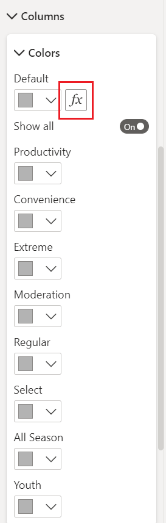

In the **Default color** pane, use the dropdowns to identify the fields to use for conditional formatting. In this example, we've selected the **Sales fact** > **Total Units** field and selected light blue for the **Lowest value** and dark blue for **Highest value**. 

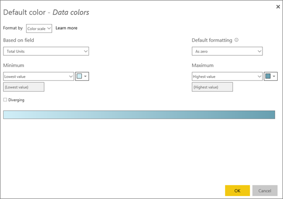

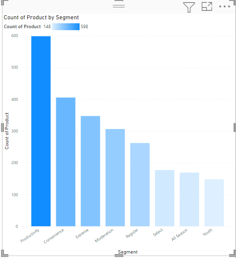

You can also format the color of the visual using a field that is not part of the visual. In the following image, **%Market Share SPLY YTD** is being used. 

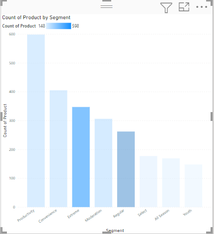

As you can see, although we've sold more units of both **Productivity** and **Extreme** (their columns are higher), **Moderation** has a larger **%Market Share SPLY YTD** (its column has more color saturation).

### Customize the colors used in the color scale
You can also change the way the values map to these colors. In the following image, the colors for **Minimum** and **Maximum** are set to orange and green, respectively.

In this first image, notice how the bars in the chart reflect the gradient shown in the bar; the highest value is green, the lowest is orange, and each bar between is colored with a shade of the spectrum between green and orange.

Now, let’s see what happens if we provide numeric values in the **Minimum** and **Maximum** value boxes. Select **Custom** from the dropboxes for both **Minimum** and **Maximum**, and set **Minimum** to 3,500, and set **Maximum** to 6,000.

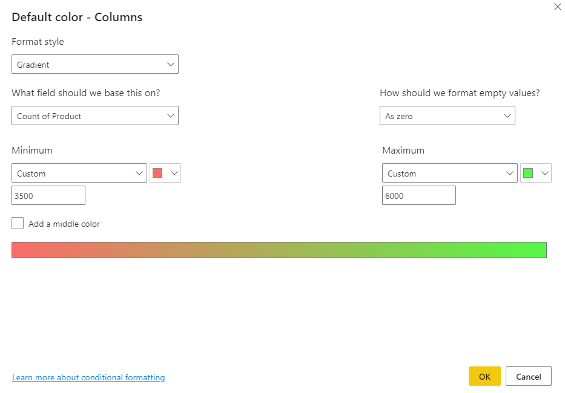

By setting those values, gradient is no longer applied to values on the chart that are below **Minimum** or above **Maximum**; any bar with a value over **Maximum** value is colored green, and any bar with a value under **Minimum** value is colored red.

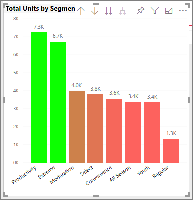

### Use diverging color scales
Sometimes your data may have a naturally diverging scale. For example, a temperate range has a natural center at freezing point, and a profitability score has a natural mid-point (zero).

To use diverging color scales, select the checkbox for  **Diverging**. When **Diverging** is turned on, an additional color selector, called **Center**, appears, as shown in the following image.

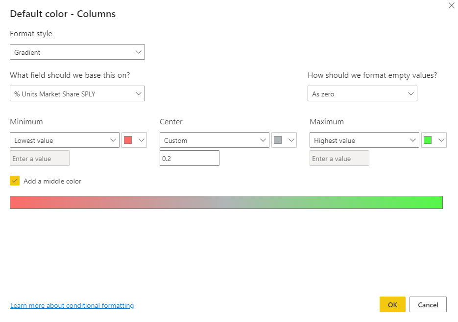

When the **Diverging** slider is on, you can set the colors for **Minimum**, **Maximum** and **Center** separately. In the following image, **Center** is set to .2 for **% Market Share SPLY YTD**, so bars with values above .2 are a gradient shade of green, and bars below one are shades of red.

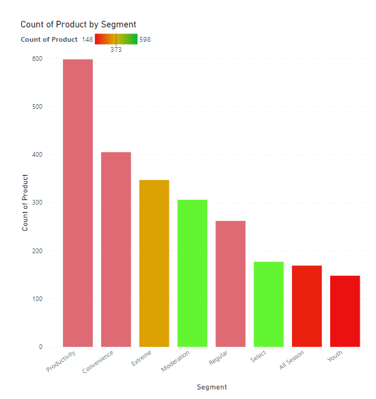

## Add color to table rows
Tables and matrixes offer many options for color formatting. 

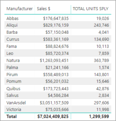

One of the quickest ways to apply color to a table or matrix is to open the Formatting tab and select **Style**.  In the image below, we've selected **Bold header flashy rows**.

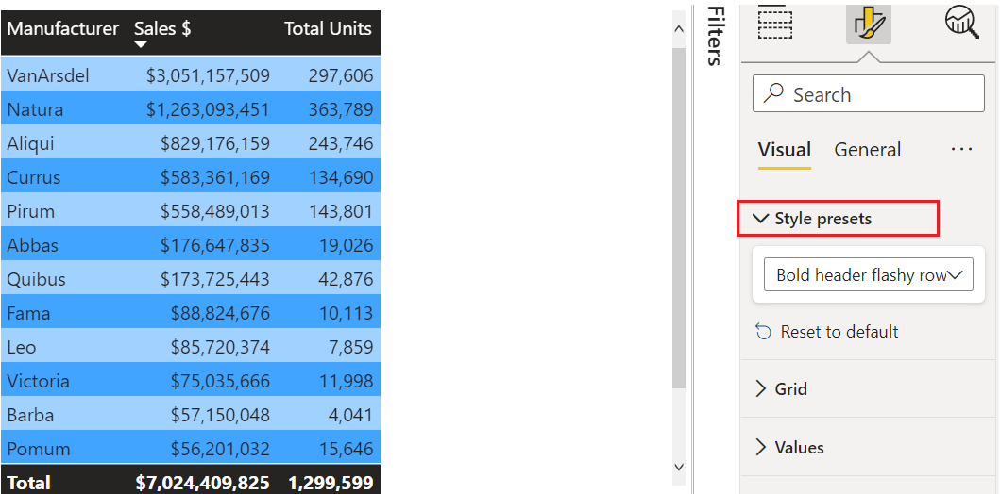

Experiment with other color formatting options. In this image, we've changed the background color under **Column headers** and changed both the **Background color** and **Alternate background color** for the **Values** (rows).

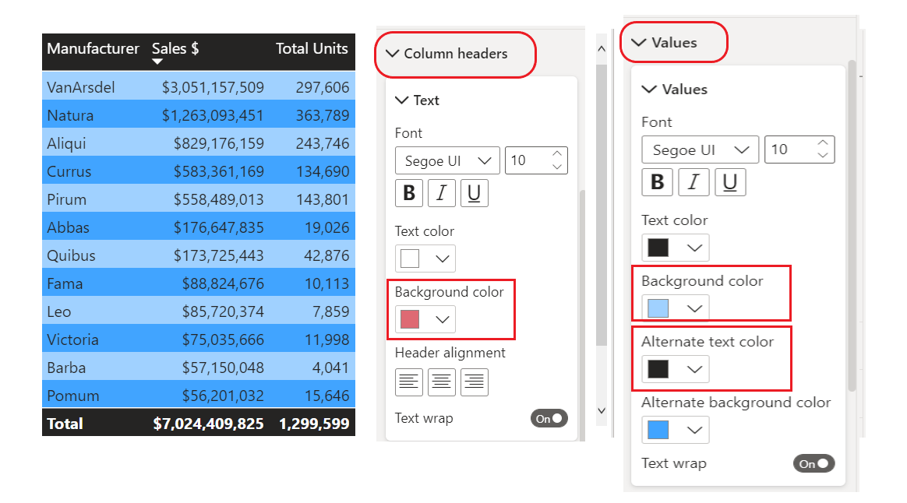

## How to undo in Power BI
Like many other Microsoft services and software, Power BI provides an easy way to undo your last command. For example, let’s say you change the color of a data point, or a series of data points, and you don’t like the color when it appears in the visualization. You don’t recall exactly which color it was before, but you know you want that color back!

To **undo** your last action, or the last few actions, all you have to do is type CTRL+Z.

To discard all the changes you made on a Formatting card, select **Revert to default**.

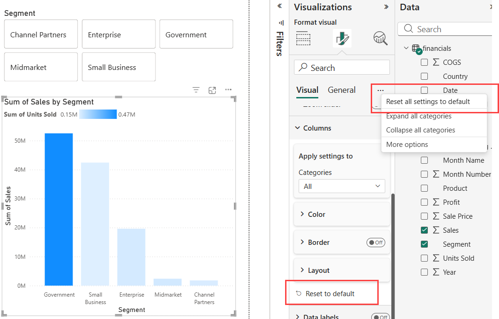

## Give us your feedback
Do you have a tip you’d like to share? Please send it our way, and we’ll see about including it here.

## Next steps
[Getting started with color formatting and axis properties](service-getting-started-with-color-formatting-and-axis-properties.md)

[Sharing reports](../collaborate-share/service-share-reports.md).

