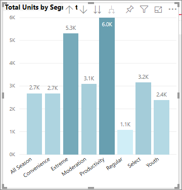
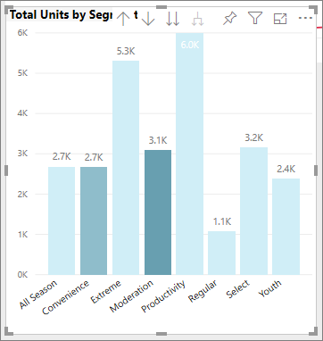
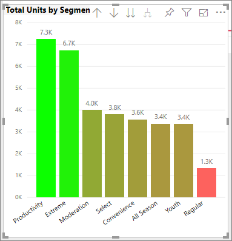
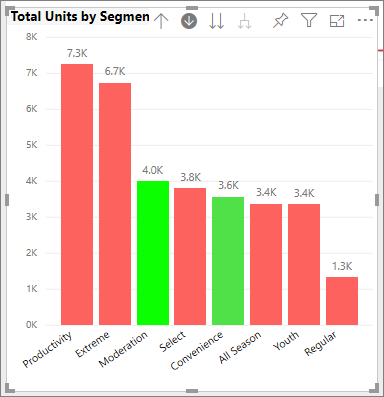

# Tips and tricks for color formatting in Power BI
Power BI provides many different ways to customize your dashboards and reports. This article details a collection of tips that can make your Power BI visualizations more compelling, interesting, and customized to your needs.

The following tips are provided. Have another great tip? Great! Send it our way and we’ll see about adding it to this list.

* Change the color of a single data point
* Base the colors of a chart on a numeric value
* Base the color of data points on a field value
* Customize colors used in the color scale
* Use diverging color scales
* How to undo in Power BI

To make any changes, you must be editing a report. Open the report and select **Edit Report** from the top menu area, as shown in the following image.

When the **Filters** and **Visualizations** panes appears along the right side of the report canvas, you’re ready to start customizing. If the pane does not appear, select the arrow, from the top right corner, to open it.

## Change the color of a single data point
Sometimes you want to highlight one particular data point. Perhaps it’s sales figures for the launch of a new product, or increased quality scores after launching a new program. With Power BI, you can highlight a particular data point by changing its color.

The following visualization ranks units sold by product segment. 

Now imagine you want to call out the **Convenience** segment to show how well this brand new segment is performing, by using color. Here are the steps:

Expand the **Data Colors** section and turn the slider On for **Show all**. This displays the colors for each data element in the visualization. When you hover over the data points, scrolling is enabled so you can modify any of the data points.

Set **Convenience** to orange. 

Once selected, the **Convenience** data point is a nice shade of orange, and certainly stands out.

Even if you change visualization types, then return, Power BI remembers your selection and keeps **Convenience** orange.

You can change the color of a data point for one, several, or all data elements in the visualization. Perhaps you want your visual to mimic your corporate colors. 

There are all sorts of things you can do with colors. In the next section, we take a look at gradients.

## Base the colors of a chart on a numeric value
Charts often benefit from dynamically setting color based on the numeric value of a field. By doing this, you could show a different value than what’s used to for the size of a bar, and show two values on a single graph. Or you can use this to highlight data points over (or under) a certain value – perhaps highlighting areas of low profitability.

The following sections demonstrate different ways to base color on a numeric value.

## Base the color of data points on a value
To change color based on a value, open the Formatting pane and select the **Conditional formatting** option.  

In the Defalt colors pane, use the dropdowns to identify the fields to use for conditional formatting. In this example, we've selected the **Sales fact** > **Total Units** field and selected light blue for the **Lowest value** and dark blue for **Highest value**. 

You can also format the color of the visual using a field that is not part of the visual. In the following image, **%Market Share SPLY YTD** is being used. 

As can see, although we've sold more units of both **Productivity** and **Extreme** (their columns are higher), **Moderation** has a larger **%Market Share SPLY YTD** (its column has more color saturation).

## Customize the colors used in the color scale
You can also change the way the values map to these colors. In the following image, the colors for **Minimum** and **Maximum** are set to orange and green, respectively.

In this first image, notice how the bars in the chart reflect the gradient shown in the bar; the highest value is green, the lowest is orange, and each bar between is colored with a shade of the spectrum between green and orange.

Now, let’s see what happens if we provide numeric values in the **Minimum** and **Maximum** value boxes. Let’s set **Minimum** to 3,500, and set **Maximum** to 6,000.

By setting those values, gradient is no longer applied to values on the chart that are below **Minimum** or above **Maximum**; any bar with a value over **Maximum** value is colored green, and any bar with a value under **Minimum** value is colored red.

## Use diverging color scales
Sometimes your data may have a naturally diverging scale. For example, a temperate range has a natural center at freezing point, and a profitability score has a natural mid-point (zero).

To use diverging color scales, select the option for  **Diverging**. When **Diverging** is turned on, an additional color selector, called **Center**, appears, as shown in the following image.

When the **Diverging** slider is on, you can set the colors for **Minimum**, **Maximum** and **Center** separately. In the following image, **Center** is set to .2 for **% Market Share SPLY YTD**, so bars with values above .2 are a gradient shade of green, and bars below one are shades of red.

## How to undo in Power BI
Like many other Microsoft services and software, Power BI provides an easy way to undo your last command. For example, let’s say you change the color of a data point, or a series of data points, and you don’t like the color when it appears in the visualization. You don’t recall exactly which color it was before, but you know you want that color back!

To **undo** your last action, or the last few actions, all you have to do is:

- Type CTRL+Z

## Feedback
Do you have a tip you’d like to share? Please send it our way, and we’ll see about including it here.

>[!NOTE]
>These color, axis, and related customizations, available when the **Format** icon is selected, are also available in Power BI Desktop.

## Next steps
[Getting started with color formatting and axis properties](service-getting-started-with-color-formatting-and-axis-properties.md)

