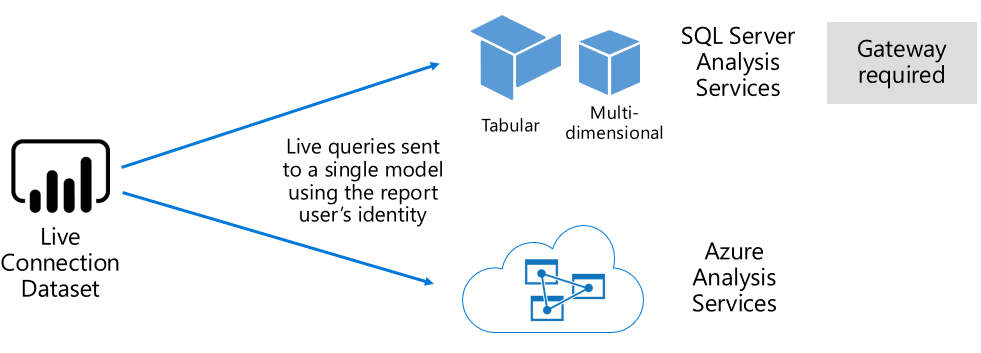
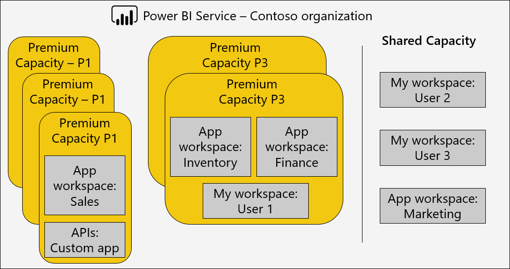
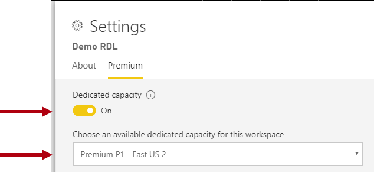
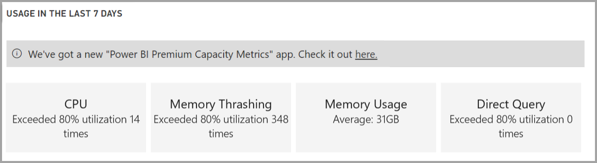
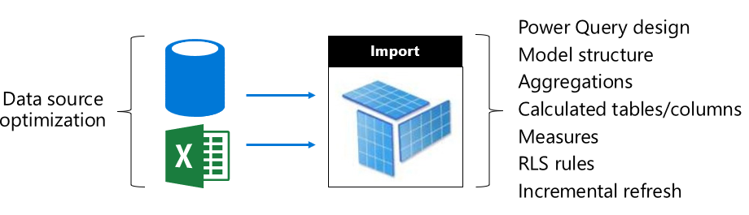
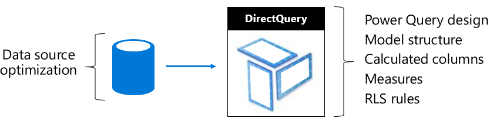
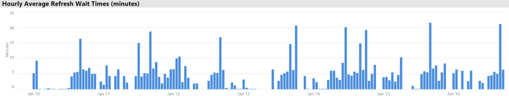
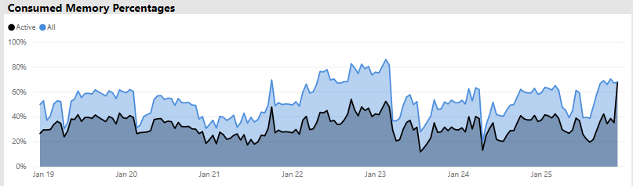
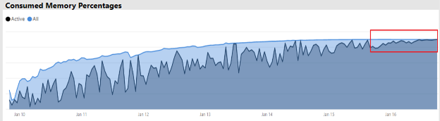

# Deploying and Managing Power BI Premium Capacities

**Summary:** Power BI Premium provides more consistent performance, support for large data volumes, and the flexibility of a unified self-service and enterprise BI platform for everyone in your organization. This level 300 technical whitepaper has been written specifically for Power BI administrators, and content authors and publishers. It aims to help them understand the potential of Power BI Premium, and to explain how to design, deploy, monitor and troubleshoot scalable solutions.

**Author:** [Peter Myers](https://www.linkedin.com/in/peterjsmyers) (Data Platform MVP, and independent BI expert with Bitwise Solutions)

**Technical Reviewers:** Adam Saxton, Akshai Mirchandani, Bhavik Merchant, David Magar, Josh Caplan, Michael Blythe, Nimrod Shalit, Olivier Matrat, Swati Gupta

**Applies to:** Power BI service, Power BI Premium and Azure Power BI Embedded capacities

> [!NOTE]
> You can save or print this whitepaper by selecting **Print** from your browser, then selecting **Save as PDF**.

## Introducing Power BI

Power BI is a business analytics service designed to deliver insights that enable fast, informed decisions. Since its release in 2015 it has quickly become a popular service used to deliver solutions for the smallest of organizations to the largest of enterprises.

It is made available in two ways: As a cloud service and as an on-premises reporting solution named **Power BI Report Server**. \[[1](#endnote-01)\]

Power BI as a cloud service is Software-as-a-Service (SaaS) \[[2](#endnote-02)\]. It represents a set of services and applications that enable organizations to develop, deploy, manage, share solutions to monitor their business.

It is not the intention of this whitepaper to provide a comprehensive description of the Power BI service. Instead, it focuses on topics relevant to the subject of Power BI Premium. For general information about Power BI, refer to the comprehensive [Power BI Documentation](service-admin-premium-multi-geo.md). For a more detailed explanation of the Power BI service with a focus on achieving well-performing enterprise deployments, refer to the comprehensive [Planning a Power BI Enterprise Deployment](https://aka.ms/pbienterprisedeploy) whitepaper.

Within the context of this whitepaper's subject, this section introduces and describes capacities, Power BI content types, model storage modes and licensing. An understanding of these topics is essential to successfully deploying and managing Power BI Premium.

### Capacities

**Capacities** are a core Power BI concept representing a set of resources (storage, processor and memory) used to host and deliver Power BI content. Capacities are either shared or dedicated. A **Shared Capacity** is shared with other Microsoft customers, while a **Dedicated Capacity** is fully committed to a single customer. Dedicated capacities are introduced in the [Premium Capacities](#premium-capacities) topic.

In shared capacity, workloads run on computational resources shared with other customers. As the capacity must share resources, limitations are imposed to ensure "fair play", such as the maximum model size (1 GB) and maximum daily refresh frequency (eight times per day).

### Workspaces

Power BI workspaces reside within capacities and they represent security, collaboration and deployment containers. Each Power BI user has a personal workspace known as **My Workspace**. Additional workspaces can be created to enable collaboration and deployment, and these are known as **App Workspaces**. By default, workspaces - including personal workspaces - are created in the shared capacity.

### Power BI Content Types

To introduce Power BI Premium topics, it is important to start with a thorough discussion of Power BI architecture including fundamental content types.

All Power BI content is stored and managed within workspaces which are containers for Power BI content. Each Power BI user has their own personal workspace, but the general best practice is to create app workspaces. App workspaces enable co-ownership of content and the ability to collaborate on content. They also provide the ability to stage and distribute content to wide audiences as apps.

The following Power BI content is stored in workspaces:

- Dataflows
- Datasets
- Workbooks
- Reports
- Dashboards

#### Dataflows

Power BI dataflows help organizations to unify data from disparate sources. They can be considered as data prepared and staged for use in models, however they cannot be used directly as a source for reporting. They leverage the extensive collection of Microsoft data connectors, enabling the ingestion of data from on-premises and cloud-based data sources.

Dataflows can only be created and managed in app workspaces, and they are stored as entities in the Common Data Model (CDM) in Azure Data Lake Storage Gen2. Typically, they are scheduled to refresh on a recurring basis to store up-to-date data.

For further information, refer to the [Self-service data prep in Power BI (Preview)](service-dataflows-overview.md) document.

#### Datasets

Power BI datasets represent a source of data ready for reporting and visualization. There are many types of datasets, created by:

- Connecting to an existing data model which is not hosted in a Power BI capacity
- Uploading a Power BI Desktop file that contains a model
- Uploading an Excel workbook (containing one or more Excel tables and/or a workbook data model) or uploading a Comma-Separated Value (CSV) file
- Using the Power BI service to create a push, streaming or hybrid streaming dataset

Except for streaming datasets \[[3](#endnote-03)\], the dataset represents a data model which leverages the mature modeling technologies of Analysis Services.

Note that in documentation, sometimes the terminologies datasets and models are interchangeable. Generally, from a Power BI service perspective it is referred to as a **dataset** , and from a development perspective it is referred to as a **model**. In the context of this whitepaper they mean much the same thing.

##### Externally-Hosted Models

Connecting to an externally-hosted model involves installing the [On-Premises Data Gateway](service-gateway-onprem.md) to connect to SQL Server Analysis Services, whether it is on-premises or VM-hosted Infrastructure-as-a-Service (IaaS). Azure Analysis Services does not require a gateway. This scenario often makes sense when existing model investments exist, typically forming part of the Enterprise Data Warehouse (EDW). It allows Power BI to perform a **Live Connection** (LC) to Analysis Services and does so by enforcing data permissions by using the identity of the Power BI report user. For SQL Server Analysis Services, both multidimensional models (cubes) and tabular models are supported. As shown in the following image, a Live Connection dataset passes queries to externally hosted models.

##### Power BI Desktop-Developed Models

Power BI Desktop - a client application intended for Power BI development - can be used to develop a model which is effectively an Analysis Services tabular model. Models can be developed by importing data from dataflows, which can then be integrated with other data sources. While the specifics on how modeling can be achieved is outside the scope of this whitepaper, it is important to understand that there are three different types - or modes - of models that can be developed by using Power BI Desktop. These modes determine whether data is imported into the model, or whether it remains in the data source. The three modes are: Import, DirectQuery, and Composite. A complete discussion of each mode will be covered in the [Model Storage Modes](#model-storage-modes) topic.

Externally-hosted models and models developed in Power BI desktop can enforce Row-Level Security (RLS) to limit the data that can be retrieved for a certain user. For example, users assigned to the Salespeople security group can only view report data for the sales region(s) to which they are assigned. RLS roles can be dynamic or static. **Dynamic roles** filter by the report user, while **static roles** apply the same filters for all users assigned to the role.

##### Excel Workbook Models

Creating datasets based on Excel workbooks or CSV files will result in the automatic creation of a model. Excel tables and CSV data will be imported to create model tables, while an Excel workbook data model will be transposed to create a Power BI model. In all cases, file data is imported into a model.

Distinctions, then, can be made about Power BI datasets that represent models:

- They are either hosted in the Power BI service, or are externally hosted by Analysis Services
- They can store imported data, or they can issue passthrough query requests to underlying data sources, or a mix of both

Here is a summary of important facts about Power BI datasets that represent models:

- SQL Server Analysis Services hosted models require a gateway to perform LC queries
- Power BI-hosted models that import data
  - Must be fully loaded into memory so that they can be queried
  - Require refresh to keep data current, and must involve gateways when source data is not accessible directly over the Internet
- Power BI-hosted models that use DirectQuery (DQ) storage mode require connectivity to the source data. When the model is queried, Power BI issues queries to the source data to retrieve current data. This mode must involve gateways when source data is not accessible directly over the Internet.
- Models may enforce RLS rules, enforcing filters to limit data access to certain users

To successfully deploy and manage Power BI Premium, it is important to understand where models are hosted, their storage mode, any dependencies on gateways, size of imported data, and refresh type and frequency. These can all have a significant impact on the Power BI Premium resources. In addition, the model design itself including its data preparation queries and calculations can add to the mix of considerations.

It is also important to understand that Power BI-hosted import models can refresh according to schedule or be triggered on-demand by a user in the Power BI service.

Designing optimized models is discussed later in this technical paper in the [Optimizing Models](#optimizing-models) topic.

#### Workbooks

Power BI workbooks are a Power BI content type \[[4](#endnote-04)\]. They are Excel workbooks that have been uploaded to the Power BI service, and should not be confused with uploaded Excel workbooks that create datasets (models). The workbook content type represents a connection to a workbook, which could either be uploaded to the Power BI service or remain in cloud storage on OneDrive or SharePoint Online.

It is important to understand that this content type is not available as a data source for Power BI data visualizations. Instead, it can be opened as a workbook in the Power BI service by using Excel Online. The main intention of this content type is to allow legacy Excel workbook reports to be accessible from within the Power BI service, and to allow its data visualizations to be pinned to Power BI dashboards.

For further information, refer to the [Get data from Excel workbook files](service-excel-workbook-files.md) document.

#### Reports

There are two types of reports: Power BI reports and paginated reports.

**Power BI reports** provide an interactive data visualization experiences which connects to only a single dataset. Reports are often designed to encourage user participation allowing them to interact with an extraordinary array of capabilities, including filtering, slicing, cross filtering and highlighting, drilling up, drilling down, drilling through, Q&A natural language questioning, focusing, page navigation, spotlighting, viewing bookmarks, and more.

In the context of this whitepaper, it is important to understand how the Power BI architecture, Power BI report design and user interactions can all impact on the Power BI service resources:

- To load and interact with reports based on import models, the model must be fully loaded into memory (whether hosted in the Power BI service or hosted externally)
- Each report visual issues a query to retrieve data by querying the model
- Generally, filter and slicer interactions involve querying the model. For example, changing a slicer selection will - by default - require reloading each visual on the page \[[5](#endnote-05)\]
- Power BI reports do not guarantee displaying current data, and may require the user to refresh the report to reload the report page and its visuals
- Users can engage with the Q&A natural language feature to ask questions, providing the Power BI report design permits it and the dataset represents a Power BI-hosted data import model or a LC dataset configured to enable Q&A

**Paginated reports** allowing the publication and rendering of SQL Server Reporting Services (SSRS) reports (\*.rdl format). As their name suggests, paginated reports are commonly used when requirements dictate a need for printing to a fixed page size, or when there are variable lists of data that must be fully expanded. For example, an invoice designed for multi-page rendering (rather than scrolling within a visual) and printing.

The two supported report types provide choice for report authors, allowing them to select the type based on requirements and intended use. Generally, Power BI reports are ideal for interactive experiences allowing the user to explore and discover insights from data, while paginated reports are better suited to parameter-driven page layouts.

Regardless of report type, achieving responsive report load and data updates (when filters or parameters are changed) is imperative to delivering a reliable and well-performing user experience.

#### Dashboards

Power BI dashboards are intended to deliver monitoring experiences and are conceptually very different from Power BI reports. Dashboards are designed for display on a single pane of glass to express values and data visualizations in tiles. Generally, dashboards offer fewer interaction experiences than Power BI reports, with some dashboard designs expecting no interaction. For example, an unattended dashboard presented on a non-touch screen in a server room. Another significant difference is that dashboards may present tiles that source data from multiple datasets, while a Power BI report can only ever be based on a single dataset.

It is important to understand that a dashboard is designed to load quickly and to express the most current data (known to the Power BI service) at all times. It achieves this by caching tile query results, and it does this for each dashboard. In fact, it must do this for each user that has access to a dashboard that is based on models that enforce dynamic RLS.

The Power BI service automatically updates dashboard query caches immediately after Power BI-hosted import models are refreshed. In the case of LC and DQ models, the dataset owner has a degree of control over how often the Power BI service updates the cache, which can be configured as frequently as every 15 minutes, or as infrequently as once a week. Note that LC query cache updates will first query model metadata to determine whether a model refresh has taken place since the last cache update, and it will not proceed to update the cache when a refresh has not since occurred. This check is not possible for DQ models, and so cache updates will happen whether the source data has changed or not.

Dashboard query cache updates based on DQ and LC models can significantly impact on both Power BI service resources and external data sources. Consider a dashboard with 20 tiles, all based on an Azure Analysis Services model that enforces dynamic RLS and that is refreshed every hour, and that this dashboard is shared with 100 users. If the dataset is configured to refresh every hour, this would result in at least 2000 (20 x 100) LC queries. This could place an enormous load on the Power BI service and external data sources, and it could also exceed limits imposed on available resources. Capacity resources and limits are described in the [Capacity Nodes](#capacity-nodes) topic.

Users can interact with a dashboard in various ways, which require Power BI service resources. Specifically, they can:

- Trigger a refresh of dashboards tiles, which can result in an on-demand refresh of all related Power BI-hosted data import models
- Engage with the Q&A natural language feature to ask questions (providing the dashboard design permits it and the dataset is a Power BI-hosted data import model or a LC dataset configured to enable Q&A)
- Use the Quick Insights feature to have Power BI discover insights from an underlying dataset, and respond with visuals that display and describe them (providing that the tile is based on a dataset that is Power BI-hosted data import model)
- Configure alerts on dashboard tiles, requiring the Power BI service to compare thresholds to tile values - possibly as frequently as hourly - and to notify users when thresholds are exceeded (providing that the tile displays a single numeric value and is based on a dataset that is Power BI-hosted data import model)

### Model Storage Modes

Recall that Power BI Desktop allows developing a model in one of three modes. It is important to understand the rationale for each data model storage mode and possible impacts on Power BI service resources. This section introduces all three modes. These will be discussed in further detail later in this whitepaper in the Optimizing Models topic.

#### Import Mode

Import mode is the most common mode used to develop models because of the extremely fast performance associated with in-memory querying, the design flexibility available to modelers, and support for specific Power BI service capabilities (Q&A, Quick Insights, etc.). It is the default mode when creating a new Power BI Desktop solution.

It is important to understand that imported data is always stored to disk and must be fully loaded into memory to be queried or refreshed. Once in memory, import models achieve blazingly fast query results. It is also important to understand that there is no concept of an import model being partially loaded into memory.

When refreshed, data is compressed and optimized and then stored to disk by the VertiPaq storage engine. When loaded from disk into memory, it is possible to see 10x compression, and so it is reasonable to expect that 10 GB of source data can compress to about 1 GB in size. Storage size on disk can achieve a 20% reduction on top this. \[[6](#endnote-06)\]

Design flexibility can be achieved in three ways. Data modelers can:

- Integrate data by caching data from multiple data sources - regardless of data source type and format
- Leverage the entire set of Power Query Formula Language (informally referred to as M) functions when creating data preparation queries
- Leverage the entire set of Data Analysis Expressions (DAX) functions when enhancing the model with business logic, achieved with calculated columns, calculated tables and measures

As shown in the following image, an Import model can integrate data from any number of supported data source types.

However, while there are compelling advantages associated with import models, there are disadvantages too:

- The entire model must be loaded to memory before Power BI can query the model, which can place pressure on available resources as the number and size of models grow
- Model data is only as current as the latest refresh, and so import models need to be refreshed, preferably on a scheduled basis
- A full refresh will remove all data from all tables and reload it from the data source. This can be very expensive in terms of time and resources for the Power BI service and the data source(s). Power BI does have support for incremental refresh which can avoid truncating and reloading entire tables, and this is covered in the [Optimizing Power BI-Hosted Models](#optimizing-power-bi-hosted-models) topic.

From a Power BI service resource perspective, import models require:

- Sufficient memory to load the model when it is queried or refreshed
- Processing resources and additional memory resources to refresh data

#### DirectQuery Mode

Models developed in DirectQuery (DQ) mode do not import data. Instead, they consist only of metadata that when queried issues native queries to the underlying data source.

There are two main reasons to consider developing a DQ model. The first reason is when data volumes are too large - even when data reduction methods are applied - to load into a model or practically refresh. The second reason is when reports and dashboards need to deliver "near real-time" data, beyond what can be achieved within scheduled refresh limits (48 times a day for a dedicated capacity).

There are several advantages associated with DQ models:

- Import model size limits do not apply
- Models do not require refresh
- Report users will see the latest data when interacting with report filters and slicers, and can refresh the entire report to retrieve current data
- Dashboard tiles, when based on DQ models, can update automatically as frequently as every 15 minutes

However, there are numerous disadvantages and limitations associated with DQ models:

- The model must be based on a single supported data source, and therefore any data integration must already be achieved in the data source. Supported data sources are relational and analytic systems, with support for many popular data stores \[[7](#endnote-07)\].
- Performance can be slow, potentially negatively impacting on the Power BI service (queries can be very CPU-intensive) and on the data source (which may not be optimized for analytic queries)
- Power Query queries cannot be overly complex, and are limited to M expressions and functions that can be transposed to native queries understood by the data source
- DAX functions are limited to those that can be transposed to native queries understood by the data source, and there is no support for calculated tables or built-in Time Intelligence capabilities
- By default, model queries that require retrieval of more than one million rows will fail
- Reports and dashboards with multiple visuals can display inconsistent results, especially when the data source is volatile
- Q&A and Quick Insights are not supported

From a Power BI service resource perspective, DQ models require:

- Minimal memory to load the model (metadata only) when it is queried
- Sometimes significant processor resources to generate and process queries sent to the data source

For further information, refer to the [Use Direct Query in Power BI Desktop](desktop-use-directquery.md) document.

#### Composite Mode

Models developed in Composite mode allow configuring the storing mode for individual model tables. It therefore supports a mix of import and DQ tables. It also supports calculated tables (defined with DAX) and multiple DQ data sources.

Table storage mode can be configured as Import, DirectQuery or Dual. A table configured as Dual storage mode is both Import and DirectQuery, and this allows the Power BI service to determine the most efficient mode to use on a query by query basis.

Composite models strive to deliver the best of Import and DirectQuery modes. When configured appropriately they can combine high query performance of in-memory models with the ability to retrieve near real-time data from data sources.

Data modelers who develop Composite models are likely to configure dimension-type tables in Import or Dual storage mode and fact-type tables in DirectQuery mode. For example, consider a model with a Product dimension-type table in Dual mode and a Sales fact-type table in DirectQuery mode. The Product table could be efficiently and quickly queried from in-memory to render a report slicer. The Sales table could then be queried in DirectQuery mode joined to the related Product table. The latter query could enable the generation of a single efficient native query to join Product and Sales tables and filtering by the slicer values.

In general, the advantages and disadvantages, associated with each model mode can be considered to apply to table storage mode in Composite models.

For further information, refer to the [Use composite models in Power BI Desktop](desktop-composite-models.md) document.

### Licensing

Power BI has three licenses:

- Power BI Free
- Power BI Pro
- Power BI Premium

The **Power BI Free** license allows an individual to sign in to the Power BI service and work within their personal workspace by publishing models and reports. It is important to understand that it is not possible to share Power BI content by using this license. This license, as its name suggests, is free.

The **Power BI Pro** license allows an individual to create and collaborate within app workspaces and share and distribute Power BI content. They can also configure refresh for their datasets to automatically keep data current, including from on-premises data sources. In addition, they can audit and govern how data is accessed and used. This license is required to receive shared content from others unless the user is associated with a Power BI Premium dedicated capacity.

The **Power BI Premium** license is a tenant-level license, and it is discussed in the [Introducing Power BI Premium](#introducing-power-bi-premium) section.

For further information about Power BI licensing, refer to the [Power BI Pricing](https://powerbi.microsoft.com/pricing/) page.

## Introducing Power BI Premium

Power BI Premium delivers a unified self-service and enterprise BI platform with scale, dependable performance, and predictable costs. It primarily achieves this by providing dedicated resources to run the Power BI service for your organization.

In addition, Power BI Premium delivers many enterprise features:

- Cost-effective content distribution, enabling the sharing of Power BI content to unlimited Power BI Free users, including external users
- Support for larger dataset sizes \[[8](#endnote-08)\]
- Higher refresh rates of dataflows and datasets (up to 48 times per day)
- Incremental refresh of dataflows and datasets
- Dataflow linked entities, and parallel execution of transforms
- Paginated reports
- Power BI Report Server, for on-premises reporting
- Ability to embed content in apps on behalf of app users (PaaS)

Many of these features can be leveraged to deliver efficient and scalable enterprise solutions and are covered in the [Optimizing Premium Capacities](#optimizing-premium-capacities) section.

### Subscriptions and Licensing

Power BI Premium is a tenant-level Office 365 subscription available in two SKU (Stock-Keeping Unit) families:

- **EM** SKUs (EM1-EM3) for embedding, requiring a yearly commitment, billed monthly
- **P** SKUs (P1-P3) for embedding and enterprise features, requiring a monthly or yearly commitment, billed monthly, and includes a license to install Power BI Report Server on-premises

An alternative approach is to purchase an Azure Power BI Embedded subscription which has a single SKU family: **A** SKUs (A1-A6) for embedding and capacity testing purposes only.

All SKUs deliver v-cores to create capacities \[[9](#endnote-09)\], but the EM SKUs are restricted for smaller scale embedding. While the focus of this whitepaper is on the P SKUs, much of what is discussed is also relevant also to the A SKUs.

In contrast to the Premium subscription SKUs, Azure SKUs require no time commitment and are billed hourly. They deliver full elasticity enabling scale up, scale down, pause, resume and delete.

Azure Power BI Embedded is largely out of scope for this whitepaper, but it is discussed in the Testing Approaches topic as a practical and economic option to test and measure workloads.

For further information about the Azure SKUs, refer to the [Azure Power BI Embedded Documentation](/azure/power-bi-embedded/).

Power BI Premium subscriptions are purchased by administrators in the Microsoft 365 admin center. Specifically, only Office 365 Global Administrators or Billing Administrators can purchase SKUs.

Once purchased, the tenant receives a corresponding number of v-cores to assign to capacities - this is known as **v-core pooling**. For example, purchasing a P3 SKU provides the tenant with 32 v-cores.

For further information, refer to the [How to purchase Power BI Premium](service-admin-premium-purchase.md) document.

### Premium Capacities

In contrast to a shared capacity where workloads run on computational resources shared with other customers, a **dedicated capacity** is for exclusive use by an organization. It is isolated with dedicated computational resources which provide dependable and consistent performance for hosted content.

The focus of this whitepaper is **Premium capacity** , meaning it is associated with any of the EM or P SKUs.

#### Capacity Nodes

As described in the Subscriptions and Licensing topic, there are two Power BI Premium SKU families: EM and P. All Power BI Premium SKUs are available as capacity nodes, with each representing a set amount of resources consisting of processor, memory and storage. In addition to resources, each SKU has operational limits on the number of DirectQuery (DQ) and Live Connection (LC) connections per second and the number of parallel model refreshes.

Processing is achieved by a set number of v-cores, divided equally between backend and frontend.

**Backend v-cores** are responsible for core Power BI functionality, including query processing, cache management, running R services, model refresh, natural language processing (Q&A), and server-side rendering of reports and images. Backend v-cores are assigned a fixed amount of memory which is primary used to host models which are also referred to as active datasets.

**Frontend v-cores** are responsible for the web service, dashboard and report document management, access rights management, scheduling, APIs, uploads and downloads, and generally for everything relating to the user experiences.

Storage is set to 100 TB per capacity node.

The resources and limits of each Premium SKU (and equivalently sized A SKU) are described in the following table.

| Capacity Nodes | Total v-cores | Backend v-cores | RAM (GB) | Frontend v-cores | DQ/LC (per sec) | Model Refresh Parallelism |
| --- | --- | --- | --- | --- | --- | --- |
| EM1/A1 | 1 | 0.5 | 2.5 | 0.5 | 3.75 | 1 |
| EM2/A2 | 2 | 1 | 5 | 1 | 7.5 | 2 |
| EM3/A3 | 4 | 2 | 10 | 2 | 15 | 3 |
| P1/A4 | 8 | 4 | 25 | 4 | 30 | 6 |
| P2/A5 | 16 | 8 | 50 | 8 | 60 | 12 |
| P3/A6 | 32 | 16 | 100 | 16 | 120 | 24 |
| | | | | | | |

#### Capacity Workloads

Capacity workloads are services made available to users. By default, Premium and Azure capacities support only a dataset workload associated with running Power BI queries which cannot be disabled.

Additional workloads can be enabled for paginated reports, dataflows, and AI. Each additional workload requires configuring the maximum memory (as a percentage of total available memory) that can be used by the workload.

#### How Capacities Function

At all times, the Power BI service strives to make the best use of capacity resources while not exceeding limits imposed on the capacity.

Capacity operations are classified as either interactive or background. Interactive operations include rendering requests and responding to user interactions (filtering, Q&A querying, etc.). Generally, import model querying is memory resource-intensive, while querying LC/DQ models is CPU-intensive. Background operations include dataflow and import model refreshes, and dashboard query caching.

It is important to understand that interactive operations are always prioritized over background operations to ensure the best possible user experience. If there are insufficient resources, background operations are added to a queue for processing when resources free up. Background operations, like dataset refreshes and AI functions, can be stopped mid-process by the Power BI service and added to a queue.

Import models must be fully loaded into memory so that they can be queried or refreshed. The Power BI service manages memory usage by using sophisticated algorithms to ensure maximum use of available memory, and can achieve overcommitting the capacity: While it is possible for a capacity to store many import models (up to 100 TB per Premium capacity), when their combined disk storage exceeds the supported memory (and additional memory is required for querying and refresh), then they cannot all be loaded into memory at the same time.

Import models are therefore loaded into - and removed from - memory according to usage. An import model is loaded when it is queried (interactive operation) and not yet in memory, or when it is to be refreshed (background operation).

The removal of a model from memory is known as **eviction** , and it is an operation that Power BI can perform quickly depending on the size of the models. If the capacity is not experiencing any memory pressure, models are simply loaded into memory and remain there. \[[10](#endnote-10)\] However, when insufficient memory is available to load a model, the Power BI service will first need to free up memory. It frees up memory by detecting models that have become inactive by seeking models which have not been used in the last three minutes \[[11](#endnote-11)\], and then evicting them. If there are no inactive models to evict, the Power BI service seeks to evict models loaded for background operations. This may include the eviction of background workloads like the AI workload. A last resort, after 30 seconds of failed attempts \[[11](#endnote-11)\], is to fail the interactive operation. In this case, the report user is gracefully notified of failure with a suggestion to try again shortly.

It is important to stress that dataset eviction is a normal and expected behavior. It strives to maximize memory usage by loading and unloading models whose combined sizes can exceed available memory. This is by design, and completely transparent to report users. High eviction rates do not necessarily mean the capacity is insufficiently resourced. They can, however, become a concern if query or refresh responsiveness is suffering because of high eviction rates.

Refreshes of import models are always memory intensive as models must be loaded into memory and additional memory is required for the processing. A full refresh can use approximately double the amount of memory required by the model. This ensures that the model can be queried even when being processed (queries are sent to the existing model, until the refresh has completed, and the new model data is available). Note, incremental refresh will require less memory and could complete faster, and so can substantially reduce pressure on capacity resources. Refreshes can also be CPU-intensive for models, especially those with complex Power Query transformations, or calculated tables/columns that are complex or are based on large tables.

Refreshes - like queries - require that the model be loaded into memory. If there is insufficient memory, the Power BI service will attempt to evict inactive models, and if this is not possible (as all models are active), the refresh job is queued. Refreshes are typically very CPU-intensive, even more so than queries. For this reason, there are capacity limits on the number of concurrent refreshes, set to 1.5 x the number of backend v-cores, rounded up. If there are too many concurrent refreshes, a scheduled refresh will be queued. When these situations occur, it takes longer for the refresh to complete. Note that on-demand refreshes (triggered by a user request or API call) will retry three times \[[11](#endnote-11)\], and then fail if there are still not enough resources.

## Managing Power BI Premium

Managing Power BI Premium involves purchasing subscriptions, and creating, managing and monitoring Premium capacities.

### Creating and Managing Capacities

The **Capacity Settings** page of the **Power BI Admin** Portal displays the number of v-cores purchased and available (i.e. yet to be assigned to a capacity) and lists Premium capacities. The page allows Office 365 Global Administrators or Power BI service administrators to create Premium capacities from available v-cores, or to modify existing Premium capacities.

When creating a Premium capacity, the administrator is required to define:

- Capacity name (unique within the tenant)
- Capacity admin(s)
- Capacity size
- Region for data residency \[[12](#endnote-12)\]

At least one Capacity Admin must be assigned. Users assigned as Capacity Admins can:

- Assign workspaces to the capacity
- Manage user permissions, to add additional Capacity Admins or users with assignment permissions (to enable them to assign workspaces to the capacity)
- Manage workloads, to configure maximum memory usage for paginated reports and dataflows workloads
- Restart the capacity, to reset all operations in case of system overload \[[13](#endnote-13)\]

Capacity Admins cannot access workspace content (unless explicitly assigned workspace permissions) and they do not have access to all Power BI admin areas (unless explicitly assigned) such as usage metrics, audit logs or tenant settings. Importantly, Capacity Admins do not have permissions to create new capacities or scale existing capacities. Also, they are assigned on a per capacity-basis, ensuring that they can only view and manage capacities to which they are assigned.

Capacity size must be selected from an available list of SKU options which is constrained by the number of available v-cores in the pool. It is possible to create multiple capacities from the pool which could be sourced from one or more purchased SKUs. For example, a P3 SKU (32 v-cores) could be used to create three capacities: one P2 (16 v-cores), and two P1 (2 x 8 v-cores). Improved performance and scale may be achieved by creating smaller sized capacities, and this topic is discussed in the [Optimizing Premium Capacities](#optimizing-premium-capacities) section. The following image shows an example setup for the fictitious Contoso organization consisting of five Premium capacities (3 x P1, and 2 x P3) with each containing app workspaces, and several workspaces in shared capacity.

A Premium capacity can be assigned to a region other than the home region of the Power BI tenant, providing administrative control over which datacenters (within defined geographic regions) Power BI content resides. \[[12](#endnote-12)\]

Power BI service administrators and Office 365 Global Administrators can modify Premium capacities. Specifically, they can:

- Change the capacity size to scale up or scale down resources. However, it is not possible to downgrade a P SKU to an EM SKU, or upgrade vice versa.
- Add or remove Capacity Admins
- Add or remove users that have assignment permissions
- Add or remove additional workloads
- Change regions

Assignment permissions are required to assign a workspace to a specific Premium capacity. The permissions can be granted to the entire organization, specific users or groups.

By default, Premium capacities support workloads associated with running Power BI queries. It also supports three additional workloads: **Paginated Reports**, **Dataflows**, and **AI**. Each workload requires configuring the maximum memory (as a percentage of total available memory) that can be used by the workload. It is important to understand that increasing maximum memory allocations can impact on the number of active models that can be hosted, and the throughput of refreshes.

Memory is dynamically allocated to dataflows, but it is statically allocated to paginated reports. The reason for statically allocating the maximum memory is that paginated reports run within a secured contained space of the capacity. Care should be taken when setting paginated reports memory as it reduces available memory for loading models.

|                     | EM3                      | P1                       | P2                      | P3                       |
|---------------------|--------------------------|--------------------------|-------------------------|--------------------------|
| Paginated reports | N/A | 20% default; 10% minimum | 20% default; 5% minimum | 20% default; 2.5% minimum |
| Dataflows | 20% default; 8% minimum  | 20% default; 4% minimum  | 20% default; 2% minimum | 20% default; 1% minimum  |
| AI | N/A | 20% default; 20% minimum  | 20% default; 10% minimum | 20% default; 5% minimum  |
| | | | | |

Deleting a Premium capacity is possible and will not result in the deletion of its workspaces and content. Instead, it will move any assigned workspaces to shared capacity. When the Premium capacity was created in a different region, the workspace will be moved to shared capacity of the home region.

### Assigning Workspaces to Capacities

Workspaces can be assigned to a Premium capacity in the **Power BI Admin**  **Portal** or - for an app workspace - in the **Workspace** pane.

Capacity Admins, as well as Office 365 Global Administrators or Power BI service administrators, can bulk assign workspaces in the **Power BI Admin**  **Portal**. Bulk assigned can apply to:

- **Workspaces by users** : All workspaces owned by those users, including personal workspaces, are assigned to the Premium capacity. This will include the re-assignment of workspaces when they are already assigned to a different Premium capacity. In addition, the users are also assigned workspace assignment permissions.

- **Specific workspaces**
- **The entire organization's workspaces** : All workspaces, including personal workspaces, are assigned to the Premium capacity. In addition, all current and future users are assigned workspace assignment permissions. \[[14](#endnote-14)\]

A workspace can be added to a Premium capacity by using the **Workspace** pane providing the user is both a workspace admin and has assignment permissions.

Workspace admins can remove a workspace from a capacity (to shared capacity) without requiring assignment permission. Removing workspaces from dedicated capacities effectively relocates the workspace to shared capacity. Note that removing a workspace from a Premium capacity may have negative consequences resulting, for example, in shared content becoming unavailable to Power BI Free licensed users, or the suspension of scheduled refresh when they exceed the allowances supported by shared capacities.

In the Power BI service, a workspace assigned to a Premium capacity is easily identified by the diamond icon that adorns the workspace name.

### Monitoring Capacities

Monitoring Premium capacities provides administrators with an understanding of how the capacities are performing. Capacities can be monitored by using the **Power BI Admin**  **Portal** or the **Power BI Premium Capacity Metrics** (Power BI) app.

#### Power BI Admin Portal

The **Power BI Admin**  **Portal** allows monitoring of four summary tiles which report on loads placed on the capacity resources. The four summary tiles are:

- **CPU** : Number of times CPU exceeded 80% utilization
- **Memory Thrashing** : Number of times exceeded 80%, representing memory pressure on the backend v-cores. Specifically, it is a measure of how many times a dataset was evicted from memory due to memory pressure and the demand for more active datasets.
- **Memory Usage** : Average memory usage (in GB)
- **Direct Query** : Number of times DQ and LC queries - measured per second - exceeded 80% of the limit

Tile values are calculated over an hourly time window to indicate how many hours in the past seven days corresponded to the metric threshold. It is important to understand that exceeding a threshold is not necessarily a dire situation, but possibly an indication of performance degradation.

By clicking on a summary tile, it is possible to clickthrough to a report to view the metric as a line chart over the past seven days. The data presented in the chart is a summary of hourly results that can help you to determine a general understanding of what was taking place at a specific hour.

The monitoring capabilities in the **Power BI Admin** Portal are basic and are designed to provide a quick understanding of key system metrics. For more detailed monitoring, it is recommended that you use the **Power BI Premium Capacity Metrics** app.

#### Power BI Premium Capacity Metrics App

The **Power BI Premium Capacity Metrics** app is a Power BI app available to Capacity Admins and is installed like any other Power BI app \[[15](#endnote-15)\]. It contains a dashboard and report.

When the app opens, the dashboard is loaded to present numerous tiles expressing an aggregated view over all capacities of which the user is a Capacity Admin. The dashboard layout includes the following main sections:

- **Overview**: App version, number of capacities and workspaces
- **System Summary**: Memory and CPU metrics
- **Dataset Summary**: Number of datasets, DQ/LC, refresh and query metrics
- **Dataflow Summary**: Number of dataflows, and dataset metrics
- **Paginated Report Summary**: Refresh and view metrics
- **AI Summary**: Number of operations, and dataset metrics

The underlying report (from which the dashboard tiles were pinned) can be accessed by clicking on any dashboard tile. It provides a more detailed perspective of each of the dashboard sections and supports interactive filtering. Filtering can be achieved by setting slicers by date range, capacity, workspace and workload (report, dataset, dataflow), and by selecting elements within report visuals to cross filter the report page. Cross filtering is a powerful technique to narrow down to specific time periods, capacities, workspaces, datasets, etc. and can be very helpful when performing root cause analysis.

The report consists of the following pages:

- **Datasets**: Displays detailed metrics on dataset health. Button selection reveals different perspectives: Summary, Refreshes, Query Durations, Query Waits and Datasets
- **Paginated Reports**: Displays detailed metrics on paginated report health
- **Dataflows**: Displays detailed metrics on dataflow health
- **AI**: Displays detailed metrics on the AI workload health
- **System**: Displays overall capacity metrics, including memory and CPU utilization
- **Display Names and IDs**: Displays names, IDs, and owners for capacities, workspaces and workloads

The reports pages include different perspectives accessible by clicking buttons. Report visuals allow monitoring metrics over time to compare them against system resource usage.

This whitepaper will not describe each page and perspective. Instead, it lists the metrics available in the report together with their purpose. The report presents many pages and visuals based on the following metrics, first by resource, as shown in the following tables.

##### Entities (of which the user is a Capacity Admin)

| Metric | Description |
| --- | --- |
| Capacities | Number of capacities |
| Workspaces | Number of workspaces in your capacities that are reporting metrics over the past seven days |
| Datasets | Number of datasets in all workspaces in your capacities |
| Dataflows | Number of dataflows in all workspaces in your capacities |
| Paginated reports | Number of paginated reports in all workspaces in your capacities |
| |

##### Memory

| Metric | Description |
| --- | --- |
| Average memory | Average memory usage over the past seven days (in GB) |
| Average memory by workloads: datasets, dataflows, paginated reports | Average memory usage over the past seven days (in GB) by workloads: datasets, dataflow, paginated reports |
| Highest utilization | Maximum memory consumption (in GB) over the past seven days, split into three-minute interval in 1-hour buckets |
| |

##### CPU

| Metric | Description |
| --- | --- |
| High utilization count | Number of times CPU exceeded 80% of the thresholds in the past seven days, split into 3-minute intervals in 1-hour buckets |
| |

##### DQ/LC connections

| Metric | Description |
| --- | --- |
| High utilization count | Number of times DQ/LC connections exceeded 80% of the thresholds in the past seven days, split into 3-minute intervals in 1-hour buckets |
| |

The following tables show workload-related metrics.

##### Dataset refresh

| Metric | Description |
| --- | --- |
| Refreshes | Number of refreshes in the past seven days |
| Successful refreshes | Number of successful refreshes in the past seven days |
| Failed refreshes | Number of failed refreshes in the past seven days |
| Average refresh duration | Average refresh duration in minutes in the past seven days |
| Maximum refresh duration | The duration of the longest running refresh in minutes |
| Average wait time | Average refresh wait time (lag between the scheduled time and start time) in minutes \[[16](#endnote-16)\] |
| Maximum wait time | Maximum refresh wait time (lag between the scheduled time and start time) in minutes |
| Refresh reliability | Percentage of refreshes that completed by in the past seven days |
| |

##### Dataset queries

| Metric | Description |
| --- | --- |
| Queries | Number of queries run in the past seven days |
| Successful queries | Number of successful queries run in the past seven days |
| Failed queries | Number of failed queries run in the past seven days |
| Average query duration | Average query duration (in ms) in the past seven daysCan be used to determine hourly query distribution together with memory consumption, split into 1-hour buckets |
| Maximum query duration | Maximum query duration (in ms) in the past seven days |
| Query wait count | Number of queries which experienced some wait time or last 7 days |
| Average query wait time | Average query wait time (in ms) over the past seven daysCan be used to determine hourly query wait time distribution together with memory consumption, split into 1-hour buckets |
| Maximum query wait time | Maximum query wait time (in ms) over the past seven days |
| |

##### Dataset loads

| Metric | Description |
| --- | --- |
| Average dataset size | Average size (in MB) of datasets in memory \[[17](#endnote-17)\] |
| Active datasets loaded in memory | Number of datasets loaded into memory per hour |
| Dataset evictions | Number of datasets evicted due to memory pressure |
| Dataset eviction and memory consumption | Number of datasets evicted from memory per hour |
| Active memory | Active memory shows the total amount of memory that cannot be evicted because it is in use. The difference between the active memory and the total memory is the sum of the memory consumed by datasets which are in memory but have not been used in the last 3 minutes. |
| |

##### Dataflows

| Metric | Description |
| --- | --- |
| Refreshes | Number of dataflow refreshes in the past seven days |
| Average refresh duration | Average dataflow refresh duration (in minutes) in the past seven days |
| Maximum refresh duration | Maximum dataflow refresh duration (in minutes) in the past seven days |
| Average refresh wait time | Average dataflow refresh wait time (lag between the scheduled time and start time, in minutes) |
| Maximum refresh wait time | Maximum dataflow refresh wait time (lag between the scheduled time and start time, in minutes) |
| Refresh reliability | Percentage of dataflow refreshes that completed in the past seven days |
| |

##### Paginated reports

| Metric | Description |
| --- | --- |
| Views | Number of report views |
| Row count | Number of rows of data in the report |
| Average retrieval | Average data retrieval duration (in ms) in the past seven days |
| Average processing | Average processing duration (in ms) in the past seven days |
| Average rendering | Average rendering duration (in ms) in the past seven days |
| Average duration | Average total time to process all phases of a report view (in ms) in the past seven days |
| |

##### AI

| Metric | Description |
| --- | --- |
|    Calls    |    Number of calls to AI functions by function type in the   past seven days    |
|    Average row   count    |    Average number of rows for each call in the past seven days    |
|    Average   input size    |    Average size of the input data in bytes in the past seven   days    |
|    Average   output size    |    Average size of the output data in bytes in the past seven   days    |
|    Average   duration    |    Average duration of API calls (in ms) in the past seven   days    |
|    Average wait time    |    Average wait time (in ms) for an AI call in the past seven   days    |
|    Success/Failure    |    Number of successes and failures in the past seven days    |
|         |         |

The app is likely to undergo frequent version updates. For up to date information, refer to the [Monitor Power BI Premium and Power BI Embedded capacities](service-admin-premium-monitor-capacity.md) document.

#### Interpreting Metrics

Metrics should be monitored to establish a baseline understanding of resource usage and workload activity. If the capacity becomes slow, it is important to understand which metrics to monitor, and the conclusions you can make.

Ideally, queries should complete within a second to deliver responsive experiences to report users and enable higher query throughput. It is usually of lesser concern when background processes - including refreshes - take longer times to complete.

In general, slow reports can be an indication of an over-heating capacity. When reports fail to load, this is an indication of an over-heated capacity. In either situation, the root cause could be attributable to many factors, including:

- **Failed queries** certainly indicate memory pressure, and that a model could not be loaded into memory. The Power BI service will attempt to load a model for 30 seconds before failing.

- **Excessive query wait times** can be due to several reasons:
  - The need for the Power BI service to first evict model(s) and then load the to-be-queried model (recall that higher dataset eviction rates alone are not an indication of capacity stress, unless accompanied by long query wait times that indicate memory thrashing)
  - Model load times (especially the wait to load a large model into memory)
  - Long running queries
  - Too many LC\DQ connections (exceeding capacity limits)
  - CPU saturation
  - Complex report designs with an excessive number of visuals on a page (recall that each visual is a query)
- **Long query durations** can indicate that model designs are not optimized, especially when multiple datasets are active in a capacity, and just one dataset is producing long query durations. This suggests that the capacity is sufficiently resourced, and that the in-question dataset is sub-optimal or just slow. Long running queries can be problematic as they can block access to resources required by other processes.
- **Long refresh wait times or AI call wait times** indicate insufficient memory due to many active models consuming memory, or that a problematic refresh is blocking other refreshes (exceeding parallel refresh limits).

A more detailed explanation of how to use the metrics is covered next in the [Optimizing Premium Capacities](#optimizing-premium-capacities) section.

## Optimizing Premium Capacities

When Premium capacity performance issues arise, a common first approach is to optimize or tune already-deployed solutions to restore acceptable response times. The overriding rationale is to avoid purchasing additional Premium capacity unless it can be justified.

When additional Premium capacity is required, there are two options which will be discussed later in this section:

- Scale up the Premium capacity
- Add a new Premium capacity

Finally, testing approaches and Premium capacity sizing will conclude this section.

### General Best Practices

When striving to achieve best utilization and performance there are some best practices which can be taken on board as general recommendations. These include:

- Using app workspaces instead of personal workspaces
- Separating business critical and Self-Service BI (SSBI) into different capacities

  

- If sharing content only with Power BI Pro users, there may be no need to store the content in a dedicated capacity
- Use dedicated capacities when looking to achieve a specific refresh time, or when specific features are required, for example large datasets or paginated reporting

### Addressing Common Questions

Optimizing Power BI Premium deployments is a complex topic involving an understanding of workload requirements, available resources and their effective use.

This topic addresses seven common support questions, describing possible issues and explanations, and information on how to identify and resolve them.

#### Why is the capacity slow, and what can I do?

There are many reasons that can contribute to a slow Premium capacity. This question requires further information to understand what is meant by slow. Are reports slow to load? Or are they failing to load? Are report visuals slow to load or update when users interact with the report? Are refreshes taking longer to complete than expected, or previously experienced?

Having gained an understanding of the reason, you can then begin to investigate. Responses to the following six questions will help you to address more specific issues.

#### What content is using up my capacity?

You can use the **Power BI Premium Capacity Metrics** app to filter by capacity, and review performance metrics for workspace content. It is possible to review the performance metrics and resource usage by hour for the past seven days for all content stored within a Premium capacity. This is often the first step to take when troubleshooting a general concern about Premium capacity performance.

Key metrics to monitor include:

- Average CPU and high utilization count
- Average Memory and high utilization count, and memory usage for specific datasets, dataflows and paginated reports
- Active datasets loaded in memory
- Average and maximum query durations
- Average query wait times
- Average dataset and dataflow refresh times
- Average AI call times and wait times

Additionally, in the Power BI Premium Capacity Metrics App, active memory shows the total amount of memory allocated to a report that cannot be evicted because it is in use in the last three minutes. A high spike in refresh wait time could be correlated with a large and/or active dataset.

The "Top 5 by Average Duration" chart highlights the top five datasets, paginated reports, dataflows, and AI calls consuming capacity resources. Content in the top five lists are candidates for investigation and possible optimization.

#### Why are reports slow?

The following tables show possible issues and ways to identify and handle them.

##### Insufficient capacity resources

| Possible Explanations | How to Identify | How to Resolve |
| --- | --- | --- |
| High total active memory (model cannot be evicted because it is in use in the last three minutes)   Multiple high spikes in query wait times   Multiple high spikes in refresh wait times | Monitor memory metrics \[[18](#endnote-18)\], and eviction counts \[[19](#endnote-19)\] | Decrease model size, or convert to DirectQuery mode - see the [Optimizing Models](#optimizing-models) topic in this section   Scale up the capacity   Assign the content to a different capacity |

##### Inefficient report designs

| Possible Explanations | How to Identify | How to Resolve |
| --- | --- | --- |
| Report pages contain numerous visuals (interactive filtering can trigger at least one query per visual)   Visuals retrieve more data than necessary | Review report designs   Interview report users to understand how they interact with the reports   Monitor dataset query metrics \[[20](#endnote-20)\] | Redesign reports with fewer visuals per page |

##### Dataset slow (especially when reports have previously performed well)

| Possible Explanations | How to Identify | How to Resolve |
| --- | --- | --- |
| Increasingly large volumes of import data   Complex or inefficient calculation logic, including RLS roles   Model not fully optimized   (DQ/LC) Gateway latency   Slow DQ source query response times | Review model designs   Monitor gateway performance counters | See the [Optimizing Models](#optimizing-models) topic in this section |

##### High concurrent report usage

| Possible Explanations | How to Identify | How to Resolve |
| --- | --- | --- |
| High query wait times   CPU saturation   DQ/LC connection limits exceeded | Monitor CPU utilization \[[21](#endnote-21)\], query wait times, and DQ/LC utilization \[[22](#endnote-22)\] metrics + Query durations  if fluctuating can indicate concurrency issues | Scale up the capacity, or assign the content to a different capacity   Redesign reports with fewer visuals per page |

#### Why are reports not loading?

When reports fail to load it is a worst-case scenario, and a sure sign that the capacity has insufficient memory and is over-heated. This can occur when all loaded models are being actively queried and so cannot be evicted, and any refresh operations have been paused or delayed. The Power BI service will attempt to load the dataset for 30 seconds, and the user is gracefully notified of the failure with a suggestion to try again shortly.

Currently there is no metric to monitor for report loading failures. You can identify the potential for this issue by monitoring system memory, specifically highest utilization and time of highest utilization. High dataset evictions and long dataset refresh average wait time could suggest that this issue is occurring.

If this happens only very occasionally, this may not be considered a priority issue. Report users are informed that the service is busy and that they should retry after a short time. If this happens too frequently, the issue can be resolved by scaling up the Premium capacity or by assigning the content to a different capacity.

Capacity Admins (and Power BI service administrators) can monitor the **Query Failures** metric to determine when this happens. They can also restart the capacity, resetting all operations in case of system overload.

#### Why are refreshes not starting on schedule?

Scheduled refresh start times are not guaranteed. Recall that the Power BI service will always prioritize interactive operations over background operations. Refresh is a background operation that can occur when two conditions are met:

- There is sufficient memory
- The number of supported concurrent refreshes for the Premium capacity is not exceeded

When the conditions are not met, the refresh is queued until the conditions are favorable.

For a full refresh, recall that at least double the current dataset memory size is required. If sufficient memory is not available, then the refresh cannot commence until model eviction frees up memory - this means delays until one or more datasets becomes inactive and can be evicted.

Recall that the supported number of maximum concurrent refreshes is set to 1.5 times the backend v-cores, rounded up.

A scheduled refresh will fail when it cannot commence before the next scheduled refresh is due to commence. An on-demand refresh triggered manually from the UI will attempt to run up to three times before failing.

Capacity Admins (and Power BI service administrators) can monitor the **Average Refresh Wait Time (minutes)** metric to determine average lag between the scheduled time and the start of the operation.

While not usually an administrative priority, to influence on-time data refreshes, ensure that sufficient memory is available. This may involve isolating datasets to capacities with known sufficient resources. It is also possible that admins could coordinate with dataset owners to help stagger or reduce scheduled data refresh times to minimize collisions. Note that it is not possible for an administrator to view the refresh queue, or to retrieve dataset schedules.

#### Why are refreshes slow?

Refreshes can be slow - or perceived to be slow (as the previous common question addresses).

When the refresh is in fact slow, it can be due to several reasons:

- Insufficient CPU (refresh can be very CPU-intensive)
- Insufficient memory, resulting in refresh pausing (which requires the refresh to start over when conditions are favorable to recommence)
- Non-capacity reasons, including data source system responsiveness, network latency, invalid permissions or gateway throughput
- Data volume - a good reason to configure incremental refresh, as discussed below

Capacity Admins (and Power BI service administrators) can monitor the **Average Refresh Duration (minutes)** metric to determine a benchmark for comparison over time, and the **Average Refresh Wait Time (minutes)** metrics to determine average lag between average lag between the scheduled time and the start of the operation.

Incremental refresh can significantly reduce data refresh duration, especially for large model tables. There are four benefits associated with incremental refresh:

- **Refreshes are faster** : Only a subset of a table needs loading, reducing CPU and memory usage, and parallelism can be higher when refreshing multiple partitions
- **Refreshes occur only when required** : Incremental refresh policies can be configured to load only when data has changed
- **Refreshes are more reliable** : Shorter running connections to volatile data source systems are less susceptible to disconnection
- **Models remain trim** : Incremental refresh policies can be configured to automatically remove history beyond a sliding window of time

For further information, refer to the [Incremental refresh in Power BI Premium](service-premium-incremental-refresh.md) document.

#### Why are data refreshes not completing?

When the data refresh commences but fails to complete, it can be due to several reasons:

- Insufficient memory, even if there is only one model in the Premium capacity, i.e. the model size is very large
- Non-capacity reasons, including data source system disconnection, invalid permissions or gateway error

Capacity Admins (and Power BI service administrators) can monitor the **Refresh Failures due to out of Memory** metric.

#### Why are AI calls failing?

AI calls can fail for multiple reasons. The minimum memory required to start the AI workload is 5 GB, but this may not be sufficient for some input datasets. For instance, automated machine learning model training requires at least twice, and sometimes multiple times the input dataset size. Also, an AI call is terminated if it takes longer than two hours to complete. For automated machine learning model training calls that don't complete in two hours, the best model found in those two hours is returned.  AI calls can also be interrupted by interactive requests, which take precedence.

Admins should monitor AI wait times for signs of other requests taking precedence. Admins can also ensure that sufficient memory is available for the AI workload relative to input data sizes. This can involve isolating AI workloads to capacities known to have sufficient resources. It is also possible that admins could coordinate with dataflow owners to help stagger or reduce dataflow refresh times to minimize collisions. Note, it is not possible for an admin to view the AI call queue.

### Optimizing Models

Optimal model design is crucial to delivering an efficient and scalable solution. However, it is beyond the scope of this whitepaper to provide a complete discussion. Instead, this section will provide key areas for consideration when optimizing models.

#### Optimizing Power BI-Hosted Models

Optimizing models hosted in a Premium capacity can be achieved at the data source(s) and model layers.

Consider the optimization possibilities for an Import model:

At the data source layer:

- Relational data sources can be optimized to ensure the fastest possible refresh by pre-integrating data, applying appropriate indexes, defining table partitions that align to incremental refresh periods, and materializing calculations (in place of calculated model tables and columns) or adding calculation logic to views
- Non-relational data sources can be pre-integrated with relational stores
- Ensure that gateways have enough resources, preferably on dedicated machines, with sufficient network bandwidth and in close proximity to the data sources

At the model layer:

- Power Query query designs can minimize or remove complex transformations and especially those that merge different data sources (data warehouses achieve this during their Extract-Transform-Load stage). Also, ensuring that appropriate data source privacy levels are set, this can avoid requiring Power BI to load full results to produce a combined result across queries.
- The model structure determines the data to load and has a direct impact on the model size. It can be designed to avoid loading unnecessary data by removing columns, removing rows (especially historic data) or by loading summarized data (at the expense of loading detailed data). Dramatic size reduction can be achieved by removing high cardinality columns (especially text columns) which do not store or compress very efficiently.
- Model query performance can be improved by configuring single direction relationships unless there is a compelling reason to allow bi-directional filtering. Consider also using the CROSSFILTER function instead of bi-directional filtering.
- Aggregation tables can achieve fast query responses by loading pre-summarized data, however this will increase the size of the model and result in longer refresh times. Generally, aggregation tables should be reserved for very large models or Composite model designs.
- Calculated tables and columns increase the model size and result in longer refresh times. Generally, a smaller storage size and faster refresh time can be achieved when the data is materialized or calculated in the data source. If this is not possible, using Power Query custom columns can offer improved storage compression.
- There may be opportunity to tune DAX expressions for measures and RLS rules, perhaps rewriting logic to avoid expensive formulas
- Incremental refresh can dramatically reduce refresh time and conserve memory and CPU. The incremental refresh can also be configured to remove historic data keeping model sizes trim.
- A model could be redesigned as two models when there are different and conflicting query patterns. For example, some reports present high-level aggregates over all history, and can tolerate 24 hours' latency. Other reports are concerned with today's data and need granular access to individual transactions. Rather than design a single model to satisfy all reports, create two models optimized for each requirement.

Consider the optimization possibilities for a DirectQuery model. As the model issues query requests to the underlying data source, data source optimization is critical to delivering responsive model queries.

 

At the data source layer:

- The data source can be optimized to ensure the fastest possible querying by pre-integrating data (which is not possible at the model layer), applying appropriate indexes, defining table partitions, materializing summarized data (with indexed views), and minimizing the amount of calculation. The best experience is achieved when passthrough queries need only filter and perform inner joins between indexed tables or views.
- Ensure that gateways have enough resources, preferably on dedicated machines, with sufficient network bandwidth and in close proximity to the data source

At the model layer:

- Power Query query designs should preferably apply no transformations - otherwise attempt to keep transformations to an absolute minimum
- Model query performance can be improved by configuring single direction relationships unless there is a compelling reason to allow bi-directional filtering. Also, model relationships should be configured to assume referential integrity is enforced (when this is the case) and will result in data source queries using more efficient inner joins (instead of outer joins).
- Avoid creating Power Query query custom columns or model calculated column - materialize these in the data source, when possible
- There may be opportunity to tune DAX expressions for measures and RLS rules, perhaps rewriting logic to avoid expensive formulas

Consider the optimization possibilities for a Composite model. Recall that a Composite model enables a mix of import and DirectQuery tables.

- Generally, the optimization topics for Import and DirectQuery models apply to Composite model tables that use these storage modes.
- Typically, strive to achieve a balanced design by configuring dimension-type tables (representing business entities) as Dual storage mode and fact-type tables (often large tables, representing operational facts) as DirectQuery storage mode. Dual storage mode means both Import and DirectQuery storage modes, and this allows the Power BI service to determine the most efficient storage mode to use when generating a native query for passthrough.
- Ensure that gateways have enough resources, preferably on dedicated machines, with sufficient network bandwidth and in close proximity to the data sources
- Aggregations tables configured as Import storage mode can deliver dramatic query performance enhancements when used to summarize DirectQuery storage mode fact-type tables. In this case, aggregation tables will increase the size of the model and increase refresh time, and often this is an acceptable tradeoff for faster queries.

#### Optimizing Externally-Hosted Models

Many optimization possibilities discussed in the [Optimizing Power BI-Hosted Models](#optimizing-power-bi-hosted-models) topic apply also to models developed with Azure Analysis Services and SQL Server Analysis Services. Clear exceptions are certain features which are not currently supported, including Composite models and aggregation tables.

An additional consideration for externally-hosted datasets is the database hosting in relation to the Power BI service. For Azure Analysis Services, this means creating the Azure resource in the same region as the Power BI tenant (home region). For SQL Server Analysis Services, for IaaS, this means hosting the VM in the same region, and for on-premises, it means ensuring an efficient gateway setup.

As an aside, it may be of interest to note that Azure Analysis Services databases and SQL Server Analysis Services tabular databases require that their models be loaded fully into memory and that they remain there at all times to support querying. Like the Power BI service, there needs to be sufficient memory for refreshing if the model must remain online during the refresh. Unlike the Power BI service, there is no concept that models are automatically aged in and out of memory according to usage. Power BI Premium, therefore, offers a more efficient approach to maximize model querying with lower memory usage.

### Capacity Planning

The size of a Premium capacity determines its available memory and processor resources and limits imposed on the capacity. The number of Premium capacities is also a consideration, as creating multiple Premium capacities can help isolate workloads from each other. Note that storage is 100 TB per capacity node, and this is likely to be more than sufficient for any workload.

Determining the size and number of Premium capacities can be challenging, especially for the initial capacities you create. The first step when capacity sizing is to understand the average workload representing expected day-to-day usage. It is important to understand that not all workloads are equal. For example - at one end of a spectrum - 100 concurrent users accessing a single report page that contains a single visual is easily achievable. Yet - at the other end of the spectrum - 100 concurrent users accessing 100 different reports, each with 100 visuals on the report page, is going to make very different demands of capacity resources.

Capacity Admins will therefore need to consider many factors specific to your environment, content and expected usage. The overriding objective is to maximize capacity utilization while delivering consistent query times, acceptable wait times, and eviction rates. Factors for consideration can include:

- **Model size and data characteristics** : Import models must be fully loaded into memory to allow querying or refreshing. LC/DQ datasets can require significant processor time and possibly significant memory to evaluate complex measures or RLS rules. Memory and processor size, and LC/DQ query throughput are constrained by the capacity size.
- **Concurrent active models** : The concurrent querying of different import models will deliver best responsiveness and performance when they remain in memory. There should be sufficient memory to host all heavily-queried models, with additional memory to allow for their refresh.
- **Import model refresh** : The refresh type (full or incremental), duration and complexity of Power Query queries and calculated table/column logic can impact on memory and especially processor usage. Concurrent refreshes are constrained by the capacity size (1.5 x backend v-cores, rounded up).
- **Concurrent queries** : Many concurrent queries can result in unresponsive reports when processor or LC/DQ connections exceeds the capacity limit. This is especially the case for report pages that include many visuals.
- **Dataflows, paginated reports, and AI functions** : The capacity can be configured to support dataflows, paginated reports and AI functions, with each requiring a configurable maximum percentage of capacity memory. Memory is dynamically allocated to dataflows, but it is statically allocated to paginated reports and the AI workload.

In addition to these factors, Capacity Admins can consider creating multiple capacities. Multiple capacities allow for the isolation of workloads and can be configured to ensure priority workloads have guaranteed resources. For example, two capacities can be created to separate business-critical workloads from self-service BI (SSBI) workloads. The business-critical capacity can be used to isolate large corporate models providing them with guaranteed resources, with authoring access granted only to the IT department. The SSBI capacity can be used to host a growing number of smaller models, with access granted to business analysts. The SSBI capacity may at times experience query or refresh waits that are tolerable.

Over time, Capacity Admins can balance workspaces across capacities by moving content between workspaces, or workspaces between capacities, and by scaling capacities up or down. Generally, to host larger models you scale up and for higher concurrency you scale out.

Recall that purchasing a license provides the tenant with v-cores. The purchase of a **P3** subscription can be used to create one, or up to four Premium capacities, i.e. 1 x P3, or 2 x P2, or 4 x P1. Also, before upsizing a P2 capacity to a P3 capacity, consideration can be given to splitting the v-cores to create two P1 capacities.

### Testing Approaches

Once a capacity size is decided, testing can be performed by creating a controlled environment. A practical and economic option is to create an Azure (A SKUs) capacity, noting that a P1 capacity is the same size as an A4 capacity, with the P2 and P3 capacities the same size as the A5 and A6 capacities, respectively. Azure capacities can be created quickly and are billed on an hourly basis. So, once testing is complete, they can be easily deleted to stop accruing costs.

The test content can be added to the workspaces created on the Azure capacity, and then as a single user can run reports to generate a realistic and representative workload of queries. If there are import models, a refresh for each model should be performed also. Monitoring tools can then be used to review all metrics to understand resource utilization.

It is important that the tests are repeatable: Tests should be run several times and they should deliver approximately the same result each time. An average of these results can be used to extrapolate and estimate a workload under true production conditions.

To generate a stress test, consider developing a load testing application to simulate a realistic workload. The specifics of how to achieve this are outside the scope of this whitepaper. For further information including a code sample, refer to the [Load Testing Power BI Applications with Visual Studio Load Test](https://blogs.msdn.microsoft.com/charles_sterling/2018/04/04/webinar-load-testing-power-bi-applications-with-visual-studio-load-test/) webinar.

## Exploring Real-World Scenarios

In this section, several real-world scenarios will be introduced to describe common issues or challenges, how to identify them, and how to help resolve them:

- [Keeping datasets up to date](#keeping-datasets-up-to-date)
- [Identifying slow-responding datasets](#identifying-slow-responding-datasets)
- [Identifying causes for sporadically slow-responding datasets](#identifying-causes-for-sporadically-slow-responding-datasets)
- [Determining whether there is enough memory](#determining-whether-there-is-enough-memory)
- [Determining whether there is enough CPU](#determining-whether-there-is-enough-cpu)

The steps, along with chart and table examples are from the **Power BI Premium Capacity Metrics App** (app) that a Power BI administrator will have access to.

### Keeping Datasets Up to Date

In this scenario, an investigation was triggered when users complained that report data sometimes appeared to be old or "stale".

In the app, the admin interacts with the **Refreshes** visual, sorting datasets by the **Max Wait Time** statistics in descending order. This helps them reveal the datasets that have the longest wait times, grouped by workspace name.

In addition, in the **Hourly Average Refresh Wait Times** visual, they notice that the refresh wait times peak consistently around 4PM each day.

There are several possible explanations for these results:

- Too many refresh attempts could be taking place at the same time, exceeding the limits imposed by the capacity node (six concurrent refreshes on a P1 with default memory allocation)

- Datasets to be refreshed may be too large to fit into available memory (requiring at least 2x the memory required for full refresh)
- Inefficient Power Query logic may be resulting in a memory usage spike during dataset refresh. On a busy capacity this can occasionally reach the physical limit, failing the refresh and potentially affecting other report view operations on the capacity.
- Frequently queried datasets that need to stay in memory may affect the ability of other datasets to refresh, due to limited available memory

To help investigate this, the Power BI administrator can look for:

- Low available memory at the time of data refresh, when available memory is less than 2x the size of the dataset to be refreshed
- Datasets that were not being refreshed and were not in memory prior to a refresh, yet which started to show interactive traffic during heavy refresh times. To see which datasets were loaded into memory at any given time a Power BI administrator can look at the datasets area of **Datasets** tab in the app and cross filter to a given time by clicking on one of the bars in the **Hourly Loaded Dataset Counts**. A local spike (shown in the image below) indicates an hour when multiple datasets were loaded into memory, which may delay start of scheduled refreshes
- Increased dataset evictions taking place when data refreshes are scheduled to start, indicating there was high memory pressure caused by serving too many different interactive reports prior to the time of refresh. The **Hourly Dataset Evictions and Memory Consumption** visual can clearly indicate spikes in evictions.

The following image shows a local spike in loaded datasets, which suggests interactive querying delayed start of refreshes. Selecting a time period in the **Hourly Loaded Dataset Counts** visual will cross filter the **Dataset Sizes** visual.

The Power BI administrator can attempt to resolve the issue by taking steps to ensure that sufficient memory is available for data refreshes to start by:

- Contacting dataset owners and asking them to stagger and space out data refresh schedules
- Reducing dataset query load by removing unnecessary dashboards or dashboard tiles, especially those that enforce row-level security
- Speeding up data refreshes by optimizing Power Query logic, model calculated columns or tables, reducing dataset sizes, or configuring larger datasets to perform incremental data refresh

### Identifying Slow-Responding Datasets

In this scenario, an investigation was triggered when users complained that certain reports took a long time to open, and at times would hang.

In the app, the Power BI administrator can use the **Query Durations** visual to determine the worst performing datasets by sorting datasets by descending **Average Duration**. This visual also shows dataset query counts, so you can see how often the datasets are queried.

The Power BI administrator can refer to the **Query Duration Distribution** visual, which shows an overall distribution of bucketed query performance (<= 30ms, 0-100ms, etc.) for the filtered time period. Generally, queries that take one second or less are considered responsive by most users; queries that take longer tend to create a perception of bad performance.

The **Hourly Query Duration Distribution** visual allows the Power BI administrator to identify one-hour periods when the capacity performance could have been perceived as poor. The larger the bar segments that represent query durations over one second, the larger the risk that users will perceive poor performance.

The visual is interactive, and when a segment of the bar is selected, the corresponding **Query Durations** table visual on the report page is cross-filtered to show the datasets it represents. This cross-filtering allows the Power BI administrator to easily identify which datasets are responding slowly.

The following image shows a visual filtered by **Hourly Query Duration Distributions**, focusing on the worst performing datasets in one-hour buckets. 

Once the poor performing dataset in a specific 1-hour timespan is identified, the Power BI administrator can investigate whether poor performance is caused by an overloaded capacity, or due to a poorly designed dataset or report. To achieve this, they can refer to the **Query Wait Times** visual, and sort datasets by descending average query wait time. If a large percentage of queries are waiting, a high demand for the dataset is likely the cause of the many query waits. If the average query wait time is substantial (> 100ms), it may be worth reviewing the dataset and report to see if optimizations can be made. For example, perhaps fewer visuals on given report pages or a DAX expression optimization.

There are several possible reasons for query wait time build up in datasets:

- A sub-optimal model design, measure expressions, or even report design - all circumstances that can contribute to long running queries that consume high levels of CPU. This forces new queries to wait until CPU threads become available and can create a convoy effect (think traffic jam), commonly seen during peak business hours. The **Query Waits** page will be the main resource to determine whether datasets have high average query wait times.
- A high number of concurrent capacity users (hundreds to thousands) consuming the same report or dataset. Even well-designed datasets can perform badly beyond a concurrency threshold. This is usually indicated by a single dataset showing a dramatically higher value for query counts than other datasets show (i.e. 300K queries for one dataset compared to <30K queries for all other datasets). At some point the query waits for this dataset will start to stagger, and this will be seen in the **Query Durations** visual.
- Many disparate datasets queried concurrently, causing thrashing as datasets frequently cycle in and out of memory. This results in users experiencing slow performance when the dataset is loaded into memory. To confirm this, the Power BI administrator can refer to the **Hourly Dataset Evictions and Memory Consumption** visual, which may indicate that a high number of datasets loaded into memory are being repeatedly evicted.

### Identifying Causes for Sporadically Slow-Responding Datasets

In this scenario, an investigation was triggered when users described that report visuals sometimes felt slow to respond or could become unresponsive, but at other times they were acceptably responsive.

Within the app, the **Query Durations** section was used to find the culprit dataset in the following way:

- In the **Query Durations** visual the admin filtered dataset by dataset (starting at the top datasets queried) and examined the cross filtered bars in the **Hourly Query Distributions** visual.
- When a single one-hour bar showed significant changes in the ratio between all query duration groups vs. other one-hour bars for that dataset (i.e. the ratios between the colors changes drastically), it means this dataset demonstrated a sporadic change in performance.
- The one-hour bars showing an irregular portion of poor performing queries, indicated a timespan where that dataset was impacted by a noisy neighbor effect, caused by other datasets' activities.

The image below shows one hour on January 30, where a significant setback in a dataset's performance occurred, indicated by the size of the "(3,10s]" execution duration bucket. Clicking that one-hour bar reveals all the datasets loaded into memory during that time, thus surfacing the candidate culprit datasets causing the noisy neighbor effect.

Once a problematic timespan is identified (i.e. during Jan 30 in the image above) the Power BI administrator can remove all dataset filters then filter only by that timespan to determine which datasets were actively queried during this time. The culprit dataset for the noisy neighbor effect is usually either the top queried dataset or the one with the longest average query duration.

A solution to this problem could be to distribute the culprit datasets over different workspaces on different Premium capacities, or on shared capacity if the dataset size, consumption requirements, and data refresh patterns are supported.

The reverse could be true as well. The Power BI administrator could identify times when a dataset query performance drastically improves and then look for what disappeared. If certain information is missing at that point, then that may help to point to the causing problem.

### Determining Whether There is Enough Memory

To determine whether there is enough memory for the capacity to complete its workloads, the Power BI administrator can refer to the **Consumed Memory Percentages** visual in the **Datasets** tab of the app. **All** (total) memory represents the memory consumed by datasets loaded into memory, regardless of whether they are actively queried or processed. **Active** memory represents the memory consumed by datasets that are being actively processed.

In a healthy capacity the visual will look like this, showing a gap between All (total) and Active memory:

In a capacity experiencing memory pressure, the same visual will clearly show active memory and total memory converging, meaning that it is impossible to load additional datasets into memory at that point in time. In this case, the Power BI administrator can click **Capacity Restart** (in **Advanced Options** of the capacity settings area of the admin portal). Restarting the capacity results in all datasets being flushed from memory and allowing them to reload into memory as required (by queries or data refresh).

### Determining Whether There is Enough CPU

In general, a capacity's average CPU utilization should remain below 80%. Exceeding this value means the capacity is approaching CPU saturation.

Effects of CPU saturation are expressed by operations taking longer than they should due to the capacity performing many CPU context switches as it attempts to process all operations. In a Premium capacity with a high number of concurrent queries this is indicated by high query wait times. A consequence of high query wait times is slower responsiveness than usual. The Power BI administrator can easily identify when the CPU is saturated by viewing the **Hourly Query Wait Time Distributions** visual. Periodic peaks of query wait time counts indicate potential CPU saturation.

A similar pattern can sometimes be detected in background operations if they contribute to CPU saturation. A Power BI administrator can look for a periodic spike in refresh times for a specific dataset, which can indicate CPU saturation at the time (probably due to other ongoing dataset refreshes and/or interactive queries). In this instance, referring to the **System** view in the app may not necessarily reveal that the CPU is at 100%. The **System** view displays hourly averages, but the CPU can become saturated for several minutes of heavy operations, which shows up as spikes in wait times.

There are more nuances to seeing the effect of CPU saturation. While the number of queries that wait is important, query wait time will always happen to some extent without causing discernable performance degradation. Some datasets (with lengthier average query time, indicating complexity or size) are more prone to the effects of CPU saturation than others. To easily identify these datasets, the Power BI administrator can look for changes in the color composition of the bars in the **Hourly Wait Time Distribution** visual. After spotting an outlier bar, they can look for the datasets that had query waits during that time and also look at the average query wait time compared to average query duration. When these two metrics are of the same magnitude and the query workload for the dataset is non-trivial, it is likely that the dataset is impacted by insufficient CPU.

This effect can be especially apparent when a dataset is consumed in short bursts of high frequency queries by multiple users (i.e. in a training session), resulting in CPU saturation during each burst. In this case, significant query wait times on this dataset can be experienced as well as impacting on other datasets in the capacity (noisy neighbor effect).

In some cases, Power BI administrators can request that dataset owners create a less volatile query workload by creating a dashboard (which queries periodically with any dataset refresh for cached tiles) instead of a report. This can help prevent spikes when the dashboard is loaded. This solution may not always be possible for given business requirements, however it can be an effective way to avoid CPU saturation, without making changing to the dataset.

## Conclusion

Power BI Premium provides more consistent performance, support for large data volumes, and the flexibility of a unified self-service and enterprise BI platform for everyone in your organization. This level 300 technical whitepaper has been written specifically for Power BI administrators, and content authors and publishers. It aims to help them understand the potential of Power BI Premium, and to explain how to design, deploy, monitor and troubleshoot scalable solutions.

To deploy and manage Power BI Premium capacities, administrators and model developers will require a very good understanding of how capacities function, how they can be managed and monitored, and how models can be optimized, in order to appropriately respond to performance issues and bottlenecks should they arise.

## End notes

\[1\] This technical paper is concerned with Power BI Premium which is only supported by the Power BI cloud service, and so Power BI Report Server is not in scope, except to state that the license required to install Power BI Report Server is included with some Power BI Premium SKUs.

\[2\] Power BI as a cloud service when used to embed content on behalf of application users is Platform-as-a-Service (PaaS). This type of embedding can be achieved with different two products, one of which is Power BI Premium.

\[3\] Push, streaming and hybrid datasets are not stored in Premium capacities, and are therefore not a consideration when deploying, managing and monitoring Premium capacities.

\[4\] Excel workbooks as a Power BI content type are not stored in Premium capacities, and are therefore not a consideration when deploying, managing or monitoring Premium capacities.

\[5\] Visuals can be configured to ignore slicer interactions. For further information, refer to the [Visualization interactions in a Power BI report](service-reports-visual-interactions.md) document.

\[6\] The difference in size can be determined by comparing the Power BI Desktop file size with the Task Manager memory using for the file.

\[7\] Support for Microsoft data sources include SQL Server, Azure Data Bricks, Azure HDInsight Spark (Beta), Azure SQL Database and Azure SQL Data Warehouse. For information about additional sources, refer to the [Data sources supported by Direct Query in Power BI](desktop-directquery-data-sources.md) document.

\[8\] Power BI Premium supports uploading a Power BI Desktop (.pbix) file up to a maximum of 10 GB in size. Once uploaded, a dataset can grow up to 12 GB in size as a result of refresh. Maximum upload size varies by SKU. For further information, refer to the [Power BI Premium support for large datasets](service-premium-large-datasets.md) document.

\[9\] SKUs with less than four v-cores do not run on dedicated infrastructure. This includes the EM1, EM2, A1 and A2 SKUs.

\[10\] While rare, models may be unloaded from memory due to service operations.

\[11\] These timings are subject to change at any time.

\[12\] This is referred to as multi-geo, currently in preview. The rationale for a multi-geo deployment is typically for corporate or government compliance, rather than performance and scale. Report and dashboard loading still involves requests to the home region for metadata. For further information, refer to the [Multi-Geo support for Power BI Premium (Preview)](service-admin-premium-multi-geo.md) document.

\[13\] It is possible that users can cause performance issues by overloading the Power BI service with jobs, writing overly complex queries, creating circular references, etc.

\[14\] The option to assign the entire organization's workspaces is not recommended, and a more targeted approach is preferred. Generally, it is not best practice to use personal workspaces for production content.

\[15\] It is possible to monitor A SKUs in the app or in the Azure portal, but not in the Power BI Admin Portal. To monitor A SKUs, refresh of the report will fail if app has not been added to the reader role of the resource. For further information, refer to the [Monitor Power BI Premium and Power BI Embedded capacities](service-admin-premium-monitor-capacity.md) document.

\[16\] Refreshes can wait when there is not enough CPU or memory to start.

\[17\] The dataset size in memory can be larger than the size on disk by up to 20%.

\[18\] Average Memory Usage (GB), and Highest Memory Consumption (GB)

\[19\] Dataset evictions

\[20\] Dataset Queries , Dataset Average Query Duration (ms), Dataset Wait Count, and Dataset Average Wait Time (ms)

\[21\] CPU High Utilization Count and CPU Time of Highest Utilization (past seven days)

\[22\] DQ/LC High Utilization Count and DQ/LC Time of Highest Utilization (past seven days)