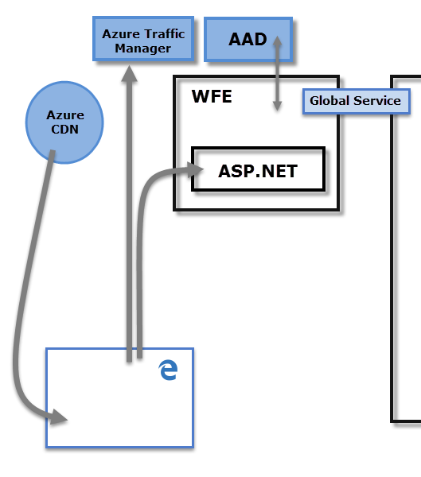
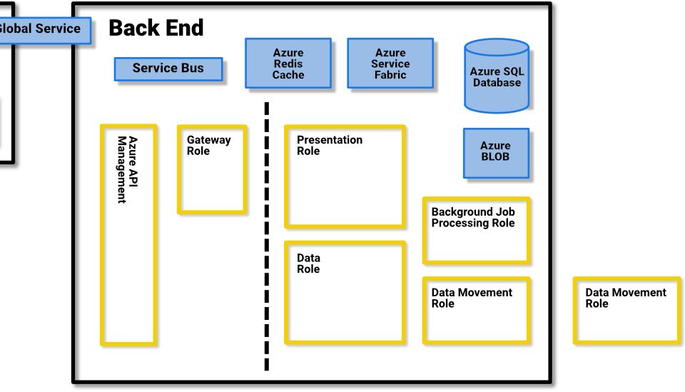
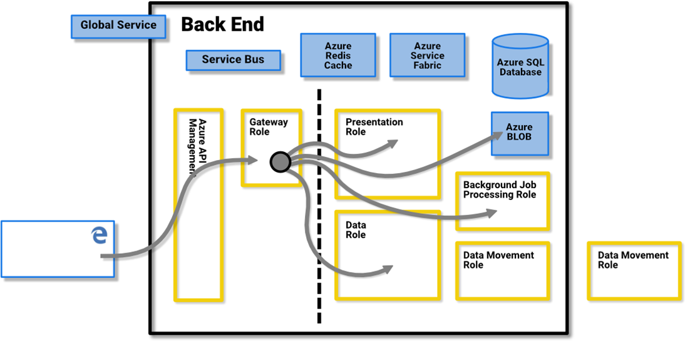
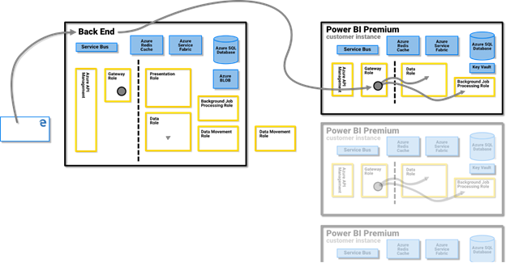
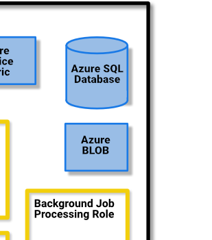
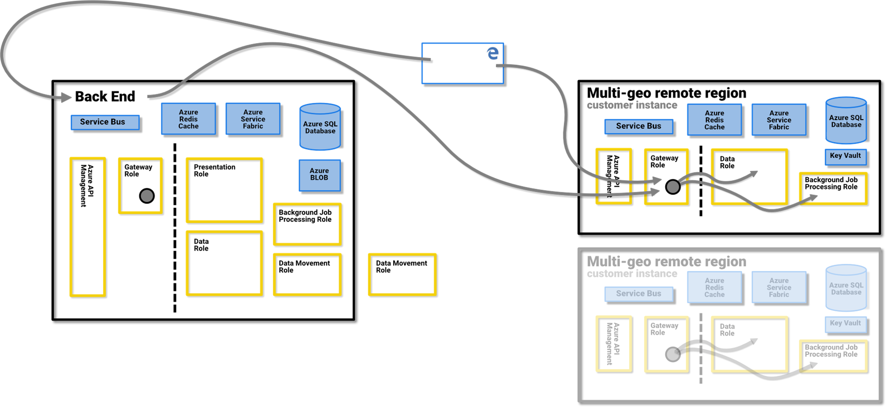
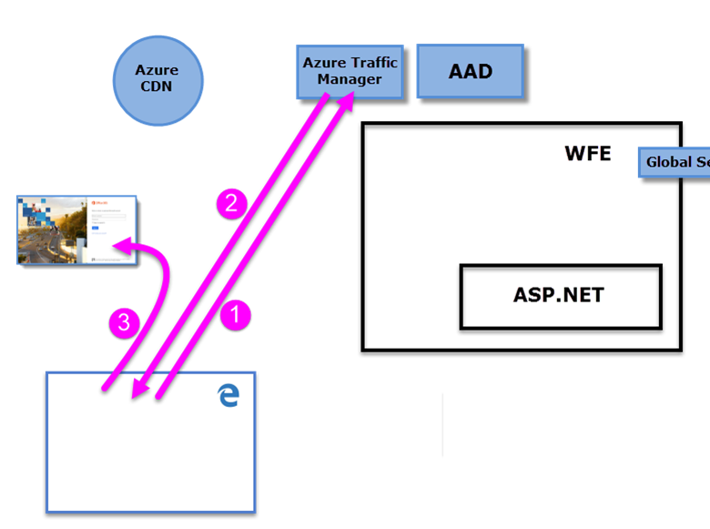
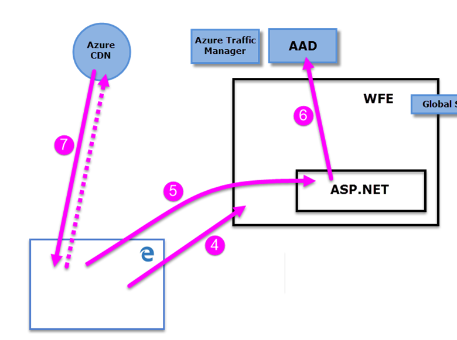
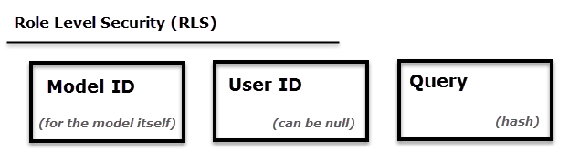

# Power BI security whitepaper

**Summary:** Power BI is an online software service (*SaaS*, or Software as a Service) offering from Microsoft that lets you easily and quickly create self-service Business Intelligence dashboards, reports, datasets, and visualizations. With Power BI, you can connect to many different data sources, combine and shape data from those connections, then create reports and dashboards that can be shared with others.

**Writer:** David Iseminger

**Technical Reviewers:** Pedram Rezaei, Cristian Petculescu, Siva Harinath, Tod Manning, Haydn Richardson, Adam Wilson, Ben Childs, Robert Bruckner, Sergei Gundorov, Kasper de Jonge

**Applies to:** Power BI SaaS, Power BI Desktop, Power BI Embedded, Power BI Premium

> [!NOTE]
> You can save or print this whitepaper by selecting **Print** from your browser, then selecting **Save as PDF**.

## Introduction

**Power BI** is an online software service (_SaaS_, or Software as a Service) offering from Microsoft that lets you easily and quickly create self-service Business Intelligence dashboards, reports, datasets, and visualizations. With Power BI, you can connect to many different data sources, combine and shape data from those connections, then create reports and dashboards that can be shared with others.

The Power BI service is governed by the [Microsoft Online Services Terms](http://www.microsoftvolumelicensing.com/DocumentSearch.aspx?Mode=3&amp;DocumentTypeId=31), and the [Microsoft Enterprise Privacy Statement](http://www.microsoft.com/privacystatement/OnlineServices/Default.aspx). For the location of data processing, refer to the Location of Data Processing terms in the Microsoft Online Services Terms. For compliance information, the [Microsoft Trust Center](https://www.microsoft.com/trustcenter) is the primary resource for Power BI. The Power BI team is working hard to bring its customers the latest innovations and productivity. Power BI is currently in Tier D of the[Office 365 Compliance Framework](http://go.microsoft.com/fwlink/p/?LinkID=618494).

This article describes Power BI security by providing an explanation of the Power BI architecture, then explaining how users authenticate to Power BI and data connections are established, and then describing how Power BI stores and moves data through the service. The last section is dedicated to security-related questions, with answers provided for each.

## Power BI Architecture

The **Power BI** service is built on **Azure**, which is Microsoft's [cloud computing platform](http://azure.microsoft.com/overview/what-is-azure/). Power BI is currently deployed in many datacenters around the world – there are many active deployments made available to customers in the regions served by those datacenters, and an equal number of passive deployments that serve as backups for each active deployment.

Each Power BI deployment consists of two clusters – a Web Front End (**WFE**) cluster, and a **Back-End** cluster. These two clusters are shown in the following image, and provide the backdrop for the rest of this article. 

Power BI uses Azure Active Directory (**AAD**) for account authentication and management. Power BI also uses the **Azure Traffic Manager (ATM)** to direct user traffic to the nearest datacenter, determined by the DNS record of the client attempting to connect, for the authentication process and to download static content and files. Power BI uses the **Azure Content Delivery Network (CDN)** to efficiently distribute the necessary static content and files to users based on geographical locale.

### The WFE Cluster

The **WFE** cluster manages the initial connection and authentication process for Power BI, using AAD to authenticate clients and provide tokens for subsequent client connections to the Power BI service.

When users attempt to connect to the Power BI service, the client's DNS service may communicate with the **Azure Traffic Manager** to find the nearest datacenter with a Power BI deployment. For more information about this process, see [Performance traffic routing method for Azure Traffic Manager](https://azure.microsoft.com/documentation/articles/traffic-manager-routing-methods/#performance-traffic-routing-method).

The WFE cluster nearest to the user manages the login and authentication sequence (described later in this article), and provides an AAD token to the user once authentication is successful. The ASP.NET component within the WFE cluster parses the request to determine which organization the user belongs to, and then consults the Power BI **Global Service**. The Global Service is a single Azure Table shared among all worldwide WFE and Back-End clusters that maps users and customer organizations to the datacenter that houses their Power BI tenant. The WFE specifies to the browser which Back-End cluster houses the organization's tenant. Once a user is authenticated, subsequent client interactions occur with the Back-End cluster directly, without the WFE being an intermediator for those requests.

### The Power BI Back-End Cluster

The **Back-End** cluster is how authenticated clients interact with the Power BI service. The **Back-End** cluster manages visualizations, user dashboards, datasets, reports, data storage, data connections, data refresh, and other aspects of interacting with the Power BI service.

The **Gateway Role** acts as a gateway between user requests and the Power BI service. Users do not interact directly with any roles other than the Gateway Role.

**Important:** It is imperative to note that _only_ Azure API Management (**APIM**) and Gateway (**GW**) roles are accessible through the public Internet. They provide authentication, authorization, DDoS protection, Throttling, Load Balancing, Routing, and other capabilities.

The dotted line in the **Back-End** cluster image, above, clarifies the boundary between the only two roles that are accessible by users (left of the dotted line), and roles that are only accessible by the system. When an authenticated user connects to the Power BI Service, the connection and any request by the client is accepted and managed by the **Gateway Role** and **Azure API Management**, which then interacts on the user's behalf with the rest of the Power BI Service. For example, when a client attempts to view a dashboard, the **Gateway Role** accepts that request then separately sends a request to the **Presentation Role** to retrieve the data needed by the browser to render the dashboard.

### Power BI Premium

**Power BI Premium** offers a dedicated, provisioned, and partitioned service workspace for subscribers that need dedicated resources for their Power BI activities. When a customer signs up for a Power BI Premium subscription, the Premium capacity is created through the **Azure Resource Manager**. The rollout of that subscription assigns a set of virtual machines commensurate with the subscription level, in the datacenter where their Power BI tenant is hosted (with the exception of multi-geo environments, as described later in this document), initiated as an **Azure Service Fabric** deployment.

Once created, all communication with the Premium cluster is routed through the Power BI Back-End cluster, where a connection to the client's dedicated **Power BI Premium** subscription virtual machines is established.

### Data Storage Architecture

Power BI uses two primary repositories for storing and managing data: data that is uploaded from users is typically sent to **Azure Blob** storage, and all metadata as well as artifacts for the system itself are stored behind a firewall in **Azure SQL Database**.

For example, when a user imports an Excel workbook into the Power BI service, an in-memory Analysis Services tabular database is created, and the data is stored in-memory for up to one hour (or until memory pressure occurs on the system). The data is also sent to **Azure Blob** storage.

Metadata about a user's Power BI subscription, such as dashboards, reports, recent data sources, workspaces, organizational information, tenant information, and other metadata about the system is stored and updated in **Azure SQL Database**. All information stored in Azure SQL Database is fully encrypted using [Azure SQL's Transparent Data Encryption](https://msdn.microsoft.com/library/dn948096.aspx) (TDE) technology. All data that is stored in Azure Blob storage is also encrypted. More information about the process of loading, storing, and moving data is described in the **Data Storage and Movement** section.

## Tenant Creation

A tenant is a dedicated instance of the Azure AD service that an organization receives and owns when it signs up for a Microsoft cloud service such as Azure, Microsoft Intune, Power BI, or Office 365. Each Azure AD tenant is distinct and separate from other Azure AD tenants.

A tenant houses the users in a company and the information about them - their passwords, user profile data, permissions, and so on. It also contains groups, applications, and other information pertaining to an organization and its security. For more information, see [What is an Azure AD tenant](https://msdn.microsoft.com/library/azure/jj573650.aspx#BKMK_WhatIsAnAzureADTenant).

A Power BI tenant is created in the datacenter deemed closest to the country (or region) and state information provided for the tenant in Azure Active Directory, which was provided when the Office 365 or Power BI service was initially provisioned. The Power BI tenant does not move from that datacenter location today.

### Multiple Geographies (Multi-geo)

Some organizations require a Power BI presence in multiple geographies, or regions, based on business needs. For example, a business may have its Power BI tenant in the United States but may also do business in other geographical areas, such as Australia, and need Power BI services and data to remain in that remote region.  Beginning in the second half of 2018, organizations with their tenant in one geography can also access Power BI resources in another geography when properly provisioned. This feature is referred to as **multi-geo** for convenience and reference throughout this document.

There are technical implications to keep in mind when operating in different geographies, which are clarified throughout this document. Important considerations include the following:

- A cached query stored in a remote region will stay in that region at rest, however other data in transit may go back and forth between multiple geographies.
- Reports in PBIX or XLSX files in a remote region that are published to Power BI sometimes result in a copy or shadow copy being stored in Power BI's Azure Blob storage, and when that occurs the data is encrypted using Azure Storage Service Encryption (SSE).
- When moving data from one region to another in a multi-geo environment, garbage collection in the region from which the data was moved occurs within 7 to 10 days, at which point the copy of data moved from the original region will be destroyed.

The following image illustrates how the Power BI services provided in the remote region with a multi-geo environment is routed through the **Power BI Back-End** cluster, where a connection to the client's remote Power BI subscription virtual machine is established.

### Datacenters and Locales

Power BI is offered in certain regions, based on where Power BI clusters are deployed in regional datacenters. Microsoft plans to expand its Power BI infrastructure into additional datacenters.

The following links provide additional information about Azure datacenters.

- [Azure Regions](http://azure.microsoft.com/regions/) – information about Azure's global presence and locations
- [Azure Services, by region](http://azure.microsoft.com/regions/#services) – a complete listing of Azure services (both infrastructure services and platform services) available from Microsoft in each region.

Currently, the Power BI service is available in specific regions, serviced by datacenters as described in the [Microsoft Trust Center]((https://www.microsoft.com/TrustCenter/CloudServices/business-application-platform/data-location). The following link shows a map of Power BI datacenters, you can hover over a region to see the datacenters located there:

* [Power BI Datacenters](https://www.microsoft.com/TrustCenter/CloudServices/business-application-platform/data-location)

Microsoft also provides datacenters for sovereignties. For more information about Power BI service availability for national clouds, see [Power BI national clouds](https://powerbi.microsoft.com/clouds/).

For more information on where your data is stored and how it is used, refer to the [Microsoft Trust Center](https://www.microsoft.com/TrustCenter/Transparency/default.aspx#_You_know_where). Commitments about the location of customer data at rest are specified in the **Data Processing Terms** of the [Microsoft Online Services Terms](http://www.microsoftvolumelicensing.com/DocumentSearch.aspx?Mode=3&amp;DocumentTypeId=31).

## User Authentication

User authentication to the Power BI service consists of a series of requests, responses, and redirects between the user's browser and the Power BI service or the Azure services used by Power BI. That sequence describes the process of user authentication in Power BI. For more information about options for an organization's user authentication models (sign-in models), see [Choosing a sign-in model for Office 365](https://blogs.office.com/2014/05/13/choosing-a-sign-in-model-for-office-365/).

### Authentication Sequence

The user authentication sequence for the Power BI service occurs as described in the following steps, which are illustrated in the following images.

1. A user initiates a connection to the Power BI service from a browser, either by typing in the Power BI address in the address bar (such as https://app.powerbi.com) or by selecting _Sign In_ from the Power BI landing page (https://powerbi.microsoft.com). The connection is established using TLS 1.2 and HTTPS, and all subsequent communication between the browser and the Power BI service uses HTTPS. The request is sent to the **Azure Traffic Manager**.

2. The **Azure Traffic Manager** checks the user's DNS record to determine the nearest datacenter where Power BI is deployed, and responds to the DNS with the IP address of the WFE cluster to which the user should be sent.

3. WFE then redirects the user to Microsoft Online Services login page.

    

1. Once the user is authenticated, the login page redirects the user to the previously determined nearest Power BI service **WFE cluster**.

2. The browser submits a cookie that was obtained from the successful login to Microsoft Online Services, which is inspected by the **ASP.NET service** inside the **WFE cluster**.

3. The WFE cluster checks with the **Azure Active Directory** (**AAD**) service to authenticate the user's Power BI service subscription, and to obtain an AAD security token. When AAD returns successful authentication of the user and returns an AAD security token, the WFE cluster consults the **Power BI**** Global Service,** which maintains a list of tenants and their Power BI Back-End cluster locations, and determines which Power BI service cluster contains the user's tenant. The WFE cluster then directs the user to the Power BI cluster where its tenant resides, and returns a collection of items to the user's browser:

      - The **AAD security token**
      - **Session information**
      - The web address of the **Back-End** cluster the user can communicate and interact with

1. The user's browser then contacts the specified Azure CDN, or for some of the files the WFE, to download the collection of specified common files necessary to enable the browser's interaction with the Power BI service. The browser page then includes the AAD token, session information, the location of the associated Back-End cluster, and the collection of files downloaded from the Azure CDN and WFE cluster, for the duration of the Power BI service browser session.

Once those items are complete, the browser initiates contact with the specified Back-End cluster and the user's interaction with the Power BI service commences. From that point forward, all calls to the Power BI service are with the specified Back-End cluster, and all calls include the user's AAD token. The AAD token has a timeout of one hour; the WFE refreshes the token periodically if a user's session remains open, in order to preserve access.

## Data Storage and Movement

In the Power BI service, data is either _at rest_ (data available to a Power BI user that is not currently being acted upon), or it is _in process_ (for example: queries being run, data connections and models being acted upon, data and/or models being uploaded into the Power BI service, and other actions that users or the Power BI service may take on data that is actively being accessed or updated). Data that is in process is referred to as _data in process_. Data at rest in Power BI is encrypted. Data that is in transit, which means data being sent or received by the Power BI service, is also encrypted.

The Power BI service also manages data differently based on whether the data is accessed with a **DirectQuery**, or import. So there are two categories of user data for Power BI: data that is accessed by DirectQuery, and data which is not accessed by DirectQuery.

A **DirectQuery** is a query for which a Power BI user's query has been translated from Microsoft's Data Analysis Expressions (DAX) language – which is the language used by Power BI and other Microsoft products to create queries – in the data source's native data language (such as T-SQL, or other native database languages). The data associated with a DirectQuery is stored by reference only, which means source data is not stored in Power BI when the DirectQuery is not active (except for visualization data used to display dashboards and reports, as described in the _Data in process (data movement)_ section, below). Rather, references to DirectQuery data are stored which allow access to that data when the DirectQuery is run. A DirectQuery contains all the necessary information to execute the query, including the connection string and the credentials used to access the data sources, which allow the DirectQuery to connect to the included data sources for automatic refresh. With a DirectQuery, underlying data model information is incorporated into the DirectQuery.

A query for an import dataset consist of a collection of DAX queries that are _not_ directly translated to the native language of any underlying data source. Import queries do not include credentials for the underlying data, and the underlying data is loaded into the Power BI service unless it is on-premises data accessed through a [Power BI Gateway](service-gateway-onprem.md), in which case the query only stores references to on-premises data.

The following table describes Power BI data based on the type of query being used. An **X** indicates the presence of Power BI data when using the associated query type.

|  |Import  |DirectQuery  |Live Connect  |
|---------|---------|---------|---------|
|Schema     |     X    |    X     |         |
|Row data     |    X     |         |         |
|Visuals data caching     |    X     |     X    |    X     |

The distinction between a DirectQuery and other queries determines how the Power BI service handles the data at rest, and whether the query itself is encrypted. The following sections describe data at rest and in movement, and explain the encryption, location, and process for handling data.

### Data at rest

When data is at rest, the Power BI service stores datasets, reports, and dashboard tiles in the manner described in the following subsections. As mentioned earlier, data at rest in Power BI is encrypted. ETL stands for Extract, Transform and Load in the following sections.

#### Encryption Keys

- The encryption keys to Azure Blob keys are stored, encrypted, in Azure Key Vault.
- The encryption keys for Azure SQL Database TDE technology is managed by Azure SQL itself.
- The encryption key for Data Movement service and on-premises data gateway are stored:
  - In the on-premises data gateway on customer's infrastructure – for on-premises data sources
  - In the Data Movement Role – for cloud-based data sources

The Content Encryption Key (CEK) used to encrypt the Windows Azure Blob Storage is a randomly generated 256-bit key. The algorithm that the CEK uses to encrypt the content is AES\_CBC\_256.

The Key Encryption Key (KEK) that is used to then encrypt the CEK is a pre-defined 256-bit key. The algorithm by KEK to encrypt the CEK is A256KW.

Gateway encryption keys based on the recovery key never leave an on-premises infrastructure. Power BI cannot access the encrypted on-premises credentials values, and cannot intercept those credentials; web clients encrypt the credential with a public key that's associated with the specific gateway with which it is communicating.

For cloud-based data sources, the Data Movement Role encrypts encryption keys using [Always Encrypted](https://msdn.microsoft.com/library/mt163865.aspx) methods. You can learn more about the [Always Encrypted database feature](https://msdn.microsoft.com/library/mt163865.aspx).

#### Datasets

1. Metadata (tables, columns, measures, calculations, connection strings, etc.)

    a. For Analysis Services on-premises nothing is stored in the service except for a reference to that database stored encrypted in Azure SQL.

    b. All other metadata for ETL, DirectQuery, and Push Data is encrypted and stored in Azure Blob storage.

1. Credentials to the original data sources
  
      a. Analysis Services on-premises – No credentials are needed and, therefore, no credentials are stored.

      b. DirectQuery – This depends whether the model is created in the service directly in which case it is stored in the connection string and encrypted in Azure Blob, or if the model is imported from Power BI Desktop in which case the credentials are stored encrypted in Data Movement's Azure SQL Database. The encryption key is stored on the machine running the Gateway on customer's infrastructure.

      c. Pushed data – not applicable

      d. ETL

      - For **Salesforce** or **OneDrive** – the refresh tokens are stored encrypted in the Azure SQL Database of the Power BI service.
      - Otherwise:
        - If the dataset is set for refresh, the credentials are stored encrypted in Data Movement's Azure SQL Database. The encryption key is stored on the machine running the Gateway on customer's infrastructure.
        - If the dataset is not set for refresh, there are no credentials stored for the data sources

1. Data

    a. Analysis Services on-premises, and DirectQuery – nothing is stored in the Power BI Service.

    b. ETL – encrypted in Azure Blob storage, but all data currently in Azure Blob storage of the Power BI service uses [Azure Storage Service Encryption (SSE)](https://docs.microsoft.com/azure/storage/common/storage-service-encryption), also known as server-side encryption. Multi-geo uses SSE as well.

    c. Push data v1 – stored encrypted in Azure Blob storage, but all data currently in Azure Blob storage in the Power BI service uses [Azure Storage Service Encryption (SSE)](https://docs.microsoft.com/azure/storage/common/storage-service-encryption), also known as server-side encryption. Multi-geo uses SSE as well.

    d. Push data v2 – stored encrypted in Azure SQL.

Power BI uses the client-side encryption approach, using cipher block chaining (CBC) mode with advanced encryption standard (AES), to encrypt its Azure Blob storage. You can [learn more about client-side encryption](https://azure.microsoft.com/documentation/articles/storage-client-side-encryption/).

Power BI provides data integrity monitoring in the following ways:

* For data at rest in Azure SQL, Power BI uses dbcc, TDE, and constant page checksum as part of the native offerings of SQL.

* For data at rest in Azure Blob storage, Power BI uses client-side encryption and HTTPS to transfer data into storage which includes integrity checks during the retrieval of the data. You can [learn more about Azure Blob storage security](https://azure.microsoft.com/documentation/articles/storage-security-guide/).

#### Reports

1. Metadata (report definition)

   a. Reports can either be Excel for Office 365 reports, or Power BI reports. The following applies for metadata based on the type of report:

       a. Excel Report metadata is stored encrypted in SQL Azure. Metadata is also stored in Office 365.

       b. Power BI reports are stored encrypted in Azure SQL database.

2. Static data

   Static data includes artifacts such as background images and custom visuals.

    a. For reports created with Excel for Office 365, nothing is stored.

    b. For Power BI reports, the static data is stored and is encrypted in Azure Blob storage.

3. Caches
    a. For reports created with Excel for Office 365, nothing is cached.

    b. For Power BI reports, data for the visuals shown are cached encrypted in Azure SQL Database.
 

4. Original Power BI Desktop (.pbix) or Excel (.xlsx) files published to Power BI

    Sometimes a copy or a shadow copy of the .xlsx or .pbix files are stored in Power BI's Azure Blob storage, and when that occurs, the data is encrypted. All such reports stored in the Power BI service, in Azure Blob storage, use [Azure Storage Service Encryption (SSE)](https://docs.microsoft.com/azure/storage/common/storage-service-encryption), also known as server-side encryption. Multi-geo uses SSE as well.

#### Dashboards and Dashboard Tiles

1. Caches – The data needed by the visuals on the dashboard is usually cached and stored encrypted in Azure SQL Database. Other tiles such as pinned visuals from Excel or SQL Server Reporting Services (SSRS) are stored in Azure Blob as images, and are also encrypted.

2. Static data – that includes artifacts such as background images and custom visuals that are stored, encrypted, in Azure Blob storage.

Regardless of the encryption method used, Microsoft manages the key encryption on customers' behalf, in either a secret store or in Azure Key Vault.

### Data Transiently Stored on Non-Volatile Devices

The following describes data that is transiently stored on non-volatile devices.

#### Datasets

1. Metadata (tables, columns, measures, calculations, connection strings, etc.)

2. Some schema-related artifacts can be stored on the disk of the compute nodes for a limited period of time. Some artifacts can also be stored in Azure REDIS Cache unencrypted for a limited period of time.

3. Credentials to the original data sources

    a. Analysis Services on-premises – nothing is stored

    b. DirectQuery – This depends whether the model is created in the service directly in which case it is stored in the connection string, in encrypted format with the encryption key stored in clear text in the same place (alongside the encrypted information); or if the model is imported from Power BI Desktop in which case the credentials are not stored on non-volatile devices.

    c. Pushed data – none (not applicable)

    d. ETL – none (nothing stored on the compute node nor different than explained in the **Data at Rest** section, above)
4. Data

    Some data artifacts can be stored on the disk of the compute nodes for a limited period of time.

### Data in process

Data is in process when it is actively being used or accessed by a user. For example, data is in process when a user accesses a dataset, revises or modifies a dashboard or report, when refresh occurs, or other data access activities that may occur. When any of those events occur and put data in process, the **Data Role** in the Power BI service creates an in-memory Analysis Services (AS) database and the dataset is loaded into that in-memory Analysis Services database. Whether the dataset is based on a DirectQuery or not, data loaded in the AS database is unencrypted to allow for access by the **Data Role**, and held in memory for further access until the Power BI service no longer needs the dataset. For customers with a Power BI Premium subscription, Power BI creates an in-memory Analysis Services (AS) database in the customer's separately provisioned collection of Power BI virtual machines.

Once data is acted upon, which includes initially loading data into Power BI, the Power BI service may cache the visualization data in an encrypted **Azure SQL Database**, regardless of whether the dataset is based on a DirectQuery.

To monitor data integrity for data in process, Power BI uses HTTPS, TCP/IP and TLS to ensure data is encrypted and maintains integrity during the transport.

## User Authentication to Data Sources

With each data source, a user establishes a connection based on his or her login, and accesses the data with those credentials. Users can then create queries, dashboards, and reports based on the underlying data.

When a user shares queries, dashboards, reports, or any visualization, access to that data and those visualizations is dependent on whether the underlying data sources support Role Level Security (RLS).

If an underlying data source is capable of **Power BI's**** Role Level Security (RLS)**, the Power BI service will apply that role level security, and users who do not have sufficient credentials to access the underlying data (which could be a query used in a dashboard, report, or other data artifact) will not see data for which the user does not have sufficient privileges. If a user's access to the underlying data is different from the user who created the dashboard or report, the visualizations and other artifacts will only show data based on the level of access that user has to the data.

If a data source does **not** apply RLS, then the Power BI login credentials are applied to the underlying data source, or if other credentials are supplied during the connection, those supplied credentials are applied. When a user loads data into the Power BI service from non-RLS data sources, the data is stored in Power BI as described in the **Data Storage and Movement** section found in this document. For non-RLS data sources, when data is shared with other users (such as through a dashboard or report) or a refresh of the data occurs, the original credentials are used to access or display the data.

For a quick example to contrast RLS and non-RLS data sources, imagine Sam creates a report and a dashboard, then shares them with Abby and Ralph. If the data sources used in the report and dashboard are from data sources that **do not** support RLS, both Abby and Ralph will be able to see the data that Sam included in the dashboard (which was uploaded into the Power BI service) and both Abby and Ralph can then interact with the data. In contrast, if Sam creates a report and dashboard from data sources that do support RLS, then shares it with Abby and Ralph, when Abby attempts to view the dashboard the following occurs:

1. Since the dashboard is from an RLS data source, the dashboard visualizations will briefly show a &quot;loading&quot; message while the Power BI service queries the data source to retrieve the current dataset specified in the connection string associated with the dashboard's underlying query.

2. The data is accessed and retrieved based on Abby's credentials and role, and only data for which Abby has sufficient authorization is loaded into the dashboard and report.

3. The visualizations in the dashboard and report are displayed based on Abby's role level.

If Ralph were to access the shared dashboard or report, the same sequence occurs based on his role level.

## Power BI and ExpressRoute

With Power BI and ExpressRoute, you can create a private network connection from your organization to Power BI (or using an ISP's colocation facility), bypassing the Internet to better secure your sensitive Power BI data and connections.

ExpressRoute is an Azure service that lets you create private connections between Azure datacenters (where Power BI resides) and your on-premises infrastructure, or create private connections between Azure datacenters and your colocation environment. For more information, please refer to the [Power BI and ExpressRoute](service-admin-power-bi-expressroute.md) article.

## Power BI Mobile

Power BI Mobile is a collection of apps designed for the three primary mobile platforms: Android, iOS, and Windows Mobile. Security considerations for Power BI Mobile apps falls into two categories:

* Device communication
* The application and data on the device

For **device communication**, all Power BI Mobile applications communicate with the Power BI service, and use the same connection and authentication sequences used by browsers, which are described in detail earlier in this whitepaper. The iOS and Android Power BI mobile applications bring up a browser session within the application itself, and the Windows mobile app brings up a broker to establish the communication channel with Power BI.

The following table lists support of certificate-based authentication (CBA) for Power BI Mobile based on mobile device platform:

| **CBA Support** | **iOS** | **Android** | **Windows** |
| --- | --- | --- | --- |
| **Power BI** (sign in to service) | supported | supported | Not supported |
| **SSRS ADFS** (connect to SSRS server) | Not supported | Supported | Not supported |

Power BI Mobile apps actively communicate with the Power BI service. Telemetry is used to gather mobile app usage statistics and similar data, which is transmitted to services that are used to monitor usage and activity; no personal data is sent with telemetry data.

The Power BI **application on the device** stores data on the device that facilitates use of the app:

* Azure Active Directory and refresh tokens are stored in a secure mechanism on the device, using industry-standard security measures.

* Data is cached in storage on the device, which is not directly encrypted by the application itself

* Settings are also stored on the device unencrypted, but no actual user data is stored.

The data cache from Power BI Mobile remains on the device for two weeks, or until: the app is removed; the user signs out of Power BI Mobile; or the user fails to sign in (such as a token expiration event, or password change). The data cache includes dashboards and reports previously accessed from the Power BI Mobile app.

Power BI Mobile applications do not look at folders on the device. 

All three platforms for which Power BI Mobile is available support Microsoft Intune, a software service that provides mobile device and application management. With Intune enabled and configured, data on the mobile device is encrypted, and the Power BI application itself cannot be installed on an SD card. You can [learn more about Microsoft Intune](http://www.microsoft.com/cloud-platform/microsoft-intune).

## Power BI Security Questions and Answers

The following questions are common security questions and answers for Power BI. These are organized based on when they were added to this whitepaper, to facilitate your ability to quickly find new questions and answers when this paper is updated. The newest questions are added to the end of this list.

**How do users connect to, and gain access to data sources while using Power BI?**

* **Power BI credentials and domain credentials:** Users sign in to Power BI using an email address; when a user attempts to connect to a data resource, Power BI passes the Power BI login email address as credentials. For domain-connected resources (either on-premises or cloud-based), the login email is matched with a _User Principal Name_ ([UPN](https://msdn.microsoft.com/library/windows/desktop/aa380525(v=vs.85).aspx)) by the directory service to determine whether sufficient credentials exist to allow access. For organizations that use work-based email addresses to sign in to Power BI (the same email they use to login to work resources, such as _david@contoso.com_), the mapping can occur seamlessly; for organizations that did not use work-based email addresses (such as _david@contoso.onmicrosoft.com_), directory mapping must be established in order to allow access to on-premises resources with Power BI login credentials.

* **SQL Server Analysis Services and Power BI:** For organizations that use on-premises SQL Server Analysis Services, Power BI offers the Power BI on-premises data gateway (which is a **Gateway**, as referenced in previous sections).  The Power BI on-premises data gateway can enforce role-level security on data sources (RLS). For more information on RLS, see **User Authentication to Data Sources** earlier in this document. You can also read an in-depth article about [Power BI Gateway](service-gateway-manage.md).

  In addition, organizations can use Kerberos for **single sign-on** (SSO) and seamlessly connect from Power BI to on-premises data sources such as SQL Server, SAP HANA, and Teradata. For more information, and the specific configuration requirements, see [**Use Kerberos for SSO from Power BI to on-premises data sources**](https://docs.microsoft.com/power-bi/service-gateway-kerberos-for-sso-pbi-to-on-premises-data).

* **Non-domain connections**: For data connections that are not domain-joined and not capable of Role Level Security (RLS), the user must provide credentials during the connection sequence, which Power BI then passes to the data source to establish the connection. If permissions are sufficient, data is loaded from the data source into the Power BI service.

**How is data transferred to Power BI?**

* All data requested and transmitted by Power BI is encrypted in transit using HTTPS to connect from the data source to the Power BI service. A secure connection is established with the data provider, and only once that connection is established will data traverse the network.

**How does Power BI cache report, dashboard, or model data, and is it secure?**

* When a data source is accessed, the Power BI service follows the process outlined in the **Data Storage and Movement** section earlier in this document.

**Do clients cache web page data locally?**

* When browser clients access Power BI, the Power BI web servers set the _Cache-Control_ directive to _no-store_. The _no-store_ directive instructs browsers not to cache the web page being viewed by the user, and not to store the web page in the client's cache folder.

**What about role-based security, sharing reports or dashboards, and data connections? How does that work in terms of data access, dashboard viewing, report access or refresh?**

* For **non-Role Level Security (RLS)** enabled data sources, if a dashboard, report, or data model is shared with other users through Power BI, the data is then available for users with whom it is shared to view and interact with. Power BI *does not* re-authenticate users against the original source of the data; once data is uploaded into Power BI, the user who authenticated against the source data is responsible for managing which other users and groups can view the data.

  When data connections are made to an **RLS** -capable data source, such as an Analysis Services data source, only dashboard data is cached in Power BI. Each time a report or dataset is viewed or accessed in Power BI that uses data from the RLS-capable data source, the Power BI service accesses the data source to get data based on the user's credentials, and if sufficient permissions exist, the data is loaded into the report or data model for that user. If authentication fails, the user will see an error.

  For more information, see the **User Authentication to Data Sources** section earlier in this document.

**Our users connect to the same data sources all the time, some of which require credentials that differ from their domain credentials. How can they avoid having to input these credentials each time they make a data connection?**

* Power BI offers the [Power BI Personal Gateway](https://support.powerbi.com/knowledgebase/articles/649846), which is a feature that lets users create credentials for multiple different data sources, then automatically use those credentials when subsequently accessing each of those data sources. For more information, see [Power BI Personal Gateway](https://support.powerbi.com/knowledgebase/articles/649846).

**How do Power BI Groups work?**

* Power BI Groups allow users to quickly and easily collaborate on the creation of dashboards, reports, and data models within established teams. For example, if you have a Power BI Group that includes everyone in your immediate team, you can easily collaborate with everyone on your team by selecting the Group from within Power BI. Power BI Groups are equivalent to Office 365 Universal Groups (which you can [learn about](https://support.office.com/Article/Find-help-about-Groups-in-Office-365-7a9b321f-b76a-4d53-b98b-a2b0b7946de1), [create](https://support.office.com/Article/View-create-and-delete-Groups-in-the-Office-365-admin-center-a6360120-2fc4-46af-b105-6a04dc5461c7), and [manage](https://support.office.com/Article/Manage-Group-membership-in-the-Office-365-admin-center-e186d224-a324-4afa-8300-0e4fc0c3000a)), and use the same authentication mechanisms used in Azure Active Directory to secure data. You can [create groups in Power BI](https://support.powerbi.com/knowledgebase/articles/654250) or create a Universal Group in Microsoft 365 admin center; either has the same result for group creation in Power BI.

  Note that data shared with Power BI Groups follows the same security consideration as any shared data in Power BI. For **non-RLS** data sources Power BI does **not** re-authenticate users against the original source of data, and once data is uploaded into Power BI, the user who authenticated against the source data is responsible for managing which other users and groups can view the data. For more information, see the **User Authentication to Data Sources** section earlier in this document.

  You can get more information about [Groups in Power BI](https://support.powerbi.com/knowledgebase/articles/654247).

**Which ports are used by on-premises data gateway and personal gateway? Are there any domain names that need to be allowed for connectivity purposes?**

* The detailed answer to this question is available at the following link: [Power BI Gateway](service-gateway-manage.md)

**When working with the on-premises data gateway, how are recovery keys used and where are they stored? What about secure credential management?**

* During gateway installation and configuration, the administrator types in a gateway **Recovery Key**. That **Recovery Key** is used to generate two sets of much stronger keys:

  - An **RSA** asymmetric key
  - An **AES** symmetric key

  Those generated keys (**RSA** and **AES**) are stored in a file located on the local machine. That file is also encrypted. The contents of the file can only be decrypted by that particular Windows machine, and only by that particular gateway service account.

  When a user enters data source credentials in the Power BI service UI, the credentials are encrypted with the public key in the browser. The gateway re-encrypts the (already encrypted) credentials with an AES symmetric key before the data is stored in Power BI. With this process, the Power BI service never has access to the unencrypted data.

**Which communication protocols are used by the on-premises data gateway, and how are they secured?**

* The gateway supports the following two communications protocols:

  - **AMQP 1.0 – TCP + TLS**: This protocol requires ports 443, 5671-5672, and 9350-9354 to be open for outgoing communication. This protocol is preferred, since it has lower communication overhead.

  - **HTTPS – WebSockets over HTTPS + TLS**: This protocol uses port 443 only. The WebSocket is initiated by a single HTTP CONNECT message. Once the channel is established, the communication is essentially TCP+TLS. You can force the gateway to use this protocol by modifying a setting described in the [On-Premises Gateway article](service-gateway-manage.md).

**What is the role of Azure CDN in Power BI?**

* As mentioned previously, Power BI uses the **Azure Content Delivery Network (CDN)** to efficiently distribute the necessary static content and files to users based on geographical locale. To go into further detail, the Power BI service uses multiple **CDNs** to efficiently distribute necessary static content and files to users through the public Internet. These static files include product downloads (such as **Power BI Desktop**, the **on-premises data gateway**, or Power BI apps from various independent service providers), browser configuration files used to initiate and establish any subsequent connections with the Power BI service, as well as the initial secure Power BI login page.

  Based on information provided during an initial connection to the Power BI service, a user's browser contacts the specified Azure **CDN** (or for some files, the **WFE**) to download the collection of specified common files necessary to enable the browser's interaction with the Power BI service. The browser page then includes the AAD token, session information, the location of the associated **Back-End** cluster, and the collection of files downloaded from the Azure **CDN** and **WFE** cluster, for the duration of the Power BI service browser session.

**For Custom Visuals, does Microsoft perform any security or privacy assessment of the custom visual code prior to publishing items to the Gallery?**

* No. It is the customer's responsibility to review and determine whether custom visual code should be relied upon. All custom visual code is operated in a sandbox environment, so that any errant code in a custom visual does not adversely affect the rest of the Power BI service.

**Are there other Power BI visuals that send information outside the customer network?**

* Yes. Bing Maps and ESRI visuals transmit data out of the Power BI service for visuals that use those services. For more information, and detailed descriptions of out-of-Power-BI tenant traffic, see [**Power BI and ExpressRoute**](service-admin-power-bi-expressroute.md).

**For Template Apps, does Microsoft perform any security or privacy assessment of the Template app prior to publishing items to the Gallery?**
* No. The app publisher is responsible for the content while the customer's responsibility to review and determine whether to trust the Template app publisher. 

**Are there Template apps that can send information outside the customer network?**
* Yes. It is the customer's responsibility to review the publisher's privacy policy and determine whether to install the Template app on Tenant. Furthermore, the publisher is responsible to notify of the app's behavior and capabilities.

**What about data sovereignty? Can we provision tenants in data centers located in specific geographies, to ensure data doesn't leave the country borders?**

* Some customers in certain geographies have an option to create a tenant in a national cloud, where data storage and processing is kept separate from all other datacenters. National clouds have a slightly different type of security, since a separate data trustee operates the national cloud Power BI service on behalf of Microsoft.

  Alternatively customers can also set up a tenant in a specific region, however, such tenants do not have a separate data trustee from Microsoft. Pricing for national clouds is different from the generally available commercial Power BI service. For more information about Power BI service availability for national clouds, see [Power BI national clouds](https://powerbi.microsoft.com/clouds/).

**How does Microsoft treat connections for customers who have Power BI Premium subscriptions? Are those connections different than those established for the non-Premium Power BI service?**

* The connections established for customers with Power BI Premium subscriptions implement an [Azure Business-to-Business (B2B)](https://docs.microsoft.com/azure/active-directory/active-directory-b2b-what-is-azure-ad-b2b) authorization process, using Azure Active Directory (AD) to enable access control and authorization. Power BI handles connections from Power BI Premium subscribers to Power BI Premium resources just as it would any other Azure AD user.

## Conclusion

The Power BI service architecture is based on two clusters – the Web Front End (WFE) cluster and the Back-End cluster. The WFE cluster is responsible for initial connection and authentication to the Power BI service, and once authenticated, the Back End handles all subsequent user interactions. Power BI uses Azure Active Directory (AAD) to store and manage user identities, and manages the storage of data and metadata using Azure Blob and Azure SQL Database, respectively.

Data storage and data processing in Power BI differs based on whether data is accessed using a DirectQuery, and is also dependent on whether data sources are in the cloud or on-premises. Power BI is also capable of enforcing Role Level Security (RLS) and interacts with Gateways that provide access to on-premises data.

## Feedback and Suggestions

We appreciate your feedback. We're interested in hearing any suggestions you have for improvement, additions, or clarifications to this whitepaper, or other content related to Power BI. Send your suggestions to [pbidocfeedback@microsoft.com](mailto:pbidocfeedback@microsoft.com).

## Additional Resources

For more information on Power BI, see the following resources.

- [Groups in Power BI](https://support.powerbi.com/knowledgebase/articles/654247)
- [Getting Started with Power BI Desktop](https://support.powerbi.com/knowledgebase/articles/471664)
- [Power BI Gateway](service-gateway-manage.md)
- [Power BI REST API - Overview](https://msdn.microsoft.com/library/dn877544.aspx)
- [Power BI API reference](https://msdn.microsoft.com/library/mt147898.aspx)
- [On-premises data gateway](service-gateway-manage.md)
- [Power BI and ExpressRoute](service-admin-power-bi-expressroute.md)
- [Power BI National Clouds](https://powerbi.microsoft.com/clouds/)
- [Power BI Premium](https://aka.ms/pbipremiumwhitepaper)
- [Use Kerberos for SSO from Power BI to on-premises data sources](service-gateway-sso-overview.md)
